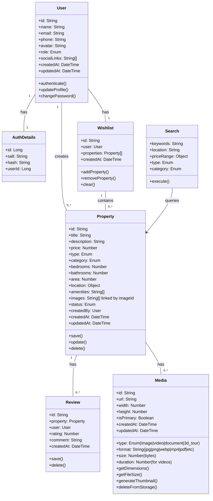
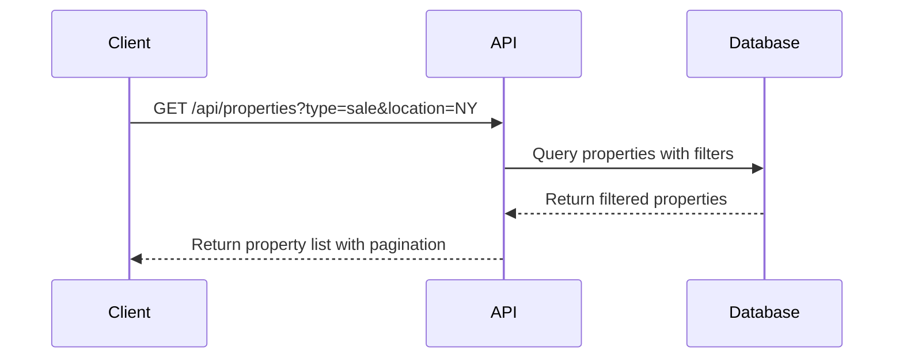
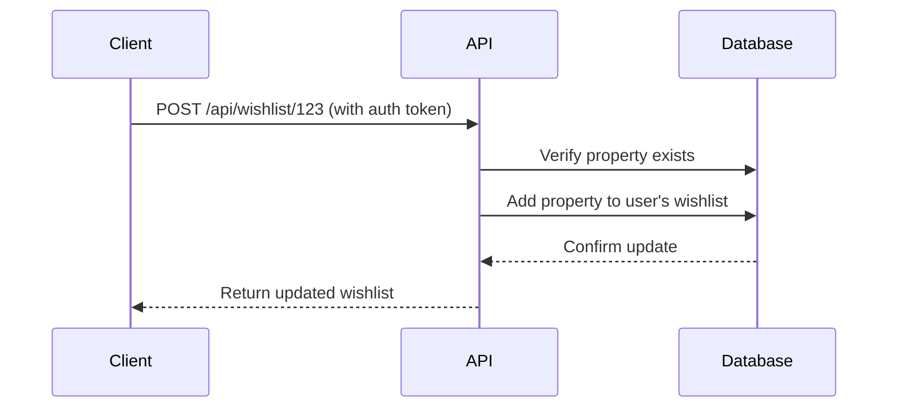
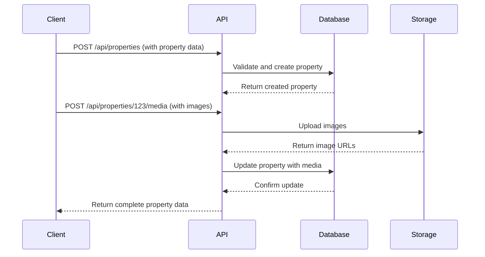
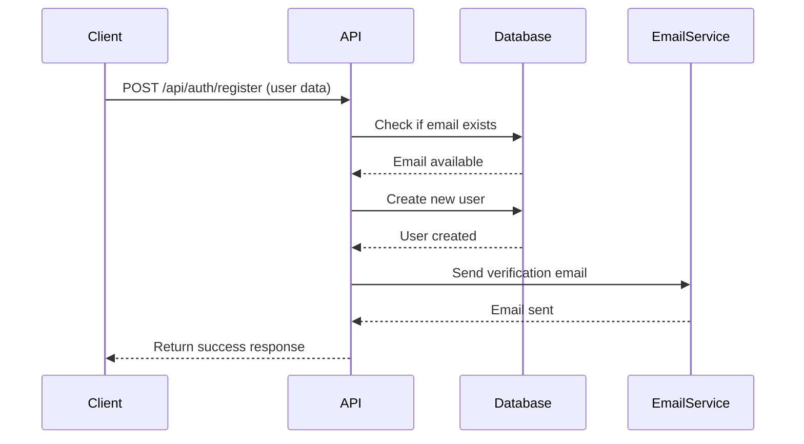
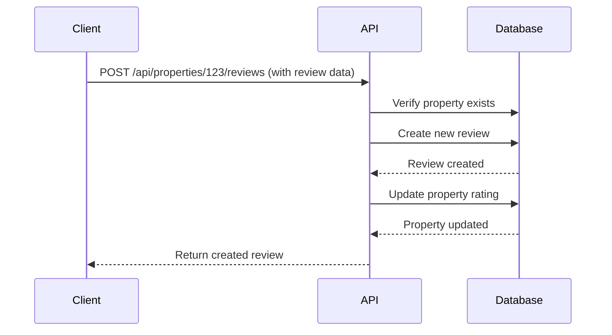
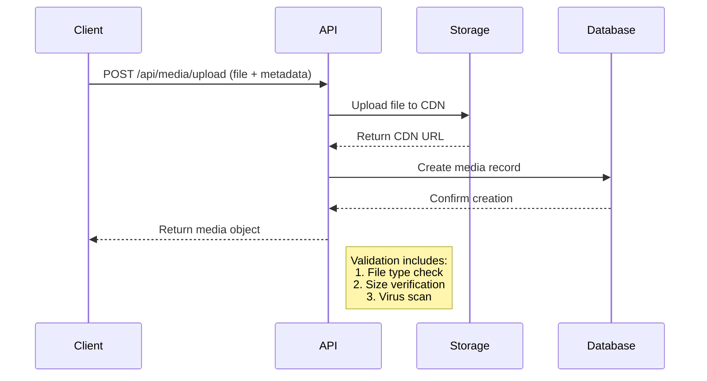
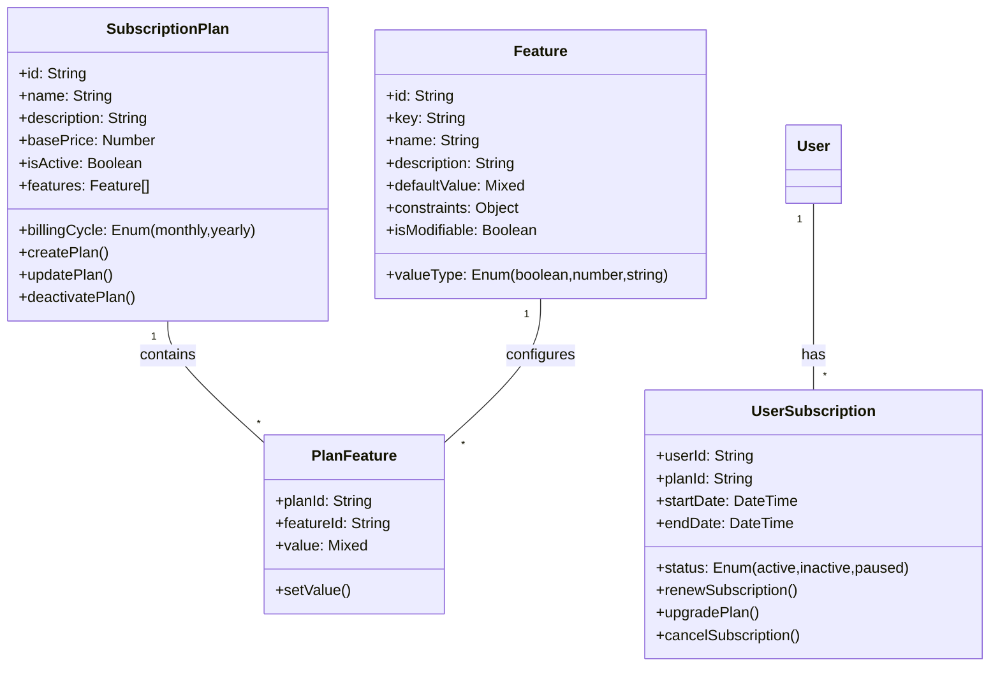
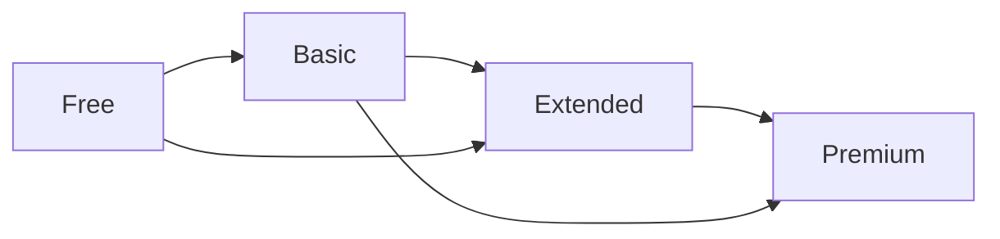
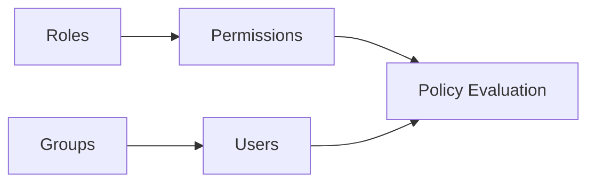

ctr+ shift + p --> pdf

# Real Estate Listing and Management System - API Documentation - part1

## Class Diagram




## API Endpoints Reference

### Authentication

| Method | Endpoint                     | Description                  | Requires Auth |
|--------|------------------------------|------------------------------|---------------|
| POST   | `/api/auth/register`         | Register new user            | No            |
| POST   | `/api/auth/login`            | User login                   | No            |
| POST   | `/api/auth/logout`           | User logout                  | Yes           |
| POST   | `/api/auth/forgot-password`  | Request password reset       | No            |
| POST   | `/api/auth/reset-password`   | Reset password               | Yes           |

### Users

| Method | Endpoint                     | Description                  |
|--------|------------------------------|------------------------------|
| GET    | `/api/users/me`              | Get current user profile     |
| PUT    | `/api/users/me`              | Update current user profile  |
| DELETE | `/api/users/me`              | Remove current user          |

### Properties

| Method | Endpoint                               | Description                          |
|--------|----------------------------------------|--------------------------------------|
| GET    | `/api/properties`                      | List all properties (filterable)     |
| POST   | `/api/properties`                      | Create new property                  |
| GET    | `/api/properties/:id`                  | Get property details                 |
| PUT    | `/api/properties/:id`                  | Update property                      |
| DELETE | `/api/properties/:id`                  | Delete property                      |
| GET    | `/api/properties/me`                   | Get current user's properties        |
| POST   | `/api/properties/:id/media`            | Upload property media                |
| DELETE | `/api/properties/:id/media/:mediaId`   | Delete property media                |

### Wishlist

| Method | Endpoint                     | Description                  |
|--------|------------------------------|------------------------------|
| GET    | `/api/wishlist`              | Get user's wishlist          |
| POST   | `/api/wishlist/:propertyId`  | Add property to wishlist     |
| DELETE | `/api/wishlist/:propertyId`  | Remove from wishlist         |
| DELETE | `/api/wishlist`              | Clear entire wishlist        |

### Search

| Method | Endpoint                     | Description                  |
|--------|------------------------------|------------------------------|
| GET    | `/api/search`                | Search properties            |
| GET    | `/api/search/suggestions`    | Get search suggestions       |

### Reviews

| Method | Endpoint                     | Description                  |
|--------|------------------------------|------------------------------|
| GET    | `/api/properties/:id/reviews`| Get property reviews         |
| POST   | `/api/properties/:id/reviews`| Add review to property       |
| DELETE | `/api/reviews/:id`           | Delete review                |


### Media/Images Management

| Method | Endpoint                               | Description                          | Parameters                                                                 |
|--------|----------------------------------------|--------------------------------------|----------------------------------------------------------------------------|
| POST   | `/api/media/upload`                    | Upload media file                    | `file` (required), `type` (property|avatar), `propertyId` (if type=property) |
| GET    | `/api/media/:mediaId`                  | Get media metadata                   | -                                                                          |
| DELETE | `/api/media/:mediaId`                  | Delete media                         | -                                                                          |
| GET    | `/api/properties/:id/media`            | List all media for property          | `?type=image|video|document` (filter by type)                           |

**Media Object Properties:**
```json
{
  "id": "media_123",
  "url": "https://cdn.example.com/properties/media_123.jpg",
  "type": "image",
  "format": "jpg",
  "width": 1920,
  "height": 1080,
  "size": 1245789,
  "createdAt": "2023-11-15T10:00:00Z",
  "metadata": {
    "propertyId": "prop_123",
    "uploadedBy": "user_456",
    "isPrimary": true
  }
}

## Request/Response Examples

### Property Creation (POST /api/properties)

**Request:**
```json
{
  "title": "Modern Downtown Apartment",
  "description": "Luxury apartment with city views",
  "price": 250000,
  "type": "sale",
  "category": "apartment",
  "bedrooms": 2,
  "bathrooms": 2,
  "area": 1200,
  "location": {
    "address": "123 Main St",
    "city": "New York",
    "state": "NY",
    "coordinates": {
      "lat": 40.7128,
      "lng": -74.0060
    }
  },
  "amenities": ["wifi", "parking", "gym"]
}
````
# Diagrams

1. Property Listing Search



2. Add Property to Wishlist



3. Create New Property Listing



4. User Registration



5. Property Review Submission


5. Media Upload Flow



# Subscription Module Documentation

## Overview
The subscription module provides flexible, configurable pricing plans for property management system users. Each feature can be independently configured per plan, allowing administrators to customize offerings without code changes.

## Class Diagram



## Available Subscription Plans & Features

| Feature                     | Free (Basic)       | Basic ($10/month) | Extended ($20/month) | Premium ($40/month) |
|-----------------------------|--------------------|-------------------|-----------------------|---------------------|
| **Property Listings**       | 1 property         | 20 properties     | Unlimited             | Unlimited           |
| **Built-in Chat**           | ❌ Not available   | ❌ Not available  | ✔️ Enabled            | ✔️ Enabled          |
| **Email Integration**       | Basic forwarding   | Basic forwarding  | Dedicated inbox       | Dedicated inbox     |
| **Availability Duration**   | 30 days            | 50 days          | 100 days              | Lifetime            |
| **Customer Support**        | ❌ No support      | ❌ No support     | 📞 Business hours     | 🕒 24/7 support     |
| **Featured Listings**       | ❌ Normal ranking  | ❌ Normal ranking | ❌ Normal ranking     | ⭐ Featured boost   |
| **Analytics Dashboard**     | ❌ Not available   | ❌ Not available  | 📊 Basic metrics      | 📈 Advanced analytics|
| **Mobile App Access**       | ❌ Web only        | ❌ Web only       | ✔️ Basic app          | ✔️ Full app         |
| **API Access**              | ❌ Not available   | 100 calls/day     | 500 calls/day         | Unlimited calls     |
| **File Storage**            | 100 MB             | 1 GB              | 5 GB                  | 20 GB               |

### Key Differences

**Free Plan:**
- Ideal for individual landlords testing the platform
- Limited to 1 active property listing
- Basic contact management only

**Basic Plan ($10):**
- Suitable for small property managers
- 20 active listings
- No chat or premium support

**Extended Plan ($20):**
- Best for growing agencies
- Unlimited listings
- Business hours support
- Basic analytics

**Premium Plan ($40):**
- Enterprise-grade features
- 24/7 priority support
- Featured listing placement
- Advanced reporting tools

### Upgrade Paths



## Business Rules
Feature Access Flow

```mermaid
    sequenceDiagram
    participant User
    participant System
    participant FeatureToggle
    
    User->>System: Attempt to list 21st property
    System->>FeatureToggle: Check listing_limit
    FeatureToggle-->>System: Max 20 (Basic plan)
    System-->>User: Return "Limit exceeded" error + upgrade prompt
````


```mermaid
   flowchart TD
    A[Start Upgrade] --> B{Valid Payment?}
    B -->|Yes| C[Prorate Charges]
    C --> D[Apply New Features]
    D --> E[Confirm Upgrade]
    B -->|No| F[Show Payment Error]

````


## Subscription API Endpoints Reference

| Method | Endpoint | Description | Requires Auth |
|--------|----------|-------------|---------------|
| `GET`  | `/api/subscriptions/plans` | List all available subscription plans | No |
| `GET`  | `/api/subscriptions/plans/:id` | Get details of a specific plan | No |
| `POST` | `/api/subscriptions/plans` | Create a new subscription plan (Admin) | Yes (Admin) |
| `PUT`  | `/api/subscriptions/plans/:id` | Update a subscription plan (Admin) | Yes (Admin) |
| `DELETE` | `/api/subscriptions/plans/:id` | Deactivate a plan (Admin) | Yes (Admin) |
| `GET`  | `/api/subscriptions/features` | List all available features | No |
| `PATCH` | `/api/subscriptions/plans/:id/features` | Update features for a plan (Admin) | Yes (Admin) |
| `GET`  | `/api/subscriptions/user/:userId` | Get user's current subscription | Yes |
| `POST` | `/api/subscriptions/user` | Create new subscription for user | Yes |
| `POST` | `/api/subscriptions/user/upgrade` | Upgrade user's subscription plan | Yes |
| `POST` | `/api/subscriptions/user/downgrade` | Downgrade user's subscription plan | Yes |
| `POST` | `/api/subscriptions/user/cancel` | Cancel user's subscription | Yes |
| `GET`  | `/api/subscriptions/user/:userId/invoices` | Get user's payment history | Yes |
| `GET`  | `/api/subscriptions/user/:userId/usage` | Get feature usage statistics | Yes |
| `POST` | `/api/subscriptions/webhook/payment` | Payment gateway webhook endpoint | No |
| `POST` | `/api/subscriptions/trial` | Start free trial (if available) | Yes |
| `GET`  | `/api/subscriptions/coupons/:code` | Validate discount coupon | No |
| `POST` | `/api/subscriptions/renew` | Manual subscription renewal | Yes |

Authentication:

Yes - Requires valid JWT token

Yes (Admin) - Requires admin privileges

No - Publicly accessible


This table provides a comprehensive overview of all subscription-related API endpoints while keeping the documentation clean and focused on the essential routing information. 

The actual request/response schemas will be documented separately in an API specification document.


## Modeule - Policy 

# Policy Module - Role-Based Access Control (RBAC) with Groups

## Class Diagram

```mermaid
classDiagram
    class User {
        +id: String
        +username: String
        +email: String
        +groups: Group[]
        +hasPermission()
        +addToGroup()
    }

    class Group {
        +id: String
        +name: String
        +description: String
        +roles: Role[]
        +users: User[]
        +addRole()
        +removeRole()
    }

    class Role {
        +id: String
        +name: String
        +permissions: Permission[]
        +addPermission()
    }

    class Permission {
        +id: String
        +resource: String
        +action: String (create|read|update|delete|manage)
        +constraints: JSON
    }

    User "n" -- "m" Group: belongs to
    Group "1" -- "n" Role: contains
    Role "1" -- "n" Permission: has


 ```

# Policy Module - Core Components

## 1. Permission Structure

### Permission Object

```json
{
  "id": "perm_property_delete",
  "resource": "property",
  "action": "delete",
  "constraints": {
    "scope": "group",
    "conditions": {
      "status": ["active", "pending"],
      "max_value": 500000
    }
  }
}
```

##### Note: Custom roles can override inherited permissions but cannot exceed parent role privileges.

# Policy Management API Endpoints

## Role Management

| Method | Endpoint | Description | Required Permissions |
|--------|----------|-------------|----------------------|
| `POST`   | `/api/policy/roles` | Create new role | `policy:roles:create` |
| `GET`    | `/api/policy/roles` | List all roles | `policy:roles:read` |
| `GET`    | `/api/policy/roles/:roleId` | Get role details | `policy:roles:read` |
| `PUT`    | `/api/policy/roles/:roleId` | Update role | `policy:roles:update` |
| `DELETE` | `/api/policy/roles/:roleId` | Delete role | `policy:roles:delete` |

## Permission Management

| Method | Endpoint | Description | Required Permissions |
|--------|----------|-------------|----------------------|
| `POST`   | `/api/policy/roles/:roleId/permissions` | Add permission to role | `policy:permissions:create` |
| `GET`    | `/api/policy/roles/:roleId/permissions` | List role permissions | `policy:permissions:read` |
| `DELETE` | `/api/policy/roles/:roleId/permissions/:permissionId` | Remove permission | `policy:permissions:delete` |

## Group Management

| Method | Endpoint | Description | Required Permissions |
|--------|----------|-------------|----------------------|
| `POST`   | `/api/policy/groups` | Create new group | `policy:groups:create` |
| `GET`    | `/api/policy/groups` | List all groups | `policy:groups:read` |
| `GET`    | `/api/policy/groups/:groupId` | Get group details | `policy:groups:read` |
| `PUT`    | `/api/policy/groups/:groupId` | Update group | `policy:groups:update` |
| `DELETE` | `/api/policy/groups/:groupId` | Delete group | `policy:groups:delete` |

## User Assignment

| Method | Endpoint | Description | Required Permissions |
|--------|----------|-------------|----------------------|
| `POST`   | `/api/policy/groups/:groupId/users` | Add user to group | `policy:assignments:create` |
| `GET`    | `/api/policy/groups/:groupId/users` | List group users | `policy:assignments:read` |
| `DELETE` | `/api/policy/groups/:groupId/users/:userId` | Remove user from group | `policy:assignments:delete` |
| `PUT`    | `/api/policy/users/:userId/roles` | Set user's roles | `policy:assignments:update` |

## Policy Evaluation

| Method | Endpoint | Description | Required Permissions |
|--------|----------|-------------|----------------------|
| `POST`   | `/api/policy/evaluate` | Check permissions | `policy:evaluate` |
| `GET`    | `/api/policy/users/:userId/permissions` | List user's effective permissions | `policy:permissions:read` |

## Audit Logs

| Method | Endpoint | Description | Required Permissions |
|--------|----------|-------------|----------------------|
| `GET`    | `/api/policy/audit` | Query policy changes | `policy:audit:read` |
| `GET`    | `/api/policy/audit/:userId` | Get user's policy history | `policy:audit:read` |

## Notes:
1. **Base Path**: All endpoints are prefixed with `/v1`
2. **Authentication**: Requires valid JWT with appropriate permissions
3. **Rate Limiting**:
   - 60 requests/minute for read operations
   - 30 requests/minute for write operations
4. **Response Format**: All endpoints return JSON
5. **Error Codes**:
   - `403 Forbidden` - Insufficient permissions
   - `404 Not Found` - Resource doesn't exist
   - `409 Conflict` - Invalid state change



# Predefined Roles Reference

## Core System Roles

| Role | Key Permissions | Constraints | Group Inheritance | Ideal For |
|------|----------------|-------------|-------------------|-----------|
| **Super Admin**<br>*(system:admin)* | `*:*` (All permissions) | None | Applies to all groups | System administrators |
| **Group Owner**<br>*(group:owner)* | <ul><li>`users:manage`</li><li>`roles:assign`</li><li>`properties:manage`</li></ul> | <ul><li>Scope: Own group</li><li>Max 5 role creations</li></ul> | Inheritable by subgroups | Team leads, Office managers |
| **Property Manager**<br>*(property:manager)* | <ul><li>`properties:crud`</li><li>`contracts:read`</li><li>`tenants:manage`</li></ul> | <ul><li>Scope: Assigned properties</li><li>Max 50 properties</li></ul> | Inherits group member permissions | Leasing agents, Brokers |
| **Agent**<br>*(property:agent)* | <ul><li>`properties:read`</li><li>`contacts:create`</li><li>`showings:manage`</li></ul> | <ul><li>Scope: Own listings</li><li>No deletion rights</li></ul> | Inherits basic permissions | Sales agents, Showing staff |
| **Guest**<br>*(system:guest)* | <ul><li>`properties:read`</li><li>`analytics:read`</li></ul> | <ul><li>No write actions</li><li>API rate-limited</li></ul> | No inheritance | Prospective clients, Auditors |

## Specialized Roles

| Role | Key Permissions | Constraints | Use Case |
|------|----------------|-------------|----------|
| **Finance**<br>*(finance:analyst)* | <ul><li>`invoices:crud`</li><li>`reports:generate`</li></ul> | <ul><li>Time: Business hours</li><li>Amount limit: $10k</li></ul> | Accounting teams |
| **Maintenance**<br>*(property:tech)* | <ul><li>`workorders:crud`</li><li>`properties:read`</li></ul> | <ul><li>Scope: Assigned locations</li><li>No financial data</li></ul> | Facility management |
| **Marketing**<br>*(marketing:specialist)* | <ul><li>`listings:feature`</li><li>`content:publish`</li></ul> | <ul><li>Approval required</li><li>Brand guidelines</li></ul> | Marketing teams |

## Permission Legend

- **CRUD**: Create, Read, Update, Delete
- **Scope Types**:
  - `own`: Only user-created resources
  - `group`: Resources within user's group(s)
  - `all`: System-wide access

## Role Inheritance Example
```mermaid
flowchart TD
    A[Super Admin] --> B[Group Owner]
    B --> C[Property Manager]
    C --> D[Agent]
    D --> E[Guest]
    B --> F[Finance]
    B --> G[Maintenance]
````

