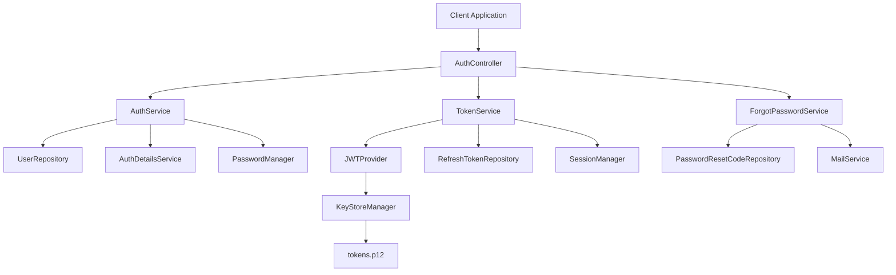
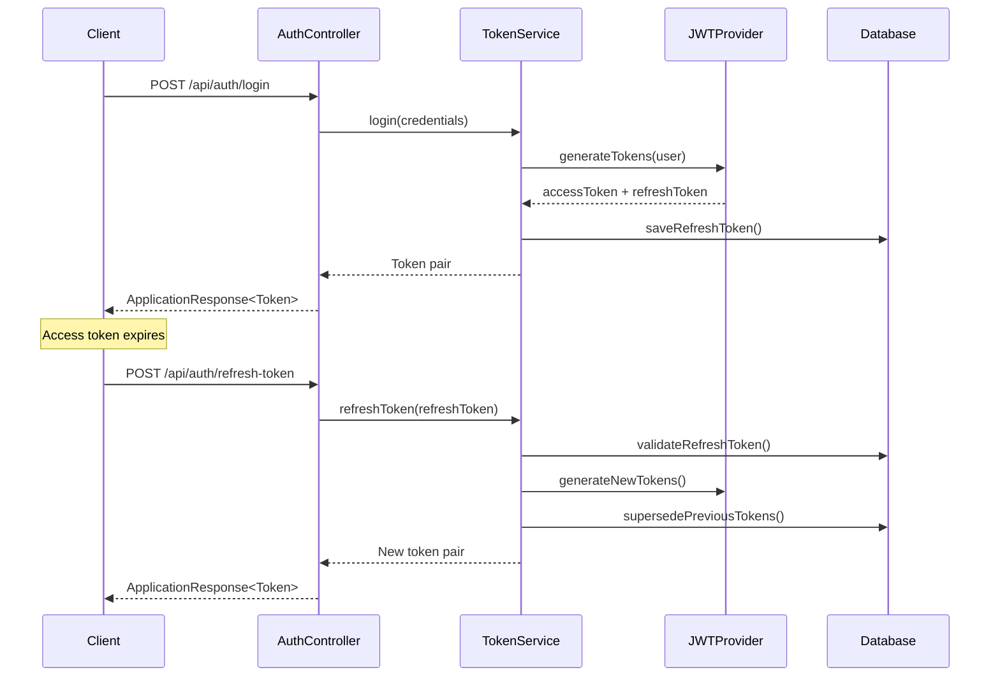

# Authentication Endpoints Guide

## Overview

The Imovel API provides a comprehensive authentication system with JWT-based token management, secure password handling, and multi-device session support. This guide covers all authentication endpoints, their usage, and implementation details.

## Table of Contents

1. [Authentication System Architecture](#authentication-system-architecture)
2. [Security Features](#security-features)
3. [API Endpoints](#api-endpoints)
4. [Request/Response Models](#requestresponse-models)
5. [PowerShell Usage Examples](#powershell-usage-examples)
6. [Error Handling](#error-handling)
7. [Best Practices](#best-practices)
8. [Security Considerations](#security-considerations)

## Authentication System Architecture

### Core Components



### Token Management Flow



## Security Features

### 🔐 JWT Token Security
- **Dual Token System**: Separate access and refresh tokens
- **Token Rotation**: Refresh tokens are superseded on each refresh
- **Device Fingerprinting**: Tokens bound to device characteristics
- **Automatic Expiration**: Configurable token lifetimes
- **Revocation Support**: Immediate token invalidation

### 🛡️ Password Security
- **Secure Hashing**: BCrypt with salt
- **Password Reset**: Time-limited 5-digit codes
- **Password Change**: Current password verification required
- **Email Validation**: Comprehensive email format checking

### 🔒 Session Management
- **Multi-Device Support**: Multiple active sessions per user
- **Session Limits**: Configurable maximum concurrent sessions
- **Device Tracking**: IP address and user agent logging
- **Logout Options**: Single device or all devices

## API Endpoints

### Base URL
```
https://api.imovel.com/api/auth
```

### 1. User Registration

**Endpoint:** `POST /api/auth/register`

**Description:** Register a new user account with email verification.

**Authentication:** Not required

**Request Body:**
```json
{
  "name": "John Doe",
  "email": "john.doe@example.com",
  "password": "SecurePassword123!",
  "phone": "+1234567890"
}
```

**Success Response (201):**
```json
{
  "success": true,
  "data": {
    "id": 123,
    "name": "John Doe",
    "email": "john.doe@example.com",
    "phone": "+1234567890",
    "role": "CLIENT",
    "createdAt": "2024-01-15T10:30:00Z"
  },
  "message": "User registered successfully",
  "error": null,
  "timestamp": "2024-01-15T10:30:00.123Z"
}
```

**PowerShell Example:**
```powershell
$registerData = @{
    name = "John Doe"
    email = "john.doe@example.com"
    password = "SecurePassword123!"
    phone = "+1234567890"
} | ConvertTo-Json

$response = Invoke-WebRequest -Uri "https://api.imovel.com/api/auth/register" `
                             -Method POST `
                             -Body $registerData `
                             -ContentType "application/json"

$result = $response.Content | ConvertFrom-Json
Write-Host "Registration successful! User ID: $($result.data.id)"
```

### 2. User Login

**Endpoint:** `POST /api/auth/login`

**Description:** Authenticate user and receive access/refresh token pair.

**Authentication:** Not required

**Request Body:**
```json
{
  "email": "john.doe@example.com",
  "password": "SecurePassword123!"
}
```

**Success Response (200):**
```json
{
  "success": true,
  "data": {
    "accessToken": "eyJhbGciOiJIUzI1NiIsInR5cCI6IkpXVCJ9.eyJzdWIiOiIxMjMiLCJlbWFpbCI6ImpvaG4uZG9lQGV4YW1wbGUuY29tIiwiaWF0IjoxNjQyMjQ4MDAwLCJleHAiOjE2NDIyNTE2MDB9.signature",
    "refreshToken": "eyJhbGciOiJIUzI1NiIsInR5cCI6IkpXVCJ9.eyJzdWIiOiIxMjMiLCJ0eXBlIjoicmVmcmVzaCIsImlhdCI6MTY0MjI0ODAwMCwiZXhwIjoxNjQyODUyODAwfQ.signature"
  },
  "message": "Login successful",
  "error": null,
  "timestamp": "2024-01-15T10:30:00.123Z"
}
```

**PowerShell Example:**
```powershell
function Login-User {
    param(
        [string]$Email,
        [string]$Password
    )
    
    $loginData = @{
        email = $Email
        password = $Password
    } | ConvertTo-Json
    
    try {
        $response = Invoke-WebRequest -Uri "https://api.imovel.com/api/auth/login" `
                                     -Method POST `
                                     -Body $loginData `
                                     -ContentType "application/json"
        
        $loginResult = $response.Content | ConvertFrom-Json
        
        if ($loginResult.success) {
            # Store tokens globally
            $global:accessToken = $loginResult.data.accessToken
            $global:refreshToken = $loginResult.data.refreshToken
            $global:authHeaders = @{
                "Authorization" = "Bearer $($global:accessToken)"
                "Content-Type" = "application/json"
            }
            
            Write-Host "✅ Login successful!" -ForegroundColor Green
            return $loginResult
        }
    }
    catch {
        Write-Error "❌ Login failed: $($_.Exception.Message)"
        return $null
    }
}

# Usage
$loginResult = Login-User -Email "john.doe@example.com" -Password "SecurePassword123!"
```

### 3. Refresh Token

**Endpoint:** `POST /api/auth/refresh-token`

**Description:** Get new access token using valid refresh token.

**Authentication:** Not required (uses refresh token)

**Request Body:**
```json
{
  "refreshToken": "eyJhbGciOiJIUzI1NiIsInR5cCI6IkpXVCJ9..."
}
```

**Success Response (200):**
```json
{
  "success": true,
  "data": {
    "accessToken": "eyJhbGciOiJIUzI1NiIsInR5cCI6IkpXVCJ9.new_access_token...",
    "refreshToken": "eyJhbGciOiJIUzI1NiIsInR5cCI6IkpXVCJ9.new_refresh_token..."
  },
  "message": "Token refreshed successfully",
  "error": null,
  "timestamp": "2024-01-15T10:45:00.123Z"
}
```

**PowerShell Example:**
```powershell
function Refresh-AuthToken {
    if (-not $global:refreshToken) {
        Write-Error "❌ No refresh token available"
        return $false
    }
    
    $refreshData = @{
        refreshToken = $global:refreshToken
    } | ConvertTo-Json
    
    try {
        $response = Invoke-WebRequest -Uri "https://api.imovel.com/api/auth/refresh-token" `
                                     -Method POST `
                                     -Body $refreshData `
                                     -ContentType "application/json"
        
        $refreshResult = $response.Content | ConvertFrom-Json
        
        if ($refreshResult.success) {
            # Update global tokens
            $global:accessToken = $refreshResult.data.accessToken
            $global:refreshToken = $refreshResult.data.refreshToken
            $global:authHeaders["Authorization"] = "Bearer $($global:accessToken)"
            
            Write-Host "✅ Token refreshed successfully!" -ForegroundColor Green
            return $true
        }
    }
    catch {
        Write-Error "❌ Token refresh failed: $($_.Exception.Message)"
        return $false
    }
}

# Auto-refresh function
function Invoke-AuthenticatedRequest {
    param(
        [string]$Uri,
        [string]$Method = "GET",
        [string]$Body = $null
    )
    
    try {
        $params = @{
            Uri = $Uri
            Method = $Method
            Headers = $global:authHeaders
        }
        
        if ($Body) { $params.Body = $Body }
        
        return Invoke-WebRequest @params
    }
    catch {
        if ($_.Exception.Response.StatusCode -eq 401) {
            Write-Host "🔄 Access token expired, refreshing..." -ForegroundColor Yellow
            if (Refresh-AuthToken) {
                # Retry with new token
                $global:authHeaders["Authorization"] = "Bearer $($global:accessToken)"
                $params.Headers = $global:authHeaders
                return Invoke-WebRequest @params
            }
        }
        throw
    }
}
```

### 4. Logout (Single Device)

**Endpoint:** `POST /api/auth/logout`

**Description:** Logout from current device and invalidate refresh token.

**Authentication:** Required (Bearer token)

**Request Body:**
```json
{
  "refreshToken": "eyJhbGciOiJIUzI1NiIsInR5cCI6IkpXVCJ9..."
}
```

**Success Response (200):**
```json
{
  "success": true,
  "data": null,
  "message": "Logged out successfully",
  "error": null,
  "timestamp": "2024-01-15T11:00:00.123Z"
}
```

**PowerShell Example:**
```powershell
function Logout-User {
    if (-not $global:refreshToken) {
        Write-Warning "⚠️ No active session to logout"
        return
    }
    
    $logoutData = @{
        refreshToken = $global:refreshToken
    } | ConvertTo-Json
    
    try {
        $response = Invoke-WebRequest -Uri "https://api.imovel.com/api/auth/logout" `
                                     -Method POST `
                                     -Body $logoutData `
                                     -Headers $global:authHeaders
        
        $logoutResult = $response.Content | ConvertFrom-Json
        
        if ($logoutResult.success) {
            # Clear global tokens
            $global:accessToken = $null
            $global:refreshToken = $null
            $global:authHeaders = @{"Content-Type" = "application/json"}
            
            Write-Host "✅ Logged out successfully!" -ForegroundColor Green
        }
    }
    catch {
        Write-Error "❌ Logout failed: $($_.Exception.Message)"
    }
}
```

### 5. Logout All Devices

**Endpoint:** `POST /api/auth/logout-all`

**Description:** Logout from all devices and revoke all refresh tokens.

**Authentication:** Required (Bearer token)

**Request Body:** Empty

**Success Response (200):**
```json
{
  "success": true,
  "data": null,
  "message": "Logged out from all devices successfully",
  "error": null,
  "timestamp": "2024-01-15T11:00:00.123Z"
}
```

**PowerShell Example:**
```powershell
function Logout-AllDevices {
    try {
        $response = Invoke-WebRequest -Uri "https://api.imovel.com/api/auth/logout-all" `
                                     -Method POST `
                                     -Headers $global:authHeaders
        
        $result = $response.Content | ConvertFrom-Json
        
        if ($result.success) {
            # Clear global tokens
            $global:accessToken = $null
            $global:refreshToken = $null
            $global:authHeaders = @{"Content-Type" = "application/json"}
            
            Write-Host "✅ Logged out from all devices!" -ForegroundColor Green
        }
    }
    catch {
        Write-Error "❌ Logout all devices failed: $($_.Exception.Message)"
    }
}
```

### 6. Forgot Password

**Endpoint:** `POST /api/auth/forgot-password`

**Description:** Request password reset code via email.

**Authentication:** Not required

**Request Body:**
```json
{
  "email": "john.doe@example.com"
}
```

**Success Response (200):**
```json
{
  "success": true,
  "data": null,
  "message": "Password reset code sent to email",
  "error": null,
  "timestamp": "2024-01-15T11:15:00.123Z"
}
```

**PowerShell Example:**
```powershell
function Request-PasswordReset {
    param([string]$Email)
    
    $resetData = @{
        email = $Email
    } | ConvertTo-Json
    
    try {
        $response = Invoke-WebRequest -Uri "https://api.imovel.com/api/auth/forgot-password" `
                                     -Method POST `
                                     -Body $resetData `
                                     -ContentType "application/json"
        
        $result = $response.Content | ConvertFrom-Json
        
        if ($result.success) {
            Write-Host "✅ Password reset code sent to $Email" -ForegroundColor Green
            Write-Host "📧 Check your email for the 5-digit reset code" -ForegroundColor Cyan
        }
    }
    catch {
        Write-Error "❌ Password reset request failed: $($_.Exception.Message)"
    }
}

# Usage
Request-PasswordReset -Email "john.doe@example.com"
```

### 7. Reset Password

**Endpoint:** `POST /api/auth/reset-password`

**Description:** Reset password using email verification code.

**Authentication:** Not required

**Request Body:**
```json
{
  "email": "john.doe@example.com",
  "code": "12345",
  "newPassword": "NewSecurePassword123!"
}
```

**Success Response (200):**
```json
{
  "success": true,
  "data": null,
  "message": "Password reset successfully",
  "error": null,
  "timestamp": "2024-01-15T11:20:00.123Z"
}
```

**PowerShell Example:**
```powershell
function Reset-Password {
    param(
        [string]$Email,
        [string]$Code,
        [string]$NewPassword
    )
    
    $resetData = @{
        email = $Email
        code = $Code
        newPassword = $NewPassword
    } | ConvertTo-Json
    
    try {
        $response = Invoke-WebRequest -Uri "https://api.imovel.com/api/auth/reset-password" `
                                     -Method POST `
                                     -Body $resetData `
                                     -ContentType "application/json"
        
        $result = $response.Content | ConvertFrom-Json
        
        if ($result.success) {
            Write-Host "✅ Password reset successfully!" -ForegroundColor Green
            Write-Host "🔐 You can now login with your new password" -ForegroundColor Cyan
        }
    }
    catch {
        Write-Error "❌ Password reset failed: $($_.Exception.Message)"
    }
}

# Interactive password reset
function Start-InteractivePasswordReset {
    $email = Read-Host "Enter your email address"
    
    # Request reset code
    Request-PasswordReset -Email $email
    
    # Wait for user to receive code
    Write-Host "⏳ Waiting for reset code..." -ForegroundColor Yellow
    $code = Read-Host "Enter the 5-digit code from your email"
    
    # Get new password securely
    $newPassword = Read-Host "Enter your new password" -AsSecureString
    $newPasswordPlain = [Runtime.InteropServices.Marshal]::PtrToStringAuto([Runtime.InteropServices.Marshal]::SecureStringToBSTR($newPassword))
    
    # Reset password
    Reset-Password -Email $email -Code $code -NewPassword $newPasswordPlain
}
```

### 8. Change Password

**Endpoint:** `POST /api/auth/change-password`

**Description:** Change password for authenticated user.

**Authentication:** Required (Bearer token)

**Request Body:**
```json
{
  "currentPassword": "OldPassword123!",
  "newPassword": "NewSecurePassword123!"
}
```

**Success Response (200):**
```json
{
  "success": true,
  "data": null,
  "message": "Password changed successfully",
  "error": null,
  "timestamp": "2024-01-15T11:25:00.123Z"
}
```

**PowerShell Example:**
```powershell
function Change-Password {
    param(
        [string]$CurrentPassword,
        [string]$NewPassword
    )
    
    $changeData = @{
        currentPassword = $CurrentPassword
        newPassword = $NewPassword
    } | ConvertTo-Json
    
    try {
        $response = Invoke-WebRequest -Uri "https://api.imovel.com/api/auth/change-password" `
                                     -Method POST `
                                     -Body $changeData `
                                     -Headers $global:authHeaders
        
        $result = $response.Content | ConvertFrom-Json
        
        if ($result.success) {
            Write-Host "✅ Password changed successfully!" -ForegroundColor Green
            Write-Host "🔐 Your account is now secured with the new password" -ForegroundColor Cyan
        }
    }
    catch {
        Write-Error "❌ Password change failed: $($_.Exception.Message)"
    }
}

# Interactive password change
function Start-InteractivePasswordChange {
    Write-Host "🔐 Password Change" -ForegroundColor Cyan
    
    $currentPassword = Read-Host "Enter your current password" -AsSecureString
    $currentPasswordPlain = [Runtime.InteropServices.Marshal]::PtrToStringAuto([Runtime.InteropServices.Marshal]::SecureStringToBSTR($currentPassword))
    
    $newPassword = Read-Host "Enter your new password" -AsSecureString
    $newPasswordPlain = [Runtime.InteropServices.Marshal]::PtrToStringAuto([Runtime.InteropServices.Marshal]::SecureStringToBSTR($newPassword))
    
    $confirmPassword = Read-Host "Confirm your new password" -AsSecureString
    $confirmPasswordPlain = [Runtime.InteropServices.Marshal]::PtrToStringAuto([Runtime.InteropServices.Marshal]::SecureStringToBSTR($confirmPassword))
    
    if ($newPasswordPlain -ne $confirmPasswordPlain) {
        Write-Error "❌ New passwords do not match!"
        return
    }
    
    Change-Password -CurrentPassword $currentPasswordPlain -NewPassword $newPasswordPlain
}
```

### 9. Debug User (Development Only)

**Endpoint:** `GET /api/auth/debug/{email}`

**Description:** Get user debug information for development purposes.

**Authentication:** Not required (Development only)

**Path Parameters:**
- `email`: User email address

**Success Response (200):**
```json
{
  "success": true,
  "data": {
    "user": {
      "id": 123,
      "email": "john.doe@example.com",
      "name": "John Doe",
      "role": "CLIENT"
    },
    "authDetails": {
      "hasPassword": true,
      "lastLogin": "2024-01-15T10:30:00Z"
    },
    "activeSessions": 2
  },
  "message": "Debug information retrieved",
  "error": null,
  "timestamp": "2024-01-15T11:30:00.123Z"
}
```

### 10. Test Login (Development Only)

**Endpoint:** `POST /api/auth/test-login`

**Description:** Test login endpoint that bypasses aspects for debugging.

**Authentication:** Not required (Development only)

**Request Body:**
```json
{
  "email": "john.doe@example.com",
  "password": "SecurePassword123!"
}
```

## Request/Response Models

### Request DTOs

#### UserRegistrationRequest
```java
public class UserRegistrationRequest {
    private String name;        // Required: User's full name
    private String email;       // Required: Valid email address
    private String password;    // Required: Minimum 8 characters
    private String phone;       // Optional: Phone number
}
```

#### UserLoginRequest
```java
public class UserLoginRequest {
    private String email;       // Required: User's email
    private String password;    // Required: User's password
}
```

#### RefreshTokenRequest
```java
public class RefreshTokenRequest {
    private String accessToken;  // Optional: Current access token
    private String refreshToken; // Required: Valid refresh token
}
```

#### ForgotPasswordRequest
```java
public class ForgotPasswordRequest {
    private String email;       // Required: User's email address
}
```

#### ResetPasswordRequest
```java
public class ResetPasswordRequest {
    private String email;       // Required: User's email address
    private String code;        // Required: 5-digit verification code
    private String newPassword; // Required: New password
}
```

#### ChangePasswordRequest
```java
public class ChangePasswordRequest {
    private String currentPassword; // Required: Current password
    private String newPassword;     // Required: New password
}
```

### Response DTOs

#### Token
```java
public class Token {
    private String accessToken;  // JWT access token (15 min expiry)
    private String refreshToken; // JWT refresh token (7 days expiry)
}
```

#### ApplicationResponse<T>
```java
public class ApplicationResponse<T> {
    private boolean success;     // Operation success status
    private T data;             // Response data (null for void operations)
    private String message;     // Success/info message
    private ErrorDetails error; // Error details (null on success)
    private String timestamp;   // ISO 8601 timestamp
}
```

## PowerShell Usage Examples

### Complete Authentication Session

```powershell
# Initialize API configuration
$global:apiConfig = @{
    baseUrl = "https://api.imovel.com"
    timeout = 30
}

$global:endpoints = @{
    auth = @{
        register = "/api/auth/register"
        login = "/api/auth/login"
        refresh = "/api/auth/refresh-token"
        logout = "/api/auth/logout"
        logoutAll = "/api/auth/logout-all"
        forgotPassword = "/api/auth/forgot-password"
        resetPassword = "/api/auth/reset-password"
        changePassword = "/api/auth/change-password"
    }
}

# Authentication state management
$global:authState = @{
    isAuthenticated = $false
    token = $null
    refreshToken = $null
    tokenExpiry = $null
    user = $null
}

# Default headers
$global:authHeaders = @{
    "Content-Type" = "application/json"
}

# Complete user registration and login flow
function Start-UserRegistration {
    param(
        [string]$Name,
        [string]$Email,
        [string]$Password,
        [string]$Phone = ""
    )
    
    Write-Host "🚀 Starting user registration..." -ForegroundColor Cyan
    
    # Register user
    $registerData = @{
        name = $Name
        email = $Email
        password = $Password
        phone = $Phone
    } | ConvertTo-Json
    
    try {
        $response = Invoke-WebRequest -Uri "$($global:apiConfig.baseUrl)$($global:endpoints.auth.register)" `
                                     -Method POST `
                                     -Body $registerData `
                                     -ContentType "application/json"
        
        $registerResult = $response.Content | ConvertFrom-Json
        
        if ($registerResult.success) {
            Write-Host "✅ Registration successful!" -ForegroundColor Green
            Write-Host "👤 User ID: $($registerResult.data.id)" -ForegroundColor Cyan
            
            # Automatically login after registration
            Write-Host "🔐 Logging in..." -ForegroundColor Yellow
            $loginResult = Login-User -Email $Email -Password $Password
            
            if ($loginResult) {
                Write-Host "🎉 Welcome to Imovel, $Name!" -ForegroundColor Green
                return $loginResult
            }
        }
    }
    catch {
        Write-Error "❌ Registration failed: $($_.Exception.Message)"
        return $null
    }
}

# Token validation and auto-refresh
function Test-TokenValidity {
    if (-not $global:authState.token) {
        return $false
    }
    
    if ($global:authState.tokenExpiry -and (Get-Date) -gt $global:authState.tokenExpiry) {
        Write-Host "⏰ Access token expired, refreshing..." -ForegroundColor Yellow
        return Refresh-AuthToken
    }
    
    return $true
}

# Secure API request wrapper
function Invoke-SecureApiRequest {
    param(
        [string]$Endpoint,
        [string]$Method = "GET",
        [hashtable]$Body = $null,
        [switch]$RequireAuth = $true
    )
    
    if ($RequireAuth -and -not (Test-TokenValidity)) {
        Write-Error "❌ Authentication required and no valid token available"
        return $null
    }
    
    $uri = "$($global:apiConfig.baseUrl)$Endpoint"
    $headers = $global:authHeaders.Clone()
    
    if ($RequireAuth -and $global:authState.token) {
        $headers["Authorization"] = "Bearer $($global:authState.token)"
    }
    
    $params = @{
        Uri = $uri
        Method = $Method
        Headers = $headers
        TimeoutSec = $global:apiConfig.timeout
    }
    
    if ($Body) {
        $params.Body = $Body | ConvertTo-Json -Depth 10
    }
    
    try {
        $response = Invoke-WebRequest @params
        return $response.Content | ConvertFrom-Json
    }
    catch {
        if ($_.Exception.Response.StatusCode -eq 401 -and $RequireAuth) {
            Write-Host "🔄 Unauthorized, attempting token refresh..." -ForegroundColor Yellow
            if (Refresh-AuthToken) {
                # Retry with new token
                $headers["Authorization"] = "Bearer $($global:authState.token)"
                $params.Headers = $headers
                $response = Invoke-WebRequest @params
                return $response.Content | ConvertFrom-Json
            }
        }
        throw
    }
}

# Usage examples
Write-Host "🏠 Imovel API Authentication Demo" -ForegroundColor Cyan
Write-Host "=================================" -ForegroundColor Cyan

# Register new user
$newUser = Start-UserRegistration -Name "Jane Smith" -Email "jane.smith@example.com" -Password "SecurePass123!" -Phone "+1987654321"

# Test authenticated request
if ($global:authState.isAuthenticated) {
    Write-Host "🔍 Testing authenticated request..." -ForegroundColor Yellow
    $userProfile = Invoke-SecureApiRequest -Endpoint "/api/users/me" -Method GET
    Write-Host "👤 Current user: $($userProfile.data.name)" -ForegroundColor Green
}

# Change password
Start-InteractivePasswordChange

# Logout
Logout-User
```

### Batch Operations

```powershell
# Batch user operations
function Invoke-BatchUserOperations {
    param(
        [array]$Users,
        [string]$AdminEmail,
        [string]$AdminPassword
    )
    
    # Admin login
    Write-Host "🔐 Admin login..." -ForegroundColor Cyan
    $adminLogin = Login-User -Email $AdminEmail -Password $AdminPassword
    
    if (-not $adminLogin) {
        Write-Error "❌ Admin login failed"
        return
    }
    
    $results = @()
    
    foreach ($user in $Users) {
        Write-Host "👤 Processing user: $($user.email)" -ForegroundColor Yellow
        
        try {
            # Register user
            $registerResult = Invoke-SecureApiRequest -Endpoint $global:endpoints.auth.register `
                                                     -Method POST `
                                                     -Body $user `
                                                     -RequireAuth:$false
            
            if ($registerResult.success) {
                $results += @{
                    email = $user.email
                    status = "success"
                    userId = $registerResult.data.id
                    message = "User registered successfully"
                }
                Write-Host "✅ $($user.email) registered" -ForegroundColor Green
            }
        }
        catch {
            $results += @{
                email = $user.email
                status = "failed"
                userId = $null
                message = $_.Exception.Message
            }
            Write-Host "❌ $($user.email) failed: $($_.Exception.Message)" -ForegroundColor Red
        }
        
        Start-Sleep -Milliseconds 500  # Rate limiting
    }
    
    # Generate report
    Write-Host "`n📊 Batch Operation Report" -ForegroundColor Cyan
    Write-Host "=========================" -ForegroundColor Cyan
    
    $successful = ($results | Where-Object { $_.status -eq "success" }).Count
    $failed = ($results | Where-Object { $_.status -eq "failed" }).Count
    
    Write-Host "✅ Successful: $successful" -ForegroundColor Green
    Write-Host "❌ Failed: $failed" -ForegroundColor Red
    
    return $results
}

# Example batch users
$batchUsers = @(
    @{ name = "User One"; email = "user1@example.com"; password = "Password123!"; phone = "+1111111111" },
    @{ name = "User Two"; email = "user2@example.com"; password = "Password123!"; phone = "+2222222222" },
    @{ name = "User Three"; email = "user3@example.com"; password = "Password123!"; phone = "+3333333333" }
)

$batchResults = Invoke-BatchUserOperations -Users $batchUsers -AdminEmail "admin@imovel.com" -AdminPassword "AdminPass123!"
```

## Error Handling

### Common Error Codes

| Code | Message | HTTP Status | Description |
|------|---------|-------------|-------------|
| 1001 | Invalid email format | 409 | Email format validation failed |
| 1002 | Email already exists | 409 | Registration with existing email |
| 1003 | Authentication failed | 401 | Invalid login credentials |
| 1004 | Invalid refresh token | 401 | Refresh token is invalid or expired |
| 1005 | Refresh token not found | 401 | Refresh token not in database |
| 1006 | Refresh token expired | 401 | Refresh token has expired |
| 1007 | Invalid payload | 400 | Request body validation failed |
| 1008 | Missing required fields | 400 | Required fields not provided |
| 1009 | Invalid credentials | 401 | Password reset with invalid code |

### Error Response Format

```json
{
  "success": false,
  "data": null,
  "message": "",
  "error": {
    "code": 1003,
    "message": "Authentication failed",
    "details": "Invalid email or password",
    "timestamp": "2024-01-15T11:30:00.123Z"
  },
  "timestamp": "2024-01-15T11:30:00.123Z"
}
```

### PowerShell Error Handling

```powershell
function Handle-ApiError {
    param(
        [System.Management.Automation.ErrorRecord]$ErrorRecord
    )
    
    try {
        $errorResponse = $ErrorRecord.Exception.Response
        $statusCode = $errorResponse.StatusCode
        
        $reader = New-Object System.IO.StreamReader($errorResponse.GetResponseStream())
        $errorContent = $reader.ReadToEnd()
        $errorData = $errorContent | ConvertFrom-Json
        
        Write-Host "❌ API Error Details:" -ForegroundColor Red
        Write-Host "   Status Code: $statusCode" -ForegroundColor Yellow
        Write-Host "   Error Code: $($errorData.error.code)" -ForegroundColor Yellow
        Write-Host "   Message: $($errorData.error.message)" -ForegroundColor Yellow
        
        if ($errorData.error.details) {
            Write-Host "   Details: $($errorData.error.details)" -ForegroundColor Yellow
        }
        
        return $errorData
    }
    catch {
        Write-Host "❌ Failed to parse error response: $($ErrorRecord.Exception.Message)" -ForegroundColor Red
        return $null
    }
}

# Enhanced API request with error handling
function Invoke-ApiRequestWithErrorHandling {
    param(
        [string]$Uri,
        [string]$Method = "GET",
        [hashtable]$Body = $null,
        [hashtable]$Headers = @{}
    )
    
    try {
        $params = @{
            Uri = $Uri
            Method = $Method
            Headers = $Headers
            ContentType = "application/json"
        }
        
        if ($Body) {
            $params.Body = $Body | ConvertTo-Json -Depth 10
        }
        
        $response = Invoke-WebRequest @params
        return $response.Content | ConvertFrom-Json
    }
    catch {
        $errorDetails = Handle-ApiError -ErrorRecord $_
        
        # Handle specific error codes
        switch ($errorDetails.error.code) {
            1003 { # Authentication failed
                Write-Host "🔐 Please check your email and password" -ForegroundColor Cyan
            }
            1002 { # Email already exists
                Write-Host "📧 This email is already registered. Try logging in instead." -ForegroundColor Cyan
            }
            1004 { # Invalid refresh token
                Write-Host "🔄 Session expired. Please login again." -ForegroundColor Cyan
                $global:authState.isAuthenticated = $false
            }
            default {
                Write-Host "ℹ️ Please try again or contact support if the problem persists." -ForegroundColor Cyan
            }
        }
        
        return $errorDetails
    }
}
```

## Best Practices

### 🔐 Security Best Practices

1. **Token Storage**
   ```powershell
   # Store tokens securely (avoid plain text files)
   $secureToken = ConvertTo-SecureString $accessToken -AsPlainText -Force
   $encryptedToken = ConvertFrom-SecureString $secureToken
   ```

2. **Password Handling**
   ```powershell
   # Always use SecureString for password input
   $password = Read-Host "Enter password" -AsSecureString
   $plainPassword = [Runtime.InteropServices.Marshal]::PtrToStringAuto([Runtime.InteropServices.Marshal]::SecureStringToBSTR($password))
   ```

3. **Token Validation**
   ```powershell
   # Always validate tokens before making requests
   if (-not (Test-TokenValidity)) {
       Write-Error "Invalid or expired token"
       return
   }
   ```

### 🚀 Performance Best Practices

1. **Connection Reuse**
   ```powershell
   # Use session variables for connection reuse
   $session = New-Object Microsoft.PowerShell.Commands.WebRequestSession
   Invoke-WebRequest -Uri $uri -WebSession $session
   ```

2. **Batch Operations**
   ```powershell
   # Implement rate limiting for batch operations
   foreach ($item in $items) {
       # Process item
       Start-Sleep -Milliseconds 100  # Rate limiting
   }
   ```

3. **Caching**
   ```powershell
   # Cache frequently accessed data
   $global:userCache = @{}
   
   function Get-CachedUser {
       param([string]$UserId)
       
       if ($global:userCache.ContainsKey($UserId)) {
           return $global:userCache[$UserId]
       }
       
       $user = Invoke-SecureApiRequest -Endpoint "/api/users/$UserId"
       $global:userCache[$UserId] = $user
       return $user
   }
   ```

### 📝 Code Organization

1. **Modular Functions**
   ```powershell
   # Create reusable authentication module
   # Save as AuthModule.psm1
   
   function Export-AuthFunctions {
       Export-ModuleMember -Function @(
           'Login-User',
           'Logout-User',
           'Refresh-AuthToken',
           'Test-TokenValidity'
       )
   }
   ```

2. **Configuration Management**
   ```powershell
   # Use configuration files
   $config = Get-Content "config.json" | ConvertFrom-Json
   $global:apiConfig = $config.api
   ```

## Security Considerations

### 🛡️ Token Security

1. **Token Rotation**: Refresh tokens are automatically superseded on each refresh
2. **Device Binding**: Tokens are bound to device fingerprints
3. **Expiration**: Short-lived access tokens (15 minutes) with longer refresh tokens (7 days)
4. **Revocation**: Immediate token revocation on logout

### 🔒 Password Security

1. **Hashing**: BCrypt with salt for password storage
2. **Validation**: Server-side password strength validation
3. **Reset Security**: Time-limited 5-digit codes for password reset
4. **Change Verification**: Current password required for password changes

### 🚨 Session Security

1. **Multi-Device Support**: Track and manage multiple active sessions
2. **Session Limits**: Configurable maximum concurrent sessions per user
3. **Device Tracking**: Log IP addresses and user agents
4. **Suspicious Activity**: Detect and respond to unusual login patterns

### 🔍 Monitoring and Logging

1. **Authentication Events**: Log all authentication attempts
2. **Token Events**: Track token generation, refresh, and revocation
3. **Security Events**: Monitor for suspicious activities
4. **Audit Trail**: Maintain comprehensive audit logs

---

## Conclusion

The Imovel Authentication API provides a robust, secure, and scalable authentication system with comprehensive PowerShell support. This guide covers all aspects of authentication, from basic login/logout to advanced security features like token rotation and device management.

