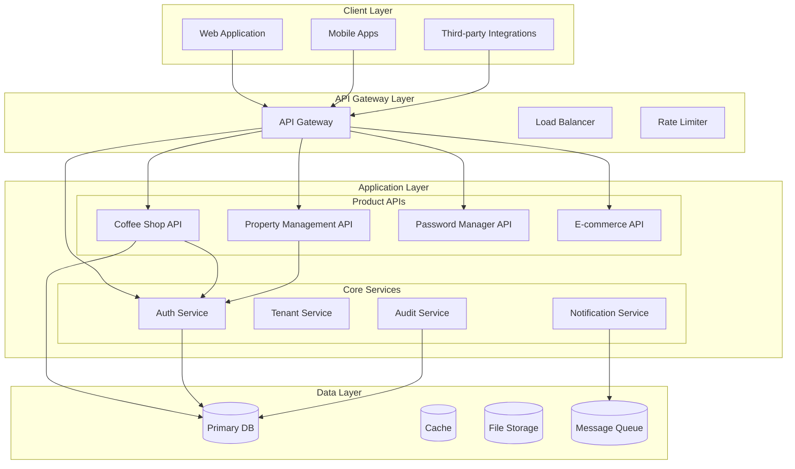

# Software Hub Platform: Project Documentation
## Integrated Business Software Suite

**Version:** 1.0.0  
**Last Updated:** $(date)  
**Status:** Planning Phase  
**Confidentiality:** Internal Use Only

---

## 📋 Executive Summary

### Vision Statement
To create a unified platform of integrated business software applications that enables small to medium businesses to manage multiple operational needs through a single, seamlessly connected ecosystem.

### Business Model
- **Primary**: SaaS subscription with tiered pricing
- **Secondary**: Transaction fees for payment processing
- **Target**: SMBs, solo entrepreneurs, specialty retailers
- **Differentiator**: Deep integration between applications vs. standalone solutions

### Market Opportunity
The global small business software market is projected to reach **$340 billion by 2027**, with increasing demand for integrated solutions that reduce software sprawl and improve operational efficiency.

---

## 🎯 Target Market Segments

| Segment | Primary Needs | Potential Applications |
|---------|--------------|----------------------|
| **Food & Beverage** | Online ordering, inventory, staff management | Coffee shop, pizza, bakery, restaurant |
| **Retail Services** | CRM, appointment booking, payments | Salon, fitness studio, tutoring |
| **Property Management (WORK IN PROGRESS)** | Listing, tenant management, maintenance | Vacation rentals, storage units, parking |
| **Professional Services** | Invoicing, project management, documents | Consultants, freelancers, agencies |
| **Community Organizations** | Membership, event management, donations | Clubs, churches, non-profits |

---

## 🏗️ Technical Architecture

### High-Level System Architecture

