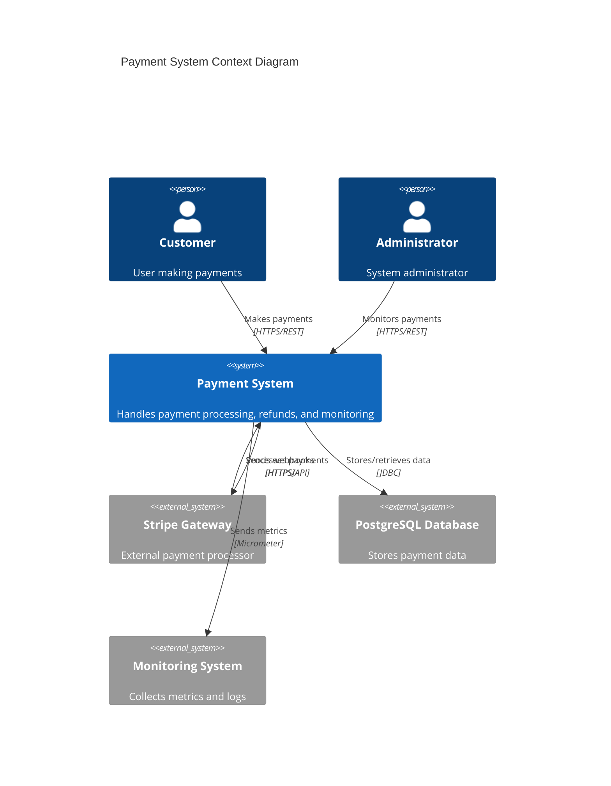
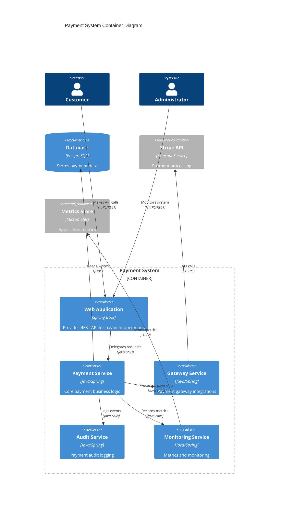
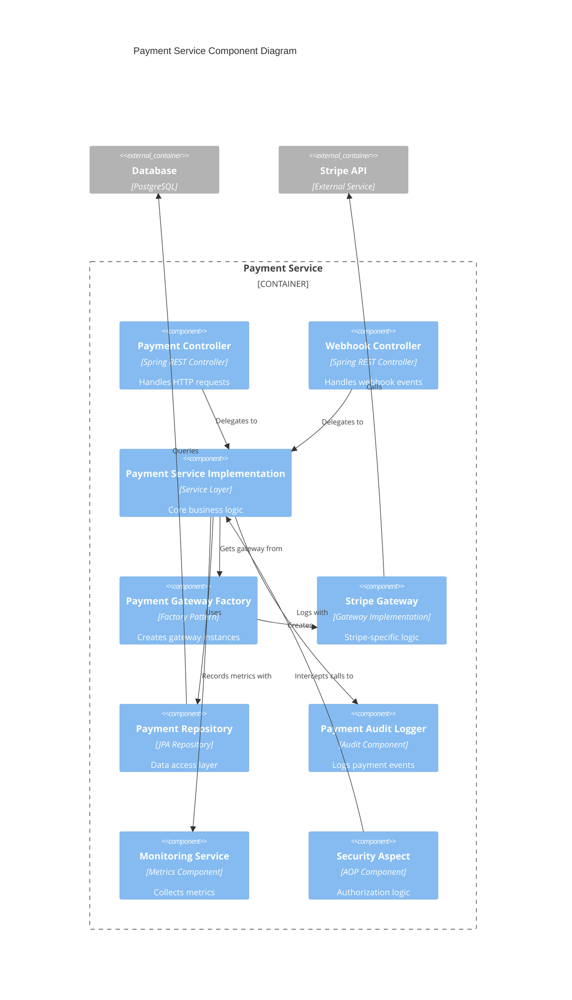
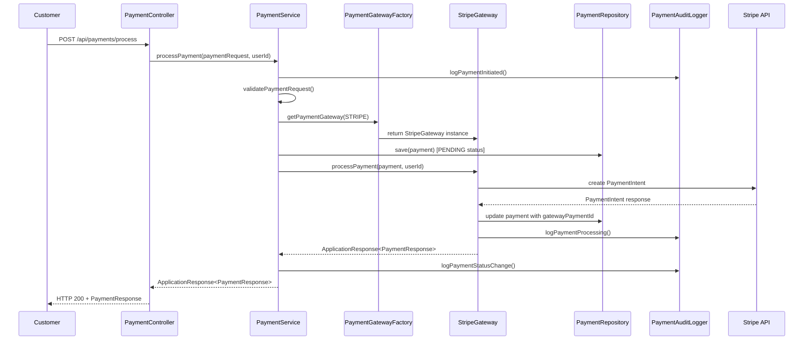
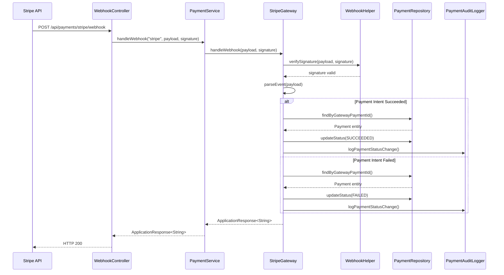
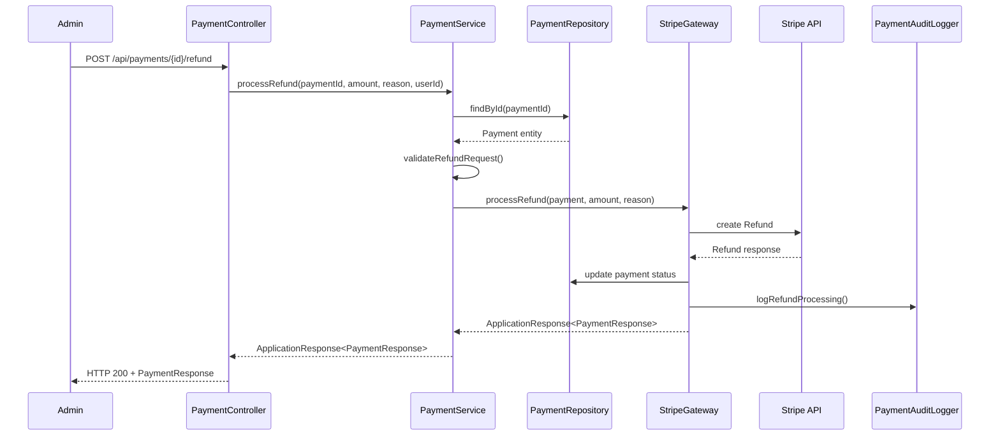
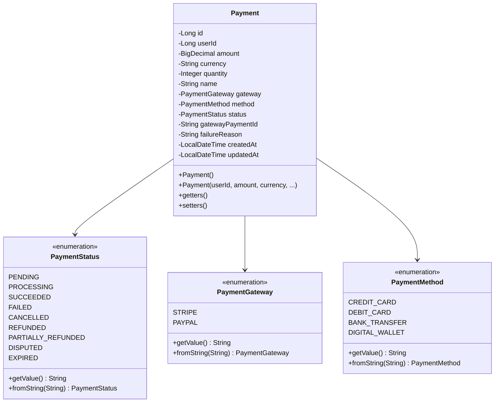
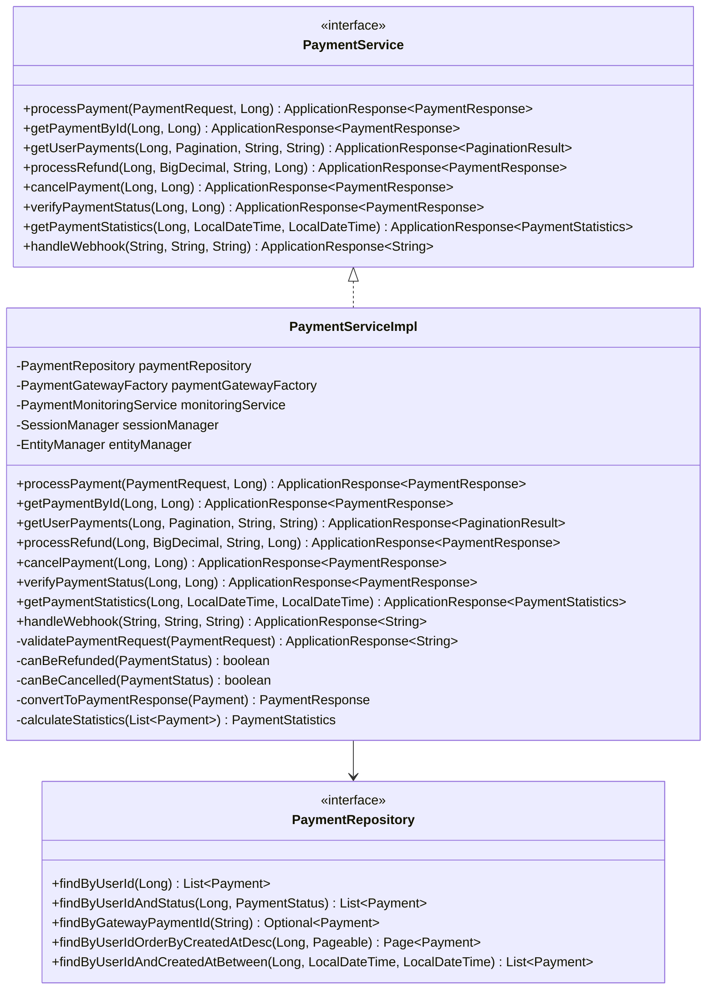
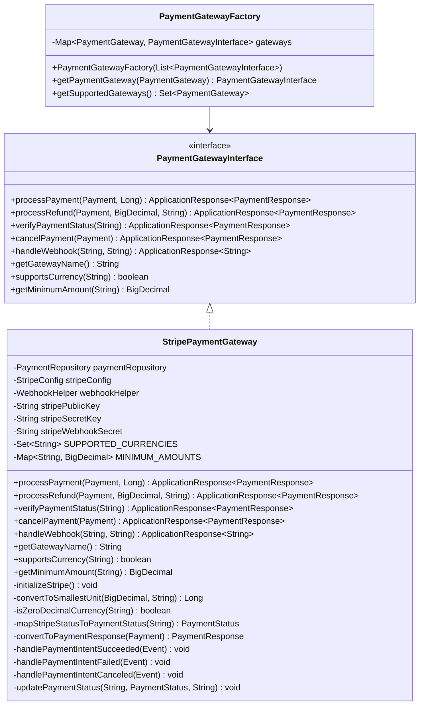
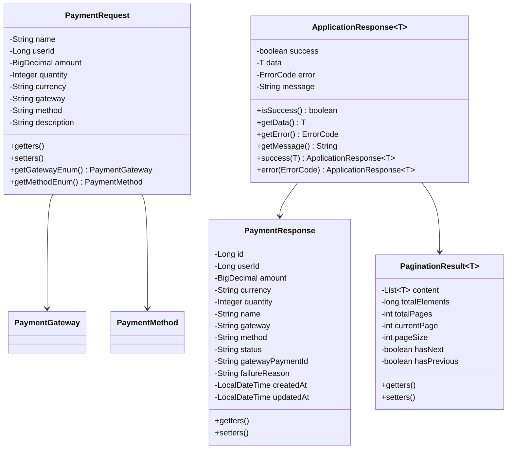

# Payment Module Documentation

## Table of Contents
1. [Overview](#overview)
2. [C4 Model Architecture](#c4-model-architecture)
3. [Sequence Diagrams](#sequence-diagrams)
4. [Class Diagrams](#class-diagrams)
5. [API Endpoints](#api-endpoints)
6. [Configuration](#configuration)
7. [Security](#security)
8. [Monitoring and Auditing](#monitoring-and-auditing)

## Overview

The Payment Module is a comprehensive payment processing system designed for the Imovel API. It provides a flexible, secure, and scalable solution for handling various payment operations including processing payments, refunds, cancellations, and webhook handling. The module follows a clean architecture pattern with clear separation of concerns.

### Key Features
- Multi-gateway support (currently Stripe with extensible architecture)
- Comprehensive audit logging
- Real-time monitoring and metrics
- Secure payment processing with authentication
- Webhook handling for payment status updates
- Refund and cancellation capabilities
- Payment statistics and reporting

## C4 Model Architecture

### Context Diagram



### Container Diagram



### Component Diagram



### Code Diagram

```mermaid
C4Component
    title Payment Processing Code Level Diagram
    
    Component_Boundary(paymentProcessing, "Payment Processing") {
        Component(paymentRequest, "PaymentRequest", "DTO", "Payment request data")
        Component(payment, "Payment", "Entity", "Payment domain model")
        Component(paymentStatus, "PaymentStatus", "Enum", "Payment status values")
        Component(paymentGateway, "PaymentGateway", "Enum", "Gateway types")
        Component(paymentMethod, "PaymentMethod", "Enum", "Payment methods")
        Component(paymentResponse, "PaymentResponse", "DTO", "Payment response data")
        Component(applicationResponse, "ApplicationResponse", "Wrapper", "Standard API response")
    }
    
    Rel(paymentRequest, payment, "Maps to")
    Rel(payment, paymentStatus, "Has")
    Rel(payment, paymentGateway, "Uses")
    Rel(payment, paymentMethod, "Uses")
    Rel(payment, paymentResponse, "Maps to")
    Rel(paymentResponse, applicationResponse, "Wrapped in")
```

## Sequence Diagrams

### Payment Processing Flow



### Webhook Processing Flow



### Refund Processing Flow



## Class Diagrams

### Core Domain Model



### Service Layer Architecture



### Gateway Architecture



### DTO and Request/Response Models



## API Endpoints

### Payment Operations

| Method | Endpoint | Description | Request Body | Response |
|--------|----------|-------------|--------------|----------|
| POST | `/api/payments/process` | Process a new payment | PaymentRequest | ApplicationResponse<PaymentResponse> |
| GET | `/api/payments/{id}` | Get payment by ID | - | ApplicationResponse<PaymentResponse> |
| GET | `/api/payments/user/{userId}` | Get user's payment history | Query params: page, size, sortBy, sortDirection | ApplicationResponse<PaginationResult<PaymentResponse>> |
| POST | `/api/payments/{id}/refund` | Process a refund | RefundRequest | ApplicationResponse<PaymentResponse> |
| POST | `/api/payments/{id}/cancel` | Cancel a payment | - | ApplicationResponse<PaymentResponse> |
| POST | `/api/payments/{id}/verify` | Verify payment status | - | ApplicationResponse<PaymentResponse> |
| GET | `/api/payments/statistics/{userId}` | Get payment statistics | Query params: startDate, endDate | ApplicationResponse<PaymentStatistics> |

### Webhook Endpoints

| Method | Endpoint | Description | Headers | Response |
|--------|----------|-------------|---------|----------|
| POST | `/api/payments/stripe/webhook` | Handle Stripe webhooks | Stripe-Signature | ApplicationResponse<String> |

### Request/Response Examples

#### Process Payment Request
```json
{
  "name": "Premium Subscription",
  "userId": 12345,
  "amount": 99.99,
  "quantity": 1,
  "currency": "USD",
  "gateway": "STRIPE",
  "method": "CREDIT_CARD",
  "description": "Monthly premium subscription"
}
```

#### Payment Response
```json
{
  "success": true,
  "data": {
    "id": 1,
    "userId": 12345,
    "amount": 99.99,
    "currency": "USD",
    "quantity": 1,
    "name": "Premium Subscription",
    "gateway": "STRIPE",
    "method": "CREDIT_CARD",
    "status": "SUCCEEDED",
    "gatewayPaymentId": "pi_1234567890",
    "failureReason": null,
    "createdAt": "2024-01-15T10:30:00",
    "updatedAt": "2024-01-15T10:30:05"
  },
  "error": null,
  "message": "Payment processed successfully"
}
```

## Configuration

### Application Properties

```yaml
# Stripe Configuration
stripe:
  public-key: ${STRIPE_PUBLIC_KEY}
  secret-key: ${STRIPE_SECRET_KEY}
  webhook-secret: ${STRIPE_WEBHOOK_SECRET}

# Payment Configuration
payment:
  default-currency: USD
  max-refund-days: 30
  webhook-timeout: 30000
  
# Monitoring Configuration
management:
  endpoints:
    web:
      exposure:
        include: health,metrics,prometheus
  metrics:
    export:
      prometheus:
        enabled: true
```

### Database Configuration

The payment module uses JPA entities with the following database schema:

```sql
CREATE TABLE payments (
    id BIGSERIAL PRIMARY KEY,
    user_id BIGINT NOT NULL,
    amount DECIMAL(19,2) NOT NULL,
    currency VARCHAR(3) NOT NULL,
    quantity INTEGER,
    name VARCHAR(255),
    gateway VARCHAR(50) NOT NULL,
    method VARCHAR(50) NOT NULL,
    status VARCHAR(50) NOT NULL,
    gateway_payment_id VARCHAR(255),
    failure_reason TEXT,
    created_at TIMESTAMP DEFAULT CURRENT_TIMESTAMP,
    updated_at TIMESTAMP DEFAULT CURRENT_TIMESTAMP
);

CREATE INDEX idx_payments_user_id ON payments(user_id);
CREATE INDEX idx_payments_status ON payments(status);
CREATE INDEX idx_payments_gateway_payment_id ON payments(gateway_payment_id);
CREATE INDEX idx_payments_created_at ON payments(created_at);
```

## Security

### Authentication and Authorization

The payment module implements comprehensive security measures:

1. **Session-based Authentication**: Uses SessionManager for user authentication
2. **AOP Security**: PaymentServiceAspect intercepts all service calls for authorization
3. **User Isolation**: All operations are scoped to the authenticated user
4. **Webhook Security**: Stripe webhook signature verification

### Security Aspect Implementation

```java
@Around("paymentServiceMethods()")
public Object authorizeAccess(ProceedingJoinPoint joinPoint) throws Throwable {
    // Extract user ID from method parameters
    // Verify against authenticated user
    // Proceed with method execution if authorized
}
```

### Data Protection

- Sensitive payment data is not logged in plain text
- Gateway payment IDs are used for external references
- Failure reasons are sanitized before storage

## Monitoring and Auditing

### Audit Logging

The PaymentAuditLogger provides comprehensive audit trails:

- Payment initiation events
- Status change tracking
- Refund processing logs
- Webhook event logging
- Validation failure tracking

### Metrics and Monitoring

PaymentMonitoringService collects:

- Payment processing times
- Success/failure rates
- Gateway response times
- Error rates by type
- Revenue metrics

### Monitoring Endpoints

- `/actuator/health` - Application health status
- `/actuator/metrics` - Application metrics
- `/actuator/prometheus` - Prometheus metrics format

### Log4j2 Configuration

The module uses structured JSON logging with separate audit loggers:

```xml
<AsyncLogger name="PAYMENT_AUDIT" level="INFO" additivity="false">
    <AppenderRef ref="AsyncFile"/>
</AsyncLogger>
```

## Error Handling

The payment module implements comprehensive error handling:

### Error Codes

| Code | Description | HTTP Status |
|------|-------------|-------------|
| 5200 | Unsupported payment gateway | 400 |
| 5201 | Invalid payment amount | 400 |
| 5202 | Payment not found | 404 |
| 5203 | Payment cannot be refunded | 400 |
| 5204 | Payment cannot be cancelled | 400 |
| 5205 | Gateway processing error | 500 |

### Exception Handling

- PaymentProcessingException for gateway-specific errors
- Validation exceptions for request validation
- Authentication exceptions for security violations
- Generic ApplicationResponse wrapper for consistent error responses

## Future Enhancements

1. **Additional Payment Gateways**: PayPal, Square, etc.
2. **Recurring Payments**: Subscription management
3. **Multi-currency Support**: Enhanced currency handling
4. **Advanced Analytics**: Detailed reporting and analytics
5. **Fraud Detection**: Integration with fraud detection services
6. **Mobile Payment Methods**: Apple Pay, Google Pay support

---

*This documentation is maintained as part of the Imovel API project. For questions or updates, please contact the development team.*