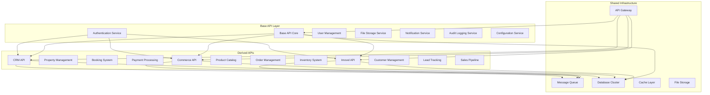
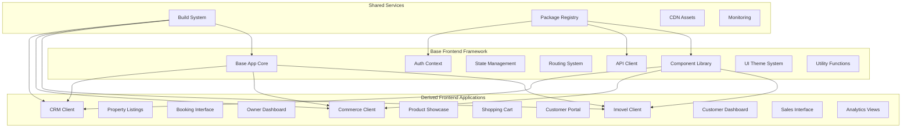

# Modular Software Development Platform - Project Architecture

## Project Overview

### Vision
Create a scalable, modular software development platform that enables rapid development of specialized applications through a base API and frontend foundation, with derived specialized modules for different business domains.

### Core Concept
- **Base API**: A foundational backend API providing common functionality, authentication, authorization, and core services
- **Derived APIs**: Specialized APIs (like Imovel API) that extend the base API with domain-specific functionality
- **Base Frontend**: A core client application with shared components, routing, and UI patterns
- **SAAS Frontend**: A  client application provided as Software as Service (React app in development)
- **Derived Frontends**: Specialized client applications that extend the base frontend for specific use cases

## System Architecture

### Backend API Architecture

### Backend Structure

backend/
├── base-api/
│   ├── src/
│   │   ├── core/
│   │   ├── middleware/
│   │   ├── services/
│   │   ├── models/
│   │   └── utils/
│   └── package.json
├── imovel-api/
│   ├── src/
│   │   ├── modules/
│   │   ├── routes/
│   │   └── extensions/
│   └── package.json
├── commerce-api/
└── shared/
    ├── types/
    ├── utilities/
    └── config/

### Frontend Structure

frontend/
├── base-client/
│   ├── src/
│   │   ├── components/
│   │   ├── hooks/
│   │   ├── store/
│   │   ├── services/
│   │   └── styles/
│   └── package.json
├── imovel-client/
│   ├── src/
│   │   ├── features/
│   │   ├── pages/
│   │   └── assets/
│   └── package.json
├── commerce-client/
└── shared/
    ├── component-library/
    ├── utils/
    └── types/

