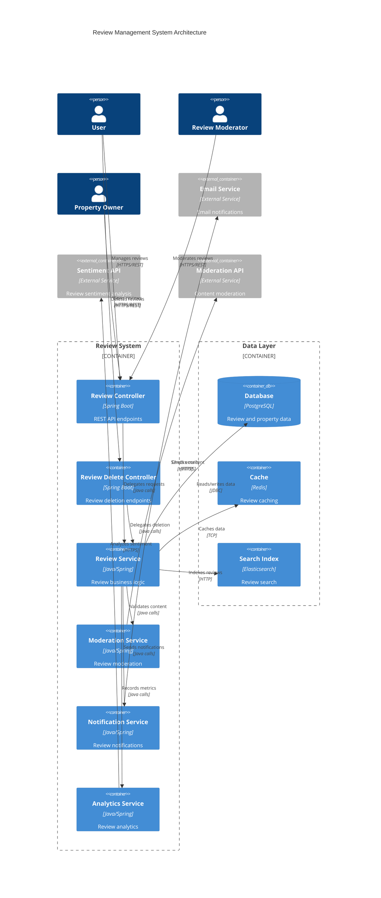

# Review Endpoints Guide

## Overview

The Review Management System provides comprehensive property review capabilities, allowing users to create, read, update, and delete reviews for properties. The system supports rating-based reviews with detailed comments, review moderation, analytics, and user engagement features with high performance and robust validation.

## Architecture

### System Architecture



### Component Diagram

```mermaid
C4Component
    title Review Components
    
    Component_Boundary(reviewComponents, "Review Components") {
        Component(reviewEntity, "Review", "Entity", "Review data model")
        Component(reviewRequest, "ReviewRequest", "DTO", "Create/update review")
        Component(reviewResponse, "ReviewResponse", "DTO", "Review with metadata")
        Component(reviewSummary, "ReviewSummary", "DTO", "Review statistics")
        Component(reviewFilter, "ReviewFilter", "DTO", "Review filtering")
        Component(reviewModeration, "ReviewModeration", "DTO", "Moderation status")
        Component(userResponse, "UserResponse", "DTO", "Review author info")
        Component(propertyResponse, "PropertyResponse", "DTO", "Property details")
        Component(applicationResponse, "ApplicationResponse", "Wrapper", "Standard API response")
    }
    
    Rel(reviewEntity, userResponse, "References")
    Rel(reviewEntity, propertyResponse, "References")
    Rel(reviewResponse, userResponse, "Includes")
    Rel(reviewResponse, reviewModeration, "Contains")
    Rel(reviewResponse, applicationResponse, "Wrapped in")
    Rel(reviewSummary, applicationResponse, "Wrapped in")
```

## Data Models

### Review Entity

Core review entity with property and user relationships:

```java
@Entity
@Table(name = "reviews")
public class Review {
    @Id
    @GeneratedValue(strategy = GenerationType.IDENTITY)
    private Long id;

    @ManyToOne(fetch = FetchType.LAZY)
    @JoinColumn(name = "property_id", nullable = false)
    private Property property;

    @ManyToOne(fetch = FetchType.LAZY)
    @JoinColumn(name = "user_id", nullable = false)
    private User user;

    @Column(nullable = false)
    private Integer rating;

    @Lob
    private String comment;

    @CreationTimestamp
    @Column(name = "created_at", nullable = false, updatable = false)
    private LocalDateTime createdAt;
    
    // Constructors, getters, and setters
}
```

### ReviewRequest DTO

Request DTO for creating and updating reviews:

```java
public class ReviewRequest {
    @NotNull(message = "Rating is required")
    @Min(value = 1, message = "Rating must be at least 1")
    @Max(value = 5, message = "Rating must be at most 5")
    private Integer rating;
    
    @Size(max = 2000, message = "Comment must not exceed 2000 characters")
    private String comment;
    
    private Set<String> tags; // Optional review tags
    private Boolean isAnonymous; // Whether to hide user identity
    private String title; // Optional review title
    private List<String> pros; // List of positive aspects
    private List<String> cons; // List of negative aspects
    private Map<String, Integer> aspectRatings; // Ratings for specific aspects
    
    // Validation method
    @AssertTrue(message = "Comment is required for ratings below 4")
    public boolean isCommentRequiredForLowRatings() {
        return rating == null || rating >= 4 || 
               (comment != null && !comment.trim().isEmpty());
    }
}
```

### ReviewResponse DTO

Response DTO containing complete review information:

```java
public class ReviewResponse {
    private Long id;
    private Long propertyId;
    private String propertyTitle;
    private ReviewAuthor author;
    private Integer rating;
    private String comment;
    private String title;
    private List<String> pros;
    private List<String> cons;
    private Set<String> tags;
    private Map<String, Integer> aspectRatings;
    private ReviewMetadata metadata;
    private ReviewModeration moderation;
    private LocalDateTime createdAt;
    private LocalDateTime updatedAt;
    
    public static class ReviewAuthor {
        private Long userId;
        private String name;
        private String email; // Only visible to property owner/admin
        private String avatar;
        private boolean isVerified;
        private boolean isAnonymous;
        private ReviewerStats stats;
        
        public static class ReviewerStats {
            private int totalReviews;
            private double averageRating;
            private int helpfulVotes;
            private LocalDateTime memberSince;
        }
    }
    
    public static class ReviewMetadata {
        private int helpfulVotes;
        private int totalVotes;
        private double helpfulnessRatio;
        private boolean isEdited;
        private LocalDateTime lastEditedAt;
        private boolean isOwnerResponse;
        private String ownerResponse;
        private LocalDateTime ownerResponseAt;
        private SentimentAnalysis sentiment;
        
        public static class SentimentAnalysis {
            private String overall; // POSITIVE, NEGATIVE, NEUTRAL
            private double positiveScore;
            private double negativeScore;
            private double neutralScore;
            private List<String> keywords;
        }
    }
    
    public static class ReviewModeration {
        private String status; // PENDING, APPROVED, REJECTED, FLAGGED
        private String reason;
        private LocalDateTime moderatedAt;
        private String moderatedBy;
        private boolean isReported;
        private int reportCount;
        private List<String> flags;
    }
}
```

### ReviewSummary DTO

Summary DTO for property review statistics:

```java
public class ReviewSummary {
    private Long propertyId;
    private int totalReviews;
    private double averageRating;
    private double medianRating;
    private RatingDistribution ratingDistribution;
    private AspectRatings aspectRatings;
    private ReviewTrends trends;
    private RecentActivity recentActivity;
    
    public static class RatingDistribution {
        private int fiveStars;
        private int fourStars;
        private int threeStars;
        private int twoStars;
        private int oneStar;
        private Map<Integer, Double> percentages;
    }
    
    public static class AspectRatings {
        private Double location;
        private Double value;
        private Double cleanliness;
        private Double communication;
        private Double amenities;
        private Double overall;
        private Map<String, Double> customAspects;
    }
    
    public static class ReviewTrends {
        private double ratingTrend; // Positive/negative trend
        private int reviewsThisMonth;
        private int reviewsLastMonth;
        private double monthlyGrowth;
        private List<MonthlyStats> monthlyBreakdown;
        
        public static class MonthlyStats {
            private String month;
            private int reviewCount;
            private double averageRating;
        }
    }
    
    public static class RecentActivity {
        private LocalDateTime lastReviewAt;
        private int reviewsLast7Days;
        private int reviewsLast30Days;
        private double recentAverageRating;
        private List<String> recentKeywords;
    }
}
```

### ReviewFilter DTO

Filter DTO for searching and filtering reviews:

```java
public class ReviewFilter {
    private Integer minRating;
    private Integer maxRating;
    private LocalDateTime fromDate;
    private LocalDateTime toDate;
    private String keyword;
    private Set<String> tags;
    private Boolean hasComment;
    private Boolean isVerifiedUser;
    private String sentiment; // POSITIVE, NEGATIVE, NEUTRAL
    private String sortBy; // rating, date, helpfulness
    private String sortDirection; // asc, desc
    private Integer page;
    private Integer size;
    private Boolean includeModerated;
    private String moderationStatus;
}
```

### ReviewUpdateRequest DTO

Request DTO for updating existing reviews:

```java
public class ReviewUpdateRequest {
    @Min(value = 1, message = "Rating must be at least 1")
    @Max(value = 5, message = "Rating must be at most 5")
    private Integer rating;
    
    @Size(max = 2000, message = "Comment must not exceed 2000 characters")
    private String comment;
    
    private String title;
    private List<String> pros;
    private List<String> cons;
    private Set<String> tags;
    private Map<String, Integer> aspectRatings;
    private String updateReason; // Reason for the update
}
```

### ReviewVoteRequest DTO

Request DTO for voting on review helpfulness:

```java
public class ReviewVoteRequest {
    @NotNull(message = "Vote type is required")
    private VoteType voteType; // HELPFUL, NOT_HELPFUL
    
    private String reason; // Optional reason for the vote
    
    public enum VoteType {
        HELPFUL, NOT_HELPFUL
    }
}
```

## API Endpoints

### 1. Get Property Reviews

**Endpoint:** `GET /api/properties/{propertyId}/reviews`

**Description:** Retrieve all reviews for a specific property with filtering and pagination options.

**Path Parameters:**
- `propertyId` (Long, required): ID of the property

**Query Parameters:**
- `minRating` (Integer, optional): Minimum rating filter (1-5)
- `maxRating` (Integer, optional): Maximum rating filter (1-5)
- `fromDate` (String, optional): Start date filter (ISO format)
- `toDate` (String, optional): End date filter (ISO format)
- `keyword` (String, optional): Search keyword in comments
- `tags` (String[], optional): Filter by review tags
- `hasComment` (Boolean, optional): Filter reviews with/without comments
- `isVerifiedUser` (Boolean, optional): Filter by verified users only
- `sentiment` (String, optional): Filter by sentiment (POSITIVE, NEGATIVE, NEUTRAL)
- `sortBy` (String, optional): Sort field (rating, date, helpfulness) (default: date)
- `sortDirection` (String, optional): Sort direction (asc, desc) (default: desc)
- `page` (Integer, optional): Page number (default: 1)
- `size` (Integer, optional): Page size (default: 10)
- `includeModerated` (Boolean, optional): Include moderated reviews (default: false)

**Response:**
```json
{
    "success": true,
    "data": {
        "reviews": [
            {
                "id": 1,
                "propertyId": 123,
                "propertyTitle": "Luxury Villa with Ocean View",
                "author": {
                    "userId": 456,
                    "name": "John Smith",
                    "avatar": "https://example.com/avatars/456.jpg",
                    "isVerified": true,
                    "isAnonymous": false,
                    "stats": {
                        "totalReviews": 15,
                        "averageRating": 4.3,
                        "helpfulVotes": 89,
                        "memberSince": "2023-01-15T10:30:00"
                    }
                },
                "rating": 5,
                "comment": "Absolutely stunning property with breathtaking ocean views. The amenities were top-notch and the location was perfect for our family vacation.",
                "title": "Perfect Family Getaway",
                "pros": [
                    "Amazing ocean views",
                    "Clean and well-maintained",
                    "Great location",
                    "Excellent amenities"
                ],
                "cons": [
                    "Parking could be better"
                ],
                "tags": ["family-friendly", "luxury", "ocean-view"],
                "aspectRatings": {
                    "location": 5,
                    "value": 4,
                    "cleanliness": 5,
                    "communication": 5,
                    "amenities": 5
                },
                "metadata": {
                    "helpfulVotes": 12,
                    "totalVotes": 15,
                    "helpfulnessRatio": 0.8,
                    "isEdited": false,
                    "lastEditedAt": null,
                    "isOwnerResponse": false,
                    "ownerResponse": null,
                    "ownerResponseAt": null,
                    "sentiment": {
                        "overall": "POSITIVE",
                        "positiveScore": 0.85,
                        "negativeScore": 0.05,
                        "neutralScore": 0.10,
                        "keywords": ["stunning", "perfect", "excellent", "amazing"]
                    }
                },
                "moderation": {
                    "status": "APPROVED",
                    "reason": null,
                    "moderatedAt": "2024-01-15T11:00:00",
                    "moderatedBy": "system",
                    "isReported": false,
                    "reportCount": 0,
                    "flags": []
                },
                "createdAt": "2024-01-15T10:30:00",
                "updatedAt": "2024-01-15T10:30:00"
            }
        ],
        "summary": {
            "propertyId": 123,
            "totalReviews": 25,
            "averageRating": 4.2,
            "medianRating": 4.0,
            "ratingDistribution": {
                "fiveStars": 12,
                "fourStars": 8,
                "threeStars": 3,
                "twoStars": 1,
                "oneStar": 1,
                "percentages": {
                    "5": 48.0,
                    "4": 32.0,
                    "3": 12.0,
                    "2": 4.0,
                    "1": 4.0
                }
            },
            "aspectRatings": {
                "location": 4.5,
                "value": 4.0,
                "cleanliness": 4.3,
                "communication": 4.4,
                "amenities": 4.2,
                "overall": 4.2
            },
            "trends": {
                "ratingTrend": 0.15,
                "reviewsThisMonth": 5,
                "reviewsLastMonth": 3,
                "monthlyGrowth": 66.7
            },
            "recentActivity": {
                "lastReviewAt": "2024-01-20T14:30:00",
                "reviewsLast7Days": 2,
                "reviewsLast30Days": 5,
                "recentAverageRating": 4.4,
                "recentKeywords": ["excellent", "clean", "beautiful", "recommended"]
            }
        },
        "pagination": {
            "totalResults": 25,
            "totalPages": 3,
            "currentPage": 1,
            "pageSize": 10,
            "hasNext": true,
            "hasPrevious": false
        }
    },
    "error": null,
    "message": "Reviews retrieved successfully"
}
```

### 2. Create Property Review

**Endpoint:** `POST /api/properties/{propertyId}/reviews`

**Description:** Create a new review for a specific property.

**Path Parameters:**
- `propertyId` (Long, required): ID of the property to review

**Request Body:**
```json
{
    "rating": 5,
    "comment": "Absolutely stunning property with breathtaking ocean views. The amenities were top-notch and the location was perfect for our family vacation.",
    "title": "Perfect Family Getaway",
    "pros": [
        "Amazing ocean views",
        "Clean and well-maintained",
        "Great location",
        "Excellent amenities"
    ],
    "cons": [
        "Parking could be better"
    ],
    "tags": ["family-friendly", "luxury", "ocean-view"],
    "isAnonymous": false,
    "aspectRatings": {
        "location": 5,
        "value": 4,
        "cleanliness": 5,
        "communication": 5,
        "amenities": 5
    }
}
```

**Response:**
```json
{
    "success": true,
    "data": {
        "id": 1,
        "propertyId": 123,
        "propertyTitle": "Luxury Villa with Ocean View",
        "author": {
            "userId": 456,
            "name": "John Smith",
            "avatar": "https://example.com/avatars/456.jpg",
            "isVerified": true,
            "isAnonymous": false,
            "stats": {
                "totalReviews": 16,
                "averageRating": 4.3,
                "helpfulVotes": 89,
                "memberSince": "2023-01-15T10:30:00"
            }
        },
        "rating": 5,
        "comment": "Absolutely stunning property with breathtaking ocean views. The amenities were top-notch and the location was perfect for our family vacation.",
        "title": "Perfect Family Getaway",
        "pros": [
            "Amazing ocean views",
            "Clean and well-maintained",
            "Great location",
            "Excellent amenities"
        ],
        "cons": [
            "Parking could be better"
        ],
        "tags": ["family-friendly", "luxury", "ocean-view"],
        "aspectRatings": {
            "location": 5,
            "value": 4,
            "cleanliness": 5,
            "communication": 5,
            "amenities": 5
        },
        "metadata": {
            "helpfulVotes": 0,
            "totalVotes": 0,
            "helpfulnessRatio": 0.0,
            "isEdited": false,
            "lastEditedAt": null,
            "isOwnerResponse": false,
            "ownerResponse": null,
            "ownerResponseAt": null,
            "sentiment": {
                "overall": "POSITIVE",
                "positiveScore": 0.85,
                "negativeScore": 0.05,
                "neutralScore": 0.10,
                "keywords": ["stunning", "perfect", "excellent", "amazing"]
            }
        },
        "moderation": {
            "status": "PENDING",
            "reason": null,
            "moderatedAt": null,
            "moderatedBy": null,
            "isReported": false,
            "reportCount": 0,
            "flags": []
        },
        "createdAt": "2024-01-20T15:30:00",
        "updatedAt": "2024-01-20T15:30:00"
    },
    "error": null,
    "message": "Review created successfully"
}
```

### 3. Update Review

**Endpoint:** `PUT /api/reviews/{reviewId}`

**Description:** Update an existing review (only by the review author).

**Path Parameters:**
- `reviewId` (Long, required): ID of the review to update

**Request Body:**
```json
{
    "rating": 4,
    "comment": "Updated review after revisiting the property. Still excellent but noticed a few minor issues.",
    "title": "Updated: Great Property with Minor Issues",
    "pros": [
        "Amazing ocean views",
        "Clean and well-maintained",
        "Great location"
    ],
    "cons": [
        "Parking could be better",
        "WiFi was occasionally slow"
    ],
    "tags": ["family-friendly", "luxury", "ocean-view", "updated"],
    "aspectRatings": {
        "location": 5,
        "value": 4,
        "cleanliness": 5,
        "communication": 4,
        "amenities": 4
    },
    "updateReason": "Revisited property and wanted to provide more accurate feedback"
}
```

**Response:**
```json
{
    "success": true,
    "data": {
        "id": 1,
        "propertyId": 123,
        "rating": 4,
        "comment": "Updated review after revisiting the property. Still excellent but noticed a few minor issues.",
        "title": "Updated: Great Property with Minor Issues",
        "pros": [
            "Amazing ocean views",
            "Clean and well-maintained",
            "Great location"
        ],
        "cons": [
            "Parking could be better",
            "WiFi was occasionally slow"
        ],
        "tags": ["family-friendly", "luxury", "ocean-view", "updated"],
        "aspectRatings": {
            "location": 5,
            "value": 4,
            "cleanliness": 5,
            "communication": 4,
            "amenities": 4
        },
        "metadata": {
            "isEdited": true,
            "lastEditedAt": "2024-01-22T10:15:00",
            "sentiment": {
                "overall": "POSITIVE",
                "positiveScore": 0.75,
                "negativeScore": 0.15,
                "neutralScore": 0.10,
                "keywords": ["excellent", "great", "issues", "minor"]
            }
        },
        "createdAt": "2024-01-20T15:30:00",
        "updatedAt": "2024-01-22T10:15:00"
    },
    "error": null,
    "message": "Review updated successfully"
}
```

### 4. Delete Review

**Endpoint:** `DELETE /api/reviews/{reviewId}`

**Description:** Delete a specific review (only by the review author or admin).

**Path Parameters:**
- `reviewId` (Long, required): ID of the review to delete

**Response:**
```json
{
    "success": true,
    "data": {
        "reviewId": 1,
        "propertyId": 123,
        "deletedAt": "2024-01-22T16:00:00",
        "deletedBy": "user",
        "backupCreated": true,
        "backupId": "review_backup_1_20240122_160000"
    },
    "error": null,
    "message": "Review deleted successfully"
}
```

### 5. Vote on Review Helpfulness

**Endpoint:** `POST /api/reviews/{reviewId}/vote`

**Description:** Vote on whether a review is helpful or not.

**Path Parameters:**
- `reviewId` (Long, required): ID of the review to vote on

**Request Body:**
```json
{
    "voteType": "HELPFUL",
    "reason": "Very detailed and informative review"
}
```

**Response:**
```json
{
    "success": true,
    "data": {
        "reviewId": 1,
        "voteType": "HELPFUL",
        "newHelpfulVotes": 13,
        "newTotalVotes": 16,
        "newHelpfulnessRatio": 0.8125,
        "userPreviousVote": null,
        "votedAt": "2024-01-22T17:00:00"
    },
    "error": null,
    "message": "Vote recorded successfully"
}
```

### 6. Get Review Statistics

**Endpoint:** `GET /api/properties/{propertyId}/reviews/statistics`

**Description:** Get comprehensive review statistics for a property.

**Path Parameters:**
- `propertyId` (Long, required): ID of the property

**Query Parameters:**
- `period` (String, optional): Time period for trends (7d, 30d, 90d, 1y, all) (default: all)
- `includeDetails` (Boolean, optional): Include detailed breakdowns (default: true)

**Response:**
```json
{
    "success": true,
    "data": {
        "propertyId": 123,
        "totalReviews": 25,
        "averageRating": 4.2,
        "medianRating": 4.0,
        "ratingDistribution": {
            "fiveStars": 12,
            "fourStars": 8,
            "threeStars": 3,
            "twoStars": 1,
            "oneStar": 1,
            "percentages": {
                "5": 48.0,
                "4": 32.0,
                "3": 12.0,
                "2": 4.0,
                "1": 4.0
            }
        },
        "aspectRatings": {
            "location": 4.5,
            "value": 4.0,
            "cleanliness": 4.3,
            "communication": 4.4,
            "amenities": 4.2,
            "overall": 4.2,
            "customAspects": {
                "parking": 3.5,
                "wifi": 3.8,
                "view": 4.8
            }
        },
        "trends": {
            "ratingTrend": 0.15,
            "reviewsThisMonth": 5,
            "reviewsLastMonth": 3,
            "monthlyGrowth": 66.7,
            "monthlyBreakdown": [
                {
                    "month": "2024-01",
                    "reviewCount": 5,
                    "averageRating": 4.4
                },
                {
                    "month": "2023-12",
                    "reviewCount": 3,
                    "averageRating": 4.0
                }
            ]
        },
        "recentActivity": {
            "lastReviewAt": "2024-01-20T14:30:00",
            "reviewsLast7Days": 2,
            "reviewsLast30Days": 5,
            "recentAverageRating": 4.4,
            "recentKeywords": ["excellent", "clean", "beautiful", "recommended"]
        }
    },
    "error": null,
    "message": "Review statistics retrieved successfully"
}
```

### 7. Get User Reviews

**Endpoint:** `GET /api/users/{userId}/reviews`

**Description:** Get all reviews written by a specific user.

**Path Parameters:**
- `userId` (Long, required): ID of the user

**Query Parameters:**
- `sortBy` (String, optional): Sort field (date, rating, property) (default: date)
- `sortDirection` (String, optional): Sort direction (asc, desc) (default: desc)
- `page` (Integer, optional): Page number (default: 1)
- `size` (Integer, optional): Page size (default: 10)

**Response:**
```json
{
    "success": true,
    "data": {
        "userId": 456,
        "userName": "John Smith",
        "reviews": [
            {
                "id": 1,
                "propertyId": 123,
                "propertyTitle": "Luxury Villa with Ocean View",
                "rating": 5,
                "comment": "Absolutely stunning property...",
                "title": "Perfect Family Getaway",
                "createdAt": "2024-01-20T15:30:00",
                "updatedAt": "2024-01-20T15:30:00"
            }
        ],
        "userStats": {
            "totalReviews": 16,
            "averageRating": 4.3,
            "helpfulVotes": 89,
            "memberSince": "2023-01-15T10:30:00",
            "reviewsThisYear": 8,
            "mostReviewedCategory": "VILLA"
        },
        "pagination": {
            "totalResults": 16,
            "totalPages": 2,
            "currentPage": 1,
            "pageSize": 10,
            "hasNext": true,
            "hasPrevious": false
        }
    },
    "error": null,
    "message": "User reviews retrieved successfully"
}
```

### 8. Report Review

**Endpoint:** `POST /api/reviews/{reviewId}/report`

**Description:** Report a review for inappropriate content or violations.

**Path Parameters:**
- `reviewId` (Long, required): ID of the review to report

**Request Body:**
```json
{
    "reason": "INAPPROPRIATE_CONTENT",
    "description": "Contains offensive language and personal attacks",
    "category": "HARASSMENT"
}
```

**Response:**
```json
{
    "success": true,
    "data": {
        "reviewId": 1,
        "reportId": "RPT_20240122_001",
        "reason": "INAPPROPRIATE_CONTENT",
        "category": "HARASSMENT",
        "reportedAt": "2024-01-22T18:00:00",
        "status": "PENDING_REVIEW",
        "estimatedReviewTime": "24-48 hours"
    },
    "error": null,
    "message": "Review reported successfully"
}
```

## Usage Examples

### PowerShell Examples

#### Get Property Reviews
```powershell
$propertyId = 123
$params = @{
    minRating = 4
    sortBy = "date"
    sortDirection = "desc"
    page = 1
    size = 10
}

$queryString = ($params.GetEnumerator() | ForEach-Object { "$($_.Key)=$($_.Value)" }) -join "&"
$response = Invoke-RestMethod -Uri "http://localhost:8080/api/properties/$propertyId/reviews?$queryString" `
    -Method GET `
    -WebSession $session

if ($response.success) {
    Write-Output "Found $($response.data.summary.totalReviews) reviews"
    Write-Output "Average rating: $($response.data.summary.averageRating)"
    
    $response.data.reviews | ForEach-Object {
        Write-Output "Review by $($_.author.name): $($_.rating) stars"
        Write-Output "  Comment: $($_.comment)"
        Write-Output "  Helpful votes: $($_.metadata.helpfulVotes)"
        Write-Output ""
    }
} else {
    Write-Error "Failed to get reviews: $($response.error.message)"
}
```

#### Create Review
```powershell
$propertyId = 123
$reviewData = @{
    rating = 5
    comment = "Absolutely stunning property with breathtaking ocean views. The amenities were top-notch and the location was perfect for our family vacation."
    title = "Perfect Family Getaway"
    pros = @("Amazing ocean views", "Clean and well-maintained", "Great location", "Excellent amenities")
    cons = @("Parking could be better")
    tags = @("family-friendly", "luxury", "ocean-view")
    isAnonymous = $false
    aspectRatings = @{
        location = 5
        value = 4
        cleanliness = 5
        communication = 5
        amenities = 5
    }
} | ConvertTo-Json -Depth 3

$response = Invoke-RestMethod -Uri "http://localhost:8080/api/properties/$propertyId/reviews" `
    -Method POST `
    -Body $reviewData `
    -ContentType "application/json" `
    -WebSession $session

if ($response.success) {
    Write-Output "Review created successfully"
    Write-Output "Review ID: $($response.data.id)"
    Write-Output "Status: $($response.data.moderation.status)"
    Write-Output "Sentiment: $($response.data.metadata.sentiment.overall)"
} else {
    Write-Error "Failed to create review: $($response.error.message)"
}
```

#### Update Review
```powershell
$reviewId = 1
$updateData = @{
    rating = 4
    comment = "Updated review after revisiting the property. Still excellent but noticed a few minor issues."
    title = "Updated: Great Property with Minor Issues"
    pros = @("Amazing ocean views", "Clean and well-maintained", "Great location")
    cons = @("Parking could be better", "WiFi was occasionally slow")
    tags = @("family-friendly", "luxury", "ocean-view", "updated")
    aspectRatings = @{
        location = 5
        value = 4
        cleanliness = 5
        communication = 4
        amenities = 4
    }
    updateReason = "Revisited property and wanted to provide more accurate feedback"
} | ConvertTo-Json -Depth 3

$response = Invoke-RestMethod -Uri "http://localhost:8080/api/reviews/$reviewId" `
    -Method PUT `
    -Body $updateData `
    -ContentType "application/json" `
    -WebSession $session

if ($response.success) {
    Write-Output "Review updated successfully"
    Write-Output "New rating: $($response.data.rating)"
    Write-Output "Last edited: $($response.data.metadata.lastEditedAt)"
} else {
    Write-Error "Failed to update review: $($response.error.message)"
}
```

#### Delete Review
```powershell
$reviewId = 1

$confirmation = Read-Host "Are you sure you want to delete this review? (yes/no)"

if ($confirmation -eq "yes") {
    $response = Invoke-RestMethod -Uri "http://localhost:8080/api/reviews/$reviewId" `
        -Method DELETE `
        -WebSession $session

    if ($response.success) {
        Write-Output "Review deleted successfully"
        Write-Output "Backup ID: $($response.data.backupId)"
        Write-Output "Deleted at: $($response.data.deletedAt)"
    } else {
        Write-Error "Failed to delete review: $($response.error.message)"
    }
} else {
    Write-Output "Review deletion cancelled"
}
```

#### Vote on Review
```powershell
$reviewId = 1
$voteData = @{
    voteType = "HELPFUL"
    reason = "Very detailed and informative review"
} | ConvertTo-Json

$response = Invoke-RestMethod -Uri "http://localhost:8080/api/reviews/$reviewId/vote" `
    -Method POST `
    -Body $voteData `
    -ContentType "application/json" `
    -WebSession $session

if ($response.success) {
    Write-Output "Vote recorded successfully"
    Write-Output "New helpful votes: $($response.data.newHelpfulVotes)"
    Write-Output "Helpfulness ratio: $($response.data.newHelpfulnessRatio)"
} else {
    Write-Error "Failed to vote: $($response.error.message)"
}
```

#### Get Review Statistics
```powershell
$propertyId = 123

$response = Invoke-RestMethod -Uri "http://localhost:8080/api/properties/$propertyId/reviews/statistics" `
    -Method GET `
    -WebSession $session

if ($response.success) {
    $stats = $response.data
    
    Write-Output "=== Review Statistics ==="
    Write-Output "Total Reviews: $($stats.totalReviews)"
    Write-Output "Average Rating: $($stats.averageRating)"
    Write-Output "Median Rating: $($stats.medianRating)"
    
    Write-Output "`n=== Rating Distribution ==="
    Write-Output "5 Stars: $($stats.ratingDistribution.fiveStars) ($($stats.ratingDistribution.percentages.'5')%)"
    Write-Output "4 Stars: $($stats.ratingDistribution.fourStars) ($($stats.ratingDistribution.percentages.'4')%)"
    Write-Output "3 Stars: $($stats.ratingDistribution.threeStars) ($($stats.ratingDistribution.percentages.'3')%)"
    Write-Output "2 Stars: $($stats.ratingDistribution.twoStars) ($($stats.ratingDistribution.percentages.'2')%)"
    Write-Output "1 Star: $($stats.ratingDistribution.oneStar) ($($stats.ratingDistribution.percentages.'1')%)"
    
    Write-Output "`n=== Aspect Ratings ==="
    Write-Output "Location: $($stats.aspectRatings.location)"
    Write-Output "Value: $($stats.aspectRatings.value)"
    Write-Output "Cleanliness: $($stats.aspectRatings.cleanliness)"
    Write-Output "Communication: $($stats.aspectRatings.communication)"
    Write-Output "Amenities: $($stats.aspectRatings.amenities)"
    
    Write-Output "`n=== Recent Activity ==="
    Write-Output "Reviews Last 7 Days: $($stats.recentActivity.reviewsLast7Days)"
    Write-Output "Reviews Last 30 Days: $($stats.recentActivity.reviewsLast30Days)"
    Write-Output "Recent Average Rating: $($stats.recentActivity.recentAverageRating)"
} else {
    Write-Error "Failed to get statistics: $($response.error.message)"
}
```

### JavaScript Examples

#### Get Property Reviews
```javascript
async function getPropertyReviews(propertyId, filters = {}) {
    const params = new URLSearchParams({
        minRating: filters.minRating || '',
        maxRating: filters.maxRating || '',
        keyword: filters.keyword || '',
        sortBy: filters.sortBy || 'date',
        sortDirection: filters.sortDirection || 'desc',
        page: filters.page || 1,
        size: filters.size || 10,
        ...filters
    });

    // Remove empty parameters
    for (let [key, value] of params.entries()) {
        if (!value) params.delete(key);
    }

    try {
        const response = await fetch(`/api/properties/${propertyId}/reviews?${params.toString()}`, {
            method: 'GET',
            credentials: 'include'
        });
        
        const data = await response.json();
        
        if (data.success) {
            return data.data;
        } else {
            throw new Error(data.error.message);
        }
    } catch (error) {
        console.error('Error getting reviews:', error);
        throw error;
    }
}

// Usage
getPropertyReviews(123, { minRating: 4, sortBy: 'helpfulness' }).then(result => {
    console.log(`Found ${result.summary.totalReviews} reviews`);
    console.log(`Average rating: ${result.summary.averageRating}`);
    
    result.reviews.forEach(review => {
        console.log(`${review.author.name}: ${review.rating} stars`);
        console.log(`  ${review.comment}`);
        console.log(`  Helpful: ${review.metadata.helpfulVotes}/${review.metadata.totalVotes}`);
    });
    
    displayReviews(result.reviews);
    updateReviewStatistics(result.summary);
});
```

#### Create Review
```javascript
async function createReview(propertyId, reviewData) {
    try {
        const response = await fetch(`/api/properties/${propertyId}/reviews`, {
            method: 'POST',
            headers: {
                'Content-Type': 'application/json'
            },
            body: JSON.stringify(reviewData),
            credentials: 'include'
        });
        
        const data = await response.json();
        
        if (data.success) {
            return data.data;
        } else {
            throw new Error(data.error.message);
        }
    } catch (error) {
        console.error('Error creating review:', error);
        throw error;
    }
}

// Usage with form handling
function handleReviewSubmit(event) {
    event.preventDefault();
    
    const formData = new FormData(event.target);
    const reviewData = {
        rating: parseInt(formData.get('rating')),
        comment: formData.get('comment'),
        title: formData.get('title'),
        pros: formData.getAll('pros').filter(p => p.trim()),
        cons: formData.getAll('cons').filter(c => c.trim()),
        tags: formData.getAll('tags'),
        isAnonymous: formData.get('isAnonymous') === 'true',
        aspectRatings: {
            location: parseInt(formData.get('locationRating')),
            value: parseInt(formData.get('valueRating')),
            cleanliness: parseInt(formData.get('cleanlinessRating')),
            communication: parseInt(formData.get('communicationRating')),
            amenities: parseInt(formData.get('amenitiesRating'))
        }
    };

    createReview(123, reviewData).then(review => {
        console.log(`Review created with ID: ${review.id}`);
        showSuccessMessage('Review submitted successfully!');
        
        // Update UI
        addReviewToList(review);
        resetReviewForm();
        
        // Show moderation status
        if (review.moderation.status === 'PENDING') {
            showInfoMessage('Your review is pending moderation and will be visible once approved.');
        }
    }).catch(error => {
        showErrorMessage(`Failed to submit review: ${error.message}`);
    });
}
```

#### Update Review
```javascript
async function updateReview(reviewId, updateData) {
    try {
        const response = await fetch(`/api/reviews/${reviewId}`, {
            method: 'PUT',
            headers: {
                'Content-Type': 'application/json'
            },
            body: JSON.stringify(updateData),
            credentials: 'include'
        });
        
        const data = await response.json();
        
        if (data.success) {
            return data.data;
        } else {
            throw new Error(data.error.message);
        }
    } catch (error) {
        console.error('Error updating review:', error);
        throw error;
    }
}

// Usage
function editReview(reviewId) {
    const updateData = {
        rating: 4,
        comment: "Updated review after revisiting the property.",
        title: "Updated: Great Property with Minor Issues",
        pros: ["Amazing ocean views", "Clean and well-maintained"],
        cons: ["Parking could be better", "WiFi was slow"],
        updateReason: "Providing more accurate feedback after second visit"
    };

    updateReview(reviewId, updateData).then(review => {
        console.log('Review updated successfully');
        showSuccessMessage('Review updated successfully!');
        
        // Update UI
        updateReviewInList(review);
        closeEditModal();
    }).catch(error => {
        showErrorMessage(`Failed to update review: ${error.message}`);
    });
}
```

#### Delete Review
```javascript
async function deleteReview(reviewId) {
    try {
        const response = await fetch(`/api/reviews/${reviewId}`, {
            method: 'DELETE',
            credentials: 'include'
        });
        
        const data = await response.json();
        
        if (data.success) {
            return data.data;
        } else {
            throw new Error(data.error.message);
        }
    } catch (error) {
        console.error('Error deleting review:', error);
        throw error;
    }
}

// Usage with confirmation
function confirmDeleteReview(reviewId, reviewTitle) {
    if (confirm(`Are you sure you want to delete your review "${reviewTitle}"?`)) {
        deleteReview(reviewId).then(result => {
            console.log('Review deleted successfully');
            showSuccessMessage('Review deleted successfully');
            
            // Remove from UI
            removeReviewFromList(reviewId);
            
            // Show backup info
            console.log(`Backup created: ${result.backupId}`);
        }).catch(error => {
            showErrorMessage(`Failed to delete review: ${error.message}`);
        });
    }
}
```

#### Vote on Review
```javascript
async function voteOnReview(reviewId, voteType, reason = '') {
    const voteData = {
        voteType: voteType,
        reason: reason
    };

    try {
        const response = await fetch(`/api/reviews/${reviewId}/vote`, {
            method: 'POST',
            headers: {
                'Content-Type': 'application/json'
            },
            body: JSON.stringify(voteData),
            credentials: 'include'
        });
        
        const data = await response.json();
        
        if (data.success) {
            return data.data;
        } else {
            throw new Error(data.error.message);
        }
    } catch (error) {
        console.error('Error voting on review:', error);
        throw error;
    }
}

// Usage with UI interaction
function handleVoteClick(reviewId, voteType, buttonElement) {
    voteOnReview(reviewId, voteType).then(result => {
        console.log(`Vote recorded: ${result.voteType}`);
        
        // Update UI
        updateVoteDisplay(reviewId, result);
        
        // Disable voting buttons to prevent multiple votes
        disableVoteButtons(reviewId);
        
        showSuccessMessage('Thank you for your feedback!');
    }).catch(error => {
        if (error.message.includes('already voted')) {
            showInfoMessage('You have already voted on this review.');
        } else {
            showErrorMessage(`Failed to record vote: ${error.message}`);
        }
    });
}

function updateVoteDisplay(reviewId, voteResult) {
    const reviewElement = document.querySelector(`[data-review-id="${reviewId}"]`);
    const helpfulCount = reviewElement.querySelector('.helpful-count');
    const helpfulnessRatio = reviewElement.querySelector('.helpfulness-ratio');
    
    helpfulCount.textContent = voteResult.newHelpfulVotes;
    helpfulnessRatio.textContent = `${(voteResult.newHelpfulnessRatio * 100).toFixed(1)}%`;
}
```

#### Get Review Statistics
```javascript
async function getReviewStatistics(propertyId, period = 'all') {
    try {
        const response = await fetch(`/api/properties/${propertyId}/reviews/statistics?period=${period}`, {
            method: 'GET',
            credentials: 'include'
        });
        
        const data = await response.json();
        
        if (data.success) {
            return data.data;
        } else {
            throw new Error(data.error.message);
        }
    } catch (error) {
        console.error('Error getting review statistics:', error);
        throw error;
    }
}

// Usage with charts
getReviewStatistics(123).then(stats => {
    updateStatisticsDashboard(stats);
}).catch(error => {
    console.error('Failed to load statistics:', error);
});

function updateStatisticsDashboard(stats) {
    // Update summary
    document.getElementById('total-reviews').textContent = stats.totalReviews;
    document.getElementById('average-rating').textContent = stats.averageRating.toFixed(1);
    document.getElementById('median-rating').textContent = stats.medianRating.toFixed(1);
    
    // Update rating distribution chart
    updateRatingDistributionChart(stats.ratingDistribution);
    
    // Update aspect ratings radar chart
    updateAspectRatingsChart(stats.aspectRatings);
    
    // Update trends chart
    updateTrendsChart(stats.trends);
    
    // Update recent activity
    updateRecentActivity(stats.recentActivity);
}

function updateRatingDistributionChart(distribution) {
    const chartData = {
        labels: ['5 Stars', '4 Stars', '3 Stars', '2 Stars', '1 Star'],
        datasets: [{
            data: [
                distribution.fiveStars,
                distribution.fourStars,
                distribution.threeStars,
                distribution.twoStars,
                distribution.oneStar
            ],
            backgroundColor: ['#4CAF50', '#8BC34A', '#FFC107', '#FF9800', '#F44336']
        }]
    };
    
    // Update chart (assuming Chart.js)
    ratingChart.data = chartData;
    ratingChart.update();
}
```

## Error Handling

### Common Error Codes

| Error Code | HTTP Status | Description |
|------------|-------------|-------------|
| 4001 | 400 | Invalid review data |
| 4002 | 400 | Invalid rating value |
| 4003 | 400 | Comment too long |
| 4004 | 400 | Invalid property ID |
| 4005 | 404 | Property not found |
| 4006 | 404 | Review not found |
| 4007 | 401 | User not authenticated |
| 4008 | 403 | Not authorized to modify review |
| 4009 | 403 | Cannot review own property |
| 4010 | 409 | User already reviewed this property |
| 4011 | 429 | Review rate limit exceeded |
| 4012 | 400 | Review contains inappropriate content |
| 4013 | 403 | Review is under moderation |
| 4014 | 400 | Cannot vote on own review |
| 4015 | 409 | User already voted on this review |
| 4016 | 500 | Review service unavailable |

### Error Response Format

```json
{
    "success": false,
    "data": null,
    "error": {
        "code": 4010,
        "message": "You have already reviewed this property",
        "status": "CONFLICT",
        "details": {
            "propertyId": 123,
            "existingReviewId": 456,
            "reviewedAt": "2024-01-15T10:30:00"
        }
    },
    "message": "Review operation failed"
}
```

### Error Handling Examples

#### PowerShell Error Handling
```powershell
try {
    $reviewData = @{
        rating = 5
        comment = "Great property!"
    } | ConvertTo-Json

    $response = Invoke-RestMethod -Uri "http://localhost:8080/api/properties/123/reviews" `
        -Method POST `
        -Body $reviewData `
        -ContentType "application/json" `
        -WebSession $session
    
    if ($response.success) {
        Write-Output "Review created successfully"
    } else {
        Write-Error "Review creation failed: $($response.error.message)"
        
        # Handle specific error codes
        switch ($response.error.code) {
            4010 { 
                Write-Warning "You have already reviewed this property (Review ID: $($response.error.details.existingReviewId))"
            }
            4009 { 
                Write-Warning "You cannot review your own property"
            }
            4012 { 
                Write-Warning "Review contains inappropriate content and cannot be posted"
            }
            4011 { 
                Write-Warning "Too many reviews submitted. Please wait before submitting another review."
            }
            default { 
                Write-Warning "Unexpected review error occurred"
            }
        }
    }
} catch {
    Write-Error "Request failed: $($_.Exception.Message)"
}
```

#### JavaScript Error Handling
```javascript
async function handleReviewOperation(operation) {
    try {
        const result = await operation();
        return result;
    } catch (error) {
        console.error('Review operation failed:', error);
        
        // Handle specific error scenarios
        if (error.message.includes('already reviewed')) {
            showUserMessage('You have already reviewed this property. You can edit your existing review instead.', 'info');
            return null;
        } else if (error.message.includes('own property')) {
            showUserMessage('You cannot review your own property.', 'error');
            return null;
        } else if (error.message.includes('inappropriate content')) {
            showUserMessage('Your review contains inappropriate content. Please revise and try again.', 'error');
            return null;
        } else if (error.message.includes('rate limit')) {
            showUserMessage('You are submitting reviews too quickly. Please wait a moment.', 'warning');
            return null;
        } else if (error.message.includes('not authenticated')) {
            showUserMessage('Please log in to submit a review.', 'error');
            redirectToLogin();
            return null;
        } else if (error.message.includes('not found')) {
            showUserMessage('Property not found. It may have been removed.', 'error');
            return null;
        } else {
            showUserMessage('Review operation failed. Please try again.', 'error');
            return null;
        }
    }
}

// Usage
handleReviewOperation(() => createReview(123, reviewData))
    .then(result => {
        if (result) {
            showUserMessage('Review submitted successfully!', 'success');
            updateReviewsList();
        }
    });
```

## Security Considerations

### Authentication & Authorization
- All review endpoints require user authentication
- Users can only modify their own reviews
- Property owners cannot review their own properties
- Admins and moderators have special permissions for moderation

### Content Moderation
- Automatic content filtering for inappropriate language
- Sentiment analysis for review quality assessment
- Manual moderation queue for flagged content
- Spam detection and prevention mechanisms

### Data Protection
- Review data is encrypted at rest
- Personal information is protected according to privacy settings
- User email addresses are only visible to property owners and admins
- Audit logging for all review operations

### Input Validation
- Rating values are constrained to 1-5 range
- Comment length is limited to prevent abuse
- HTML and script injection prevention
- File upload restrictions for review attachments

### Rate Limiting
- Review submission is rate-limited per user
- Voting operations have separate rate limits
- Search operations are throttled to prevent abuse
- Premium users may have higher limits

## Best Practices

### Review Management
1. **Encourage detailed reviews** with pros, cons, and specific feedback
2. **Use aspect ratings** to provide granular feedback
3. **Implement review guidelines** to maintain quality
4. **Moderate content** to ensure appropriate and helpful reviews
5. **Respond to reviews** as a property owner to show engagement

### User Experience
1. **Provide review templates** to help users structure their feedback
2. **Show review helpfulness** to highlight valuable content
3. **Display review statistics** to give users context
4. **Implement review filtering** to help users find relevant reviews
5. **Send notifications** for review responses and updates

### Performance
1. **Implement caching** for frequently accessed reviews
2. **Use pagination** for large review lists
3. **Optimize database queries** with proper indexing
4. **Lazy load review details** to improve initial page load
5. **Monitor review system performance** and optimize accordingly

### Data Quality
1. **Verify reviewer authenticity** to prevent fake reviews
2. **Implement review verification** for confirmed stays/purchases
3. **Use sentiment analysis** to identify potentially problematic reviews
4. **Regular review audits** to maintain quality standards
5. **Provide review editing** capabilities for users to improve their feedback

### Analytics & Insights
1. **Track review trends** to identify property improvement opportunities
2. **Monitor review sentiment** to gauge customer satisfaction
3. **Analyze aspect ratings** to identify specific strengths and weaknesses
4. **Generate review reports** for property owners and managers
5. **Use review data** to improve property recommendations

---

*This guide provides comprehensive documentation for the Review Management System. For additional support or questions, please contact the development team.*