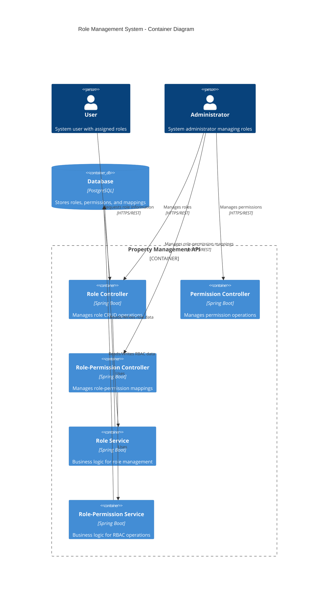
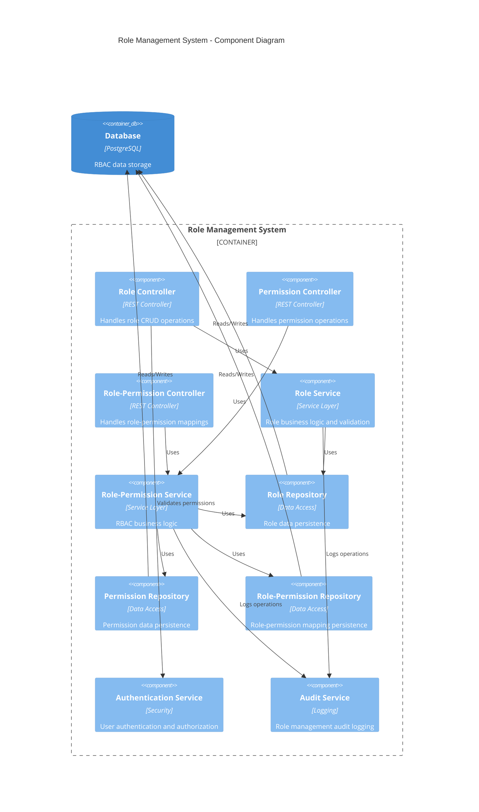

# Role Management Endpoints Guide

## Overview

The Role Management system provides a comprehensive Role-Based Access Control (RBAC) implementation for the property management platform. This system manages user roles, permissions, and their relationships to ensure secure and granular access control across all application features.

## Architecture

### C4 Container Diagram



### C4 Component Diagram



## Data Models

### Role Entity
```java
@Entity
@Table(name = "roles")
public class Role {
    @Id
    @GeneratedValue(strategy = GenerationType.IDENTITY)
    private Long id;
    
    @Column(name = "role_name", unique = true, nullable = false)
    private String roleName;
    
    @Column(name = "description")
    private String description;
    
    @OneToMany(mappedBy = "role")
    private Set<User> users;
    
    @OneToMany(mappedBy = "role")
    private Set<RolePermission> rolePermissions;
}
```

### Permission Entity
```java
@Entity
@Table(name = "permissions")
public class Permissions {
    @Id
    @GeneratedValue(strategy = GenerationType.IDENTITY)
    private Long id;
    
    @Column(name = "permission_name", unique = true, nullable = false)
    private String permissionName;
    
    @Column(name = "description")
    private String description;
    
    @OneToMany(mappedBy = "permission")
    private Set<RolePermission> rolePermissions;
}
```

### RolePermission Entity
```java
@Entity
@Table(name = "role_permissions")
public class RolePermission {
    @Id
    @GeneratedValue(strategy = GenerationType.IDENTITY)
    private Long id;
    
    @ManyToOne
    @JoinColumn(name = "role_id")
    private Role role;
    
    @ManyToOne
    @JoinColumn(name = "permission_id")
    private Permissions permission;
}
```

### RoleRequest DTO
```java
public class RoleRequest {
    private String roleName;
    private String description;
    private List<Long> permissionIds;
    private boolean isActive;
    private String createdBy;
}
```

### RoleResponse DTO
```java
public class RoleResponse {
    private Long roleId;
    private String roleName;
    private String description;
    private List<PermissionResponse> permissions;
    private Integer userCount;
    private LocalDateTime createdAt;
    private LocalDateTime updatedAt;
}
```

### PermissionRequest DTO
```java
public class PermissionRequest {
    private String permissionName;
    private String description;
    private String resource;
    private String action;
    private Map<String, Object> constraints;
}
```

### PermissionResponse DTO
```java
public class PermissionResponse {
    private Long permissionId;
    private String permissionName;
    private String description;
    private String resource;
    private String action;
    private List<Long> roleIds;
    private Map<String, Object> constraints;
}
```

### RolePermissionRequest DTO
```java
public class RolePermissionRequest {
    private Long roleId;
    private Long permissionId;
    private String roleName;
    private String permissionName;
    private Map<String, Object> metadata;
}
```

### RoleToPermissionResponse DTO
```java
public class RoleToPermissionResponse {
    private Long roleId;
    private String roleName;
    private Long permissionId;
    private String permissionName;
    private LocalDateTime assignedAt;
    private String assignedBy;
}
```

### RoleStatistics DTO
```java
public class RoleStatistics {
    private Long totalRoles;
    private Long totalPermissions;
    private Long totalMappings;
    private Map<String, Integer> roleDistribution;
    private Map<String, Integer> permissionUsage;
    private List<RoleUsageMetric> topRoles;
}
```

### UserRoleAssignment DTO
```java
public class UserRoleAssignment {
    private Long userId;
    private String userEmail;
    private Long roleId;
    private String roleName;
    private LocalDateTime assignedAt;
    private String assignedBy;
    private boolean isActive;
}
```

## API Endpoints

### 1. Get All Roles
**GET** `/api/roles`

Retrieve all roles in the system with their associated permissions and user counts.

**Headers:**
```
Authorization: Bearer <access_token>
Content-Type: application/json
```

**Query Parameters:**
- `page` (optional): Page number (default: 0)
- `size` (optional): Page size (default: 20)
- `sort` (optional): Sort field (default: roleName)
- `direction` (optional): Sort direction (ASC/DESC, default: ASC)
- `search` (optional): Search term for role name or description

**Response:**
```json
{
  "success": true,
  "data": [
    {
      "roleId": 1,
      "roleName": "ADMIN",
      "description": "System administrator with full access",
      "permissions": [
        {
          "permissionId": 1,
          "permissionName": "PROPERTY_CREATE",
          "description": "Create new properties",
          "resource": "property",
          "action": "create"
        }
      ],
      "userCount": 5,
      "createdAt": "2024-01-15T10:30:00Z",
      "updatedAt": "2024-01-15T10:30:00Z"
    }
  ],
  "message": "Roles retrieved successfully",
  "error": null,
  "timestamp": "2024-01-15T10:30:00Z"
}
```

### 2. Create Role
**POST** `/api/roles`

Create a new role in the system.

**Headers:**
```
Authorization: Bearer <access_token>
Content-Type: application/json
```

**Request Body:**
```json
{
  "roleName": "PROPERTY_MANAGER",
  "description": "Manages properties and tenant relationships",
  "permissionIds": [1, 2, 3, 5],
  "isActive": true,
  "createdBy": "admin@example.com"
}
```

**Response:**
```json
{
  "success": true,
  "data": {
    "roleId": 4,
    "roleName": "PROPERTY_MANAGER",
    "description": "Manages properties and tenant relationships",
    "permissions": [],
    "userCount": 0,
    "createdAt": "2024-01-15T10:30:00Z",
    "updatedAt": "2024-01-15T10:30:00Z"
  },
  "message": "Role created successfully",
  "error": null,
  "timestamp": "2024-01-15T10:30:00Z"
}
```

### 3. Get Role by ID
**GET** `/api/roles/{id}`

Retrieve a specific role by its ID with detailed information.

**Headers:**
```
Authorization: Bearer <access_token>
```

**Path Parameters:**
- `id`: Role ID (Long)

**Response:**
```json
{
  "success": true,
  "data": {
    "roleId": 1,
    "roleName": "ADMIN",
    "description": "System administrator with full access",
    "permissions": [
      {
        "permissionId": 1,
        "permissionName": "PROPERTY_CREATE",
        "description": "Create new properties",
        "resource": "property",
        "action": "create",
        "constraints": {
          "scope": "all",
          "maxValue": null
        }
      }
    ],
    "userCount": 5,
    "createdAt": "2024-01-15T10:30:00Z",
    "updatedAt": "2024-01-15T10:30:00Z"
  },
  "message": "Role retrieved successfully",
  "error": null,
  "timestamp": "2024-01-15T10:30:00Z"
}
```

### 4. Get Role by Name
**GET** `/api/roles/name/{roleName}`

Retrieve a specific role by its name.

**Headers:**
```
Authorization: Bearer <access_token>
```

**Path Parameters:**
- `roleName`: Role name (String)

**Response:**
```json
{
  "success": true,
  "data": {
    "roleId": 2,
    "roleName": "AGENT",
    "description": "Property agent with limited access",
    "permissions": [
      {
        "permissionId": 1,
        "permissionName": "PROPERTY_CREATE",
        "description": "Create new properties"
      }
    ],
    "userCount": 12,
    "createdAt": "2024-01-15T10:30:00Z",
    "updatedAt": "2024-01-15T10:30:00Z"
  },
  "message": "Role retrieved successfully",
  "error": null,
  "timestamp": "2024-01-15T10:30:00Z"
}
```

### 5. Update Role
**PUT** `/api/roles/{id}`

Update an existing role's information.

**Headers:**
```
Authorization: Bearer <access_token>
Content-Type: application/json
```

**Path Parameters:**
- `id`: Role ID (Long)

**Request Body:**
```json
{
  "roleName": "SENIOR_AGENT",
  "description": "Senior property agent with extended permissions",
  "permissionIds": [1, 2, 3, 5, 8],
  "isActive": true
}
```

**Response:**
```json
{
  "success": true,
  "data": {
    "roleId": 2,
    "roleName": "SENIOR_AGENT",
    "description": "Senior property agent with extended permissions",
    "permissions": [],
    "userCount": 12,
    "createdAt": "2024-01-15T10:30:00Z",
    "updatedAt": "2024-01-15T11:45:00Z"
  },
  "message": "Role updated successfully",
  "error": null,
  "timestamp": "2024-01-15T11:45:00Z"
}
```

### 6. Delete Role
**DELETE** `/api/roles/{id}`

Delete a role from the system (only if no users are assigned).

**Headers:**
```
Authorization: Bearer <access_token>
```

**Path Parameters:**
- `id`: Role ID (Long)

**Response:**
```json
{
  "success": true,
  "data": null,
  "message": "Role deleted successfully",
  "error": null,
  "timestamp": "2024-01-15T11:45:00Z"
}
```

### 7. Initialize Default Roles
**POST** `/api/roles/initialize`

Initialize the system with default roles (ADMIN, AGENT, TENANT).

**Headers:**
```
Authorization: Bearer <access_token>
```

**Response:**
```json
{
  "success": true,
  "data": [
    {
      "roleId": 1,
      "roleName": "ADMIN",
      "description": "System default admin role"
    },
    {
      "roleId": 2,
      "roleName": "AGENT",
      "description": "System default agent role"
    },
    {
      "roleId": 3,
      "roleName": "TENANT",
      "description": "System default tenant role"
    }
  ],
  "message": "Default roles initialized successfully",
  "error": null,
  "timestamp": "2024-01-15T11:45:00Z"
}
```

### 8. Assign Permission to Role
**POST** `/api/role-permissions/assign`

Assign a permission to a role.

**Headers:**
```
Authorization: Bearer <access_token>
Content-Type: application/json
```

**Request Body:**
```json
{
  "roleId": 2,
  "permissionId": 5,
  "metadata": {
    "assignedBy": "admin@example.com",
    "reason": "Role expansion for senior agents"
  }
}
```

**Response:**
```json
{
  "success": true,
  "data": {
    "roleId": 2,
    "roleName": "AGENT",
    "permissionId": 5,
    "permissionName": "PROPERTY_UPDATE",
    "assignedAt": "2024-01-15T11:45:00Z",
    "assignedBy": "admin@example.com"
  },
  "message": "Permission assigned to role successfully",
  "error": null,
  "timestamp": "2024-01-15T11:45:00Z"
}
```

### 9. Assign Permission by Name
**POST** `/api/role-permissions/assign-by-name`

Assign a permission to a role using their names.

**Headers:**
```
Authorization: Bearer <access_token>
```

**Query Parameters:**
- `roleName`: Role name (String)
- `permissionName`: Permission name (String)

**Response:**
```json
{
  "success": true,
  "data": {
    "roleId": 2,
    "roleName": "AGENT",
    "permissionId": 5,
    "permissionName": "PROPERTY_UPDATE",
    "assignedAt": "2024-01-15T11:45:00Z",
    "assignedBy": "system"
  },
  "message": "Permission assigned to role successfully",
  "error": null,
  "timestamp": "2024-01-15T11:45:00Z"
}
```

### 10. Remove Permission from Role
**DELETE** `/api/role-permissions/remove`

Remove a permission from a role.

**Headers:**
```
Authorization: Bearer <access_token>
Content-Type: application/json
```

**Request Body:**
```json
{
  "roleId": 2,
  "permissionId": 5
}
```

**Response:**
```json
{
  "success": true,
  "data": null,
  "message": "Permission removed from role successfully",
  "error": null,
  "timestamp": "2024-01-15T11:45:00Z"
}
```

### 11. Get Permissions by Role
**GET** `/api/role-permissions/role/{roleId}`

Get all permissions assigned to a specific role.

**Headers:**
```
Authorization: Bearer <access_token>
```

**Path Parameters:**
- `roleId`: Role ID (Long)

**Response:**
```json
{
  "success": true,
  "data": [
    {
      "roleId": 2,
      "roleName": "AGENT",
      "permissionId": 1,
      "permissionName": "PROPERTY_CREATE",
      "assignedAt": "2024-01-15T10:30:00Z",
      "assignedBy": "system"
    },
    {
      "roleId": 2,
      "roleName": "AGENT",
      "permissionId": 2,
      "permissionName": "PROPERTY_READ",
      "assignedAt": "2024-01-15T10:30:00Z",
      "assignedBy": "system"
    }
  ],
  "message": "Role permissions retrieved successfully",
  "error": null,
  "timestamp": "2024-01-15T11:45:00Z"
}
```

### 12. Get Roles by Permission
**GET** `/api/role-permissions/permission/{permissionId}`

Get all roles that have a specific permission.

**Headers:**
```
Authorization: Bearer <access_token>
```

**Path Parameters:**
- `permissionId`: Permission ID (Long)

**Response:**
```json
{
  "success": true,
  "data": [
    {
      "roleId": 1,
      "roleName": "ADMIN",
      "permissionId": 1,
      "permissionName": "PROPERTY_CREATE",
      "assignedAt": "2024-01-15T10:30:00Z",
      "assignedBy": "system"
    },
    {
      "roleId": 2,
      "roleName": "AGENT",
      "permissionId": 1,
      "permissionName": "PROPERTY_CREATE",
      "assignedAt": "2024-01-15T10:30:00Z",
      "assignedBy": "system"
    }
  ],
  "message": "Permission roles retrieved successfully",
  "error": null,
  "timestamp": "2024-01-15T11:45:00Z"
}
```

### 13. Check Role Permission
**GET** `/api/role-permissions/check`

Check if a role has a specific permission.

**Headers:**
```
Authorization: Bearer <access_token>
Content-Type: application/json
```

**Request Body:**
```json
{
  "roleId": 2,
  "permissionId": 5
}
```

**Response:**
```json
{
  "success": true,
  "data": true,
  "message": "Permission check completed",
  "error": null,
  "timestamp": "2024-01-15T11:45:00Z"
}
```

### 14. Get Role Statistics
**GET** `/api/roles/statistics`

Get comprehensive statistics about roles and permissions in the system.

**Headers:**
```
Authorization: Bearer <access_token>
```

**Response:**
```json
{
  "success": true,
  "data": {
    "totalRoles": 5,
    "totalPermissions": 15,
    "totalMappings": 42,
    "roleDistribution": {
      "ADMIN": 2,
      "AGENT": 12,
      "TENANT": 150,
      "PROPERTY_MANAGER": 8
    },
    "permissionUsage": {
      "PROPERTY_CREATE": 3,
      "PROPERTY_READ": 4,
      "PROPERTY_UPDATE": 2
    },
    "topRoles": [
      {
        "roleName": "TENANT",
        "userCount": 150,
        "permissionCount": 5
      }
    ]
  },
  "message": "Role statistics retrieved successfully",
  "error": null,
  "timestamp": "2024-01-15T11:45:00Z"
}
```

### 15. Get User Permissions
**GET** `/api/role-permissions/user-permissions`

Get all permissions for the current authenticated user.

**Headers:**
```
Authorization: Bearer <access_token>
```

**Response:**
```json
{
  "success": true,
  "data": [
    {
      "permissionId": 1,
      "permissionName": "PROPERTY_CREATE",
      "description": "Create new properties",
      "resource": "property",
      "action": "create",
      "roleIds": [2],
      "constraints": {
        "scope": "own",
        "maxValue": 1000000
      }
    }
  ],
  "message": "User permissions retrieved successfully",
  "error": null,
  "timestamp": "2024-01-15T11:45:00Z"
}
```

## Usage Examples

### PowerShell Examples

```powershell
# Set base URL and headers
$baseUrl = "http://localhost:8080/api"
$headers = @{
    "Authorization" = "Bearer your-jwt-token"
    "Content-Type" = "application/json"
}

# Get all roles
$roles = Invoke-RestMethod -Uri "$baseUrl/roles" -Method GET -Headers $headers
Write-Output "Total roles: $($roles.data.Count)"

# Create a new role
$newRole = @{
    roleName = "MAINTENANCE_STAFF"
    description = "Maintenance and repair staff"
    permissionIds = @(1, 2, 8)
    isActive = $true
    createdBy = "admin@example.com"
} | ConvertTo-Json

$createdRole = Invoke-RestMethod -Uri "$baseUrl/roles" -Method POST -Headers $headers -Body $newRole
Write-Output "Created role: $($createdRole.data.roleName)"

# Assign permission to role
$assignment = @{
    roleId = 2
    permissionId = 5
    metadata = @{
        assignedBy = "admin@example.com"
        reason = "Role expansion"
    }
} | ConvertTo-Json

$result = Invoke-RestMethod -Uri "$baseUrl/role-permissions/assign" -Method POST -Headers $headers -Body $assignment
Write-Output "Permission assigned: $($result.message)"

# Check role permission
$checkPermission = @{
    roleId = 2
    permissionId = 5
} | ConvertTo-Json

$hasPermission = Invoke-RestMethod -Uri "$baseUrl/role-permissions/check" -Method GET -Headers $headers -Body $checkPermission
Write-Output "Role has permission: $($hasPermission.data)"

# Get role statistics
$stats = Invoke-RestMethod -Uri "$baseUrl/roles/statistics" -Method GET -Headers $headers
Write-Output "Total roles: $($stats.data.totalRoles)"
Write-Output "Total permissions: $($stats.data.totalPermissions)"
```

### JavaScript Examples

```javascript
const baseUrl = 'http://localhost:8080/api';
const headers = {
    'Authorization': 'Bearer your-jwt-token',
    'Content-Type': 'application/json'
};

// Get all roles with pagination
async function getAllRoles(page = 0, size = 20) {
    try {
        const response = await fetch(`${baseUrl}/roles?page=${page}&size=${size}`, {
            method: 'GET',
            headers: headers
        });
        const result = await response.json();
        console.log('Roles:', result.data);
        return result.data;
    } catch (error) {
        console.error('Error fetching roles:', error);
    }
}

// Create a new role
async function createRole(roleData) {
    try {
        const response = await fetch(`${baseUrl}/roles`, {
            method: 'POST',
            headers: headers,
            body: JSON.stringify({
                roleName: roleData.name,
                description: roleData.description,
                permissionIds: roleData.permissions,
                isActive: true,
                createdBy: 'admin@example.com'
            })
        });
        const result = await response.json();
        console.log('Role created:', result.data);
        return result.data;
    } catch (error) {
        console.error('Error creating role:', error);
    }
}

// Assign permission to role
async function assignPermissionToRole(roleId, permissionId) {
    try {
        const response = await fetch(`${baseUrl}/role-permissions/assign`, {
            method: 'POST',
            headers: headers,
            body: JSON.stringify({
                roleId: roleId,
                permissionId: permissionId,
                metadata: {
                    assignedBy: 'admin@example.com',
                    reason: 'Role management update'
                }
            })
        });
        const result = await response.json();
        console.log('Permission assigned:', result.message);
        return result.data;
    } catch (error) {
        console.error('Error assigning permission:', error);
    }
}

// Get role permissions
async function getRolePermissions(roleId) {
    try {
        const response = await fetch(`${baseUrl}/role-permissions/role/${roleId}`, {
            method: 'GET',
            headers: headers
        });
        const result = await response.json();
        console.log('Role permissions:', result.data);
        return result.data;
    } catch (error) {
        console.error('Error fetching role permissions:', error);
    }
}

// Check if role has permission
async function checkRolePermission(roleId, permissionId) {
    try {
        const response = await fetch(`${baseUrl}/role-permissions/check`, {
            method: 'GET',
            headers: headers,
            body: JSON.stringify({
                roleId: roleId,
                permissionId: permissionId
            })
        });
        const result = await response.json();
        console.log('Has permission:', result.data);
        return result.data;
    } catch (error) {
        console.error('Error checking permission:', error);
    }
}

// Get user permissions
async function getUserPermissions() {
    try {
        const response = await fetch(`${baseUrl}/role-permissions/user-permissions`, {
            method: 'GET',
            headers: headers
        });
        const result = await response.json();
        console.log('User permissions:', result.data);
        return result.data;
    } catch (error) {
        console.error('Error fetching user permissions:', error);
    }
}

// Example usage
(async () => {
    // Get all roles
    const roles = await getAllRoles();
    
    // Create a new role
    const newRole = await createRole({
        name: 'INSPECTOR',
        description: 'Property inspector role',
        permissions: [1, 2, 3]
    });
    
    // Assign additional permission
    if (newRole) {
        await assignPermissionToRole(newRole.roleId, 5);
    }
    
    // Check permissions
    const hasPermission = await checkRolePermission(2, 5);
    console.log('Agent has property update permission:', hasPermission);
})();
```

## Error Handling

### Common Error Codes

| Error Code | HTTP Status | Description | Solution |
|------------|-------------|-------------|----------|
| `ROLE_NOT_FOUND` | 404 | Role with specified ID not found | Verify role ID exists |
| `PERMISSION_NOT_FOUND` | 404 | Permission with specified ID not found | Verify permission ID exists |
| `ROLE_NAME_ALREADY_EXISTS` | 409 | Role name already exists | Use a different role name |
| `PERMISSION_ALREADY_ASSIGNED` | 409 | Permission already assigned to role | Check existing assignments |
| `ROLE_HAS_USERS` | 400 | Cannot delete role with assigned users | Remove users first |
| `INVALID_ROLE_NAME` | 400 | Role name is invalid or empty | Provide valid role name |
| `INSUFFICIENT_PERMISSIONS` | 403 | User lacks required permissions | Check user role permissions |
| `ROLE_ASSIGNMENT_FAILED` | 500 | Failed to assign role | Check system logs |

### Error Response Format

```json
{
  "success": false,
  "data": null,
  "message": "Role not found with id: 999",
  "error": {
    "code": "ROLE_NOT_FOUND",
    "details": "The specified role ID does not exist in the system",
    "timestamp": "2024-01-15T11:45:00Z",
    "path": "/api/roles/999"
  },
  "timestamp": "2024-01-15T11:45:00Z"
}
```

## Security Considerations

### Authentication & Authorization
- All endpoints require valid JWT authentication
- Role management operations require ADMIN privileges
- Permission checks are enforced at the service layer
- Audit logging for all role/permission changes

### Input Validation
- Role names must be unique and non-empty
- Permission names follow standardized format
- Request payload validation using Bean Validation
- SQL injection prevention through parameterized queries

### Data Protection
- Sensitive operations are logged for audit trails
- Role assignments are tracked with timestamps
- Permission constraints are validated before assignment
- Cascade operations are controlled to prevent data loss

### Rate Limiting
- Role creation limited to prevent abuse
- Permission assignment operations are throttled
- Bulk operations have size limits
- API endpoints have request rate limits

## Best Practices

### Role Management
- Use descriptive role names (e.g., PROPERTY_MANAGER vs PM)
- Implement role hierarchies where appropriate
- Regular audit of role assignments and permissions
- Document role purposes and responsibilities

### Permission Design
- Follow principle of least privilege
- Use granular permissions for fine-grained control
- Group related permissions logically
- Implement permission inheritance where beneficial

### Performance Optimization
- Cache frequently accessed role-permission mappings
- Use pagination for large role lists
- Implement efficient database queries
- Monitor role assignment performance

### Security Best Practices
- Regular review of role permissions
- Implement role rotation policies
- Monitor for privilege escalation attempts
- Maintain audit logs for compliance

### Error Handling
- Provide clear error messages for role operations
- Implement proper exception handling
- Log security-related errors appropriately
- Return consistent error response format

### Monitoring & Analytics
- Track role usage patterns
- Monitor permission assignment trends
- Alert on suspicious role changes
- Generate role management reports