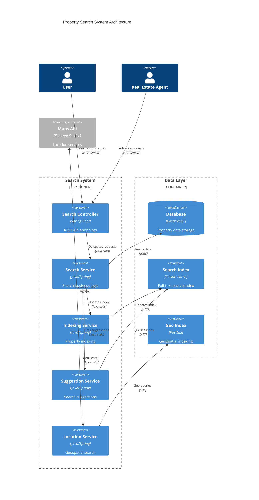

# Search Endpoints Guide

## Overview

The Search System provides comprehensive property search capabilities including text-based search, advanced filtering, location-based search, and intelligent search suggestions. The system is designed to help users quickly find properties that match their specific criteria with high performance and relevance.

## Architecture

### System Architecture



### Component Diagram

```mermaid
C4Component
    title Search Components
    
    Component_Boundary(searchComponents, "Search Components") {
        Component(searchRequest, "SearchRequest", "DTO", "Search criteria")
        Component(searchResponse, "SearchResponse", "DTO", "Search results")
        Component(searchFilter, "SearchFilter", "DTO", "Advanced filters")
        Component(suggestionRequest, "SuggestionRequest", "DTO", "Suggestion query")
        Component(suggestionResponse, "SuggestionResponse", "DTO", "Suggestion results")
        Component(propertyResponse, "PropertyResponse", "DTO", "Property data")
        Component(locationFilter, "LocationFilter", "DTO", "Location criteria")
        Component(priceRange, "PriceRange", "DTO", "Price filtering")
        Component(applicationResponse, "ApplicationResponse", "Wrapper", "Standard API response")
    }
    
    Rel(searchRequest, searchFilter, "Contains")
    Rel(searchFilter, locationFilter, "Includes")
    Rel(searchFilter, priceRange, "Includes")
    Rel(searchResponse, propertyResponse, "Contains list of")
    Rel(searchResponse, applicationResponse, "Wrapped in")
    Rel(suggestionResponse, applicationResponse, "Wrapped in")
```

## Data Models

### SearchRequest DTO

Request DTO for property search:

```java
public class SearchRequest {
    @NotBlank(message = "Search query is required")
    @Size(max = 255, message = "Search query must not exceed 255 characters")
    private String query;
    
    private String location;
    private Double minPrice;
    private Double maxPrice;
    private String propertyType; // SALE, RENT, COMMERCIAL
    private String propertyCategory; // HOUSE, APARTMENT, HOTEL, VILLA, OFFICE, LAND
    private String propertyStatus; // AVAILABLE, PENDING, SOLD, RENTED
    private Integer minBedrooms;
    private Integer maxBedrooms;
    private Integer minBathrooms;
    private Integer maxBathrooms;
    private String city;
    private String state;
    private String zipCode;
    private Double latitude;
    private Double longitude;
    private Double radiusKm; // Search radius in kilometers
    private Set<String> amenities;
    private String sortBy; // price, createdAt, bedrooms, bathrooms
    private String sortDirection; // asc, desc
    private Integer page;
    private Integer size;
    
    // Convenience methods for enum conversion
    public PropertyType getPropertyTypeEnum() {
        return propertyType != null ? PropertyType.valueOf(propertyType.toUpperCase()) : null;
    }
    
    public PropertyCategory getPropertyCategoryEnum() {
        return propertyCategory != null ? PropertyCategory.valueOf(propertyCategory.toUpperCase()) : null;
    }
    
    public PropertyStatus getPropertyStatusEnum() {
        return propertyStatus != null ? PropertyStatus.valueOf(propertyStatus.toUpperCase()) : null;
    }
}
```

### SearchResponse DTO

Response DTO containing search results:

```java
public class SearchResponse {
    private List<PropertyResponse> properties;
    private SearchMetadata metadata;
    private List<SearchFacet> facets;
    
    public static class SearchMetadata {
        private long totalResults;
        private int totalPages;
        private int currentPage;
        private int pageSize;
        private String query;
        private long searchTimeMs;
        private boolean hasNext;
        private boolean hasPrevious;
    }
    
    public static class SearchFacet {
        private String name;
        private List<FacetValue> values;
        
        public static class FacetValue {
            private String value;
            private long count;
        }
    }
}
```

### SuggestionRequest DTO

Request DTO for search suggestions:

```java
public class SuggestionRequest {
    @NotBlank(message = "Partial query is required")
    @Size(min = 1, max = 100, message = "Partial query must be between 1 and 100 characters")
    private String partialQuery;
    
    private String location;
    private String propertyType;
    private Integer maxSuggestions; // Default: 10
    private SuggestionType type; // ALL, PROPERTIES, LOCATIONS, AMENITIES
    
    public enum SuggestionType {
        ALL, PROPERTIES, LOCATIONS, AMENITIES
    }
}
```

### SuggestionResponse DTO

Response DTO containing search suggestions:

```java
public class SuggestionResponse {
    private List<Suggestion> suggestions;
    private String query;
    private long responseTimeMs;
    
    public static class Suggestion {
        private String text;
        private String type; // property, location, amenity
        private String category;
        private int relevanceScore;
        private Map<String, Object> metadata;
    }
}
```

### LocationFilter DTO

Location-based filtering criteria:

```java
public class LocationFilter {
    private String address;
    private String city;
    private String state;
    private String zipCode;
    private String country;
    private Double latitude;
    private Double longitude;
    private Double radiusKm;
    private BoundingBox boundingBox;
    
    public static class BoundingBox {
        private Double northLat;
        private Double southLat;
        private Double eastLng;
        private Double westLng;
    }
}
```

### PriceRange DTO

Price filtering criteria:

```java
public class PriceRange {
    @DecimalMin(value = "0.0", message = "Minimum price must be non-negative")
    private BigDecimal minPrice;
    
    @DecimalMin(value = "0.0", message = "Maximum price must be non-negative")
    private BigDecimal maxPrice;
    
    private String currency; // Default: USD
    
    @AssertTrue(message = "Maximum price must be greater than minimum price")
    public boolean isValidRange() {
        if (minPrice != null && maxPrice != null) {
            return maxPrice.compareTo(minPrice) >= 0;
        }
        return true;
    }
}
```

## API Endpoints

### 1. Search Properties

**Endpoint:** `GET /api/search`

**Description:** Search for properties based on various criteria including text search, location, price range, and property characteristics.

**Query Parameters:**
- `query` (String, required): Search query string
- `location` (String, optional): Location filter
- `minPrice` (Double, optional): Minimum price filter
- `maxPrice` (Double, optional): Maximum price filter
- `propertyType` (String, optional): Property type (SALE, RENT, COMMERCIAL)
- `propertyCategory` (String, optional): Property category (HOUSE, APARTMENT, HOTEL, VILLA, OFFICE, LAND)
- `propertyStatus` (String, optional): Property status (AVAILABLE, PENDING, SOLD, RENTED)
- `minBedrooms` (Integer, optional): Minimum number of bedrooms
- `maxBedrooms` (Integer, optional): Maximum number of bedrooms
- `minBathrooms` (Integer, optional): Minimum number of bathrooms
- `maxBathrooms` (Integer, optional): Maximum number of bathrooms
- `city` (String, optional): City filter
- `state` (String, optional): State filter
- `zipCode` (String, optional): ZIP code filter
- `latitude` (Double, optional): Latitude for geo search
- `longitude` (Double, optional): Longitude for geo search
- `radiusKm` (Double, optional): Search radius in kilometers
- `amenities` (String[], optional): Required amenities
- `sortBy` (String, optional): Sort field (price, createdAt, bedrooms, bathrooms)
- `sortDirection` (String, optional): Sort direction (asc, desc)
- `page` (Integer, optional): Page number (default: 1)
- `size` (Integer, optional): Page size (default: 10)

**Response:**
```json
{
    "success": true,
    "data": {
        "properties": [
            {
                "id": 1,
                "mainTitle": "Luxury Villa with Ocean View",
                "type": "SALE",
                "category": "VILLA",
                "price": 1250000.00,
                "keywords": "luxury, ocean view, villa, beachfront",
                "location": {
                    "address": "123 Ocean Drive",
                    "city": "Miami",
                    "state": "FL",
                    "zipCode": "33139",
                    "latitude": 25.7617,
                    "longitude": -80.1918
                },
                "contactPhone": "+1-555-0123",
                "contactEmail": "agent@luxuryrealty.com",
                "nearbyPlaces": [
                    {
                        "placeType": "Beach",
                        "name": "South Beach",
                        "distance": "0.2 km"
                    },
                    {
                        "placeType": "School",
                        "name": "Miami Beach Elementary",
                        "distance": "1.5 km"
                    }
                ],
                "area": "450 sqm",
                "bedrooms": 5,
                "bathrooms": 4,
                "parkingSpots": 3,
                "maxAdultsAccommodation": 10,
                "maxChildrenAccommodation": 4,
                "website": "https://luxuryrealty.com/property/1",
                "description": "Stunning oceanfront villa with panoramic views...",
                "amenities": ["Pool", "Gym", "Garden", "Security", "WiFi"],
                "enableAccordionWidget": true,
                "accordionItems": [
                    {
                        "title": "Property Features",
                        "details": "High-end finishes, smart home technology..."
                    }
                ],
                "showSimilarProperties": true,
                "showPriceChangeDynamics": true,
                "showGoogleMaps": true,
                "status": "AVAILABLE",
                "createdByEmail": "agent@luxuryrealty.com",
                "createdAt": "2024-01-15T10:30:00",
                "updatedAt": "2024-01-15T10:30:00"
            }
        ],
        "metadata": {
            "totalResults": 156,
            "totalPages": 16,
            "currentPage": 1,
            "pageSize": 10,
            "query": "luxury villa ocean view",
            "searchTimeMs": 45,
            "hasNext": true,
            "hasPrevious": false
        },
        "facets": [
            {
                "name": "propertyType",
                "values": [
                    {"value": "SALE", "count": 89},
                    {"value": "RENT", "count": 67}
                ]
            },
            {
                "name": "propertyCategory",
                "values": [
                    {"value": "VILLA", "count": 34},
                    {"value": "HOUSE", "count": 78},
                    {"value": "APARTMENT", "count": 44}
                ]
            },
            {
                "name": "priceRange",
                "values": [
                    {"value": "0-500000", "count": 23},
                    {"value": "500000-1000000", "count": 45},
                    {"value": "1000000+", "count": 88}
                ]
            }
        ]
    },
    "error": null,
    "message": "Search completed successfully"
}
```

### 2. Get Search Suggestions

**Endpoint:** `GET /api/search/suggestions`

**Description:** Get intelligent search suggestions based on partial input to help users discover relevant properties and refine their search.

**Query Parameters:**
- `partialQuery` (String, required): Partial search query
- `location` (String, optional): Location context for suggestions
- `propertyType` (String, optional): Property type filter for suggestions
- `maxSuggestions` (Integer, optional): Maximum number of suggestions (default: 10)
- `type` (String, optional): Suggestion type (ALL, PROPERTIES, LOCATIONS, AMENITIES)

**Response:**
```json
{
    "success": true,
    "data": {
        "suggestions": [
            {
                "text": "luxury villa with pool",
                "type": "property",
                "category": "search_term",
                "relevanceScore": 95,
                "metadata": {
                    "matchCount": 23,
                    "avgPrice": 1200000
                }
            },
            {
                "text": "luxury villa Miami Beach",
                "type": "property",
                "category": "location_specific",
                "relevanceScore": 92,
                "metadata": {
                    "matchCount": 12,
                    "location": "Miami Beach, FL"
                }
            },
            {
                "text": "Miami Beach",
                "type": "location",
                "category": "city",
                "relevanceScore": 88,
                "metadata": {
                    "propertyCount": 156,
                    "state": "FL"
                }
            },
            {
                "text": "Ocean View",
                "type": "amenity",
                "category": "feature",
                "relevanceScore": 85,
                "metadata": {
                    "propertyCount": 67
                }
            },
            {
                "text": "luxury villa for sale",
                "type": "property",
                "category": "type_specific",
                "relevanceScore": 82,
                "metadata": {
                    "matchCount": 34,
                    "propertyType": "SALE"
                }
            }
        ],
        "query": "luxury villa",
        "responseTimeMs": 12
    },
    "error": null,
    "message": "Suggestions retrieved successfully"
}
```

## Usage Examples

### PowerShell Examples

#### Basic Property Search
```powershell
$searchParams = @{
    query = "luxury villa"
    location = "Miami"
    minPrice = 500000
    maxPrice = 2000000
    propertyType = "SALE"
    page = 1
    size = 10
}

$queryString = ($searchParams.GetEnumerator() | ForEach-Object { "$($_.Key)=$($_.Value)" }) -join "&"
$response = Invoke-RestMethod -Uri "http://localhost:8080/api/search?$queryString" `
    -Method GET `
    -WebSession $session

Write-Output "Found $($response.data.metadata.totalResults) properties"
$response.data.properties | ForEach-Object {
    Write-Output "Property: $($_.mainTitle) - $($_.price) $($_.location.city)"
}
```

#### Advanced Search with Multiple Filters
```powershell
$advancedSearch = @{
    query = "beachfront"
    city = "Miami"
    state = "FL"
    minBedrooms = 3
    maxBedrooms = 6
    minBathrooms = 2
    propertyCategory = "VILLA"
    amenities = @("Pool", "Security", "WiFi")
    sortBy = "price"
    sortDirection = "desc"
    page = 1
    size = 20
}

# Convert amenities array to query string format
$amenitiesQuery = $advancedSearch.amenities | ForEach-Object { "amenities=$_" }
$otherParams = $advancedSearch.GetEnumerator() | Where-Object { $_.Key -ne "amenities" } | ForEach-Object { "$($_.Key)=$($_.Value)" }
$queryString = ($otherParams + $amenitiesQuery) -join "&"

$response = Invoke-RestMethod -Uri "http://localhost:8080/api/search?$queryString" `
    -Method GET `
    -WebSession $session

Write-Output "Advanced search results: $($response.data.metadata.totalResults) properties found"
Write-Output "Search took: $($response.data.metadata.searchTimeMs)ms"

# Display facets
$response.data.facets | ForEach-Object {
    Write-Output "Facet: $($_.name)"
    $_.values | ForEach-Object {
        Write-Output "  $($_.value): $($_.count) properties"
    }
}
```

#### Geospatial Search
```powershell
$geoSearch = @{
    query = "apartment"
    latitude = 25.7617
    longitude = -80.1918
    radiusKm = 5
    propertyType = "RENT"
    maxPrice = 3000
    sortBy = "price"
    sortDirection = "asc"
}

$queryString = ($geoSearch.GetEnumerator() | ForEach-Object { "$($_.Key)=$($_.Value)" }) -join "&"
$response = Invoke-RestMethod -Uri "http://localhost:8080/api/search?$queryString" `
    -Method GET `
    -WebSession $session

Write-Output "Found $($response.data.metadata.totalResults) apartments within 5km"
$response.data.properties | ForEach-Object {
    $distance = [math]::Round([math]::Sqrt([math]::Pow($_.location.latitude - 25.7617, 2) + [math]::Pow($_.location.longitude - (-80.1918), 2)) * 111, 2)
    Write-Output "$($_.mainTitle) - $($_.price)/month - ~${distance}km away"
}
```

#### Get Search Suggestions
```powershell
$suggestionParams = @{
    partialQuery = "luxury"
    location = "Miami"
    maxSuggestions = 15
    type = "ALL"
}

$queryString = ($suggestionParams.GetEnumerator() | ForEach-Object { "$($_.Key)=$($_.Value)" }) -join "&"
$response = Invoke-RestMethod -Uri "http://localhost:8080/api/search/suggestions?$queryString" `
    -Method GET `
    -WebSession $session

Write-Output "Suggestions for 'luxury':"
$response.data.suggestions | ForEach-Object {
    Write-Output "  $($_.text) ($($_.type)) - Score: $($_.relevanceScore)"
}
```

### JavaScript Examples

#### Basic Property Search
```javascript
async function searchProperties(searchCriteria) {
    const params = new URLSearchParams();
    
    Object.entries(searchCriteria).forEach(([key, value]) => {
        if (value !== null && value !== undefined) {
            if (Array.isArray(value)) {
                value.forEach(item => params.append(key, item));
            } else {
                params.append(key, value);
            }
        }
    });

    try {
        const response = await fetch(`/api/search?${params.toString()}`, {
            method: 'GET',
            credentials: 'include'
        });
        
        const data = await response.json();
        
        if (data.success) {
            return data.data;
        } else {
            throw new Error(data.error.message);
        }
    } catch (error) {
        console.error('Error searching properties:', error);
        throw error;
    }
}

// Usage
const searchCriteria = {
    query: "luxury villa",
    location: "Miami",
    minPrice: 500000,
    maxPrice: 2000000,
    propertyType: "SALE",
    page: 1,
    size: 10
};

searchProperties(searchCriteria).then(results => {
    console.log(`Found ${results.metadata.totalResults} properties`);
    results.properties.forEach(property => {
        console.log(`${property.mainTitle} - $${property.price} in ${property.location.city}`);
    });
});
```

#### Advanced Search with Filters
```javascript
async function advancedPropertySearch() {
    const searchCriteria = {
        query: "beachfront",
        city: "Miami",
        state: "FL",
        minBedrooms: 3,
        maxBedrooms: 6,
        minBathrooms: 2,
        propertyCategory: "VILLA",
        amenities: ["Pool", "Security", "WiFi"],
        sortBy: "price",
        sortDirection: "desc",
        page: 1,
        size: 20
    };

    try {
        const results = await searchProperties(searchCriteria);
        
        console.log(`Advanced search results: ${results.metadata.totalResults} properties found`);
        console.log(`Search took: ${results.metadata.searchTimeMs}ms`);
        
        // Display facets
        results.facets.forEach(facet => {
            console.log(`Facet: ${facet.name}`);
            facet.values.forEach(value => {
                console.log(`  ${value.value}: ${value.count} properties`);
            });
        });
        
        return results;
    } catch (error) {
        console.error('Advanced search failed:', error);
        throw error;
    }
}
```

#### Geospatial Search
```javascript
async function searchNearby(latitude, longitude, radiusKm, filters = {}) {
    const searchCriteria = {
        query: filters.query || "*",
        latitude: latitude,
        longitude: longitude,
        radiusKm: radiusKm,
        ...filters
    };

    try {
        const results = await searchProperties(searchCriteria);
        
        // Calculate distances for display
        const propertiesWithDistance = results.properties.map(property => {
            const distance = calculateDistance(
                latitude, longitude,
                property.location.latitude, property.location.longitude
            );
            return { ...property, distance: distance };
        });
        
        return {
            ...results,
            properties: propertiesWithDistance
        };
    } catch (error) {
        console.error('Geospatial search failed:', error);
        throw error;
    }
}

function calculateDistance(lat1, lon1, lat2, lon2) {
    const R = 6371; // Earth's radius in kilometers
    const dLat = (lat2 - lat1) * Math.PI / 180;
    const dLon = (lon2 - lon1) * Math.PI / 180;
    const a = Math.sin(dLat/2) * Math.sin(dLat/2) +
              Math.cos(lat1 * Math.PI / 180) * Math.cos(lat2 * Math.PI / 180) *
              Math.sin(dLon/2) * Math.sin(dLon/2);
    const c = 2 * Math.atan2(Math.sqrt(a), Math.sqrt(1-a));
    return Math.round(R * c * 100) / 100; // Round to 2 decimal places
}

// Usage
searchNearby(25.7617, -80.1918, 5, {
    propertyType: "RENT",
    maxPrice: 3000,
    sortBy: "price"
}).then(results => {
    console.log(`Found ${results.metadata.totalResults} properties within 5km`);
    results.properties.forEach(property => {
        console.log(`${property.mainTitle} - $${property.price}/month - ${property.distance}km away`);
    });
});
```

#### Get Search Suggestions
```javascript
async function getSearchSuggestions(partialQuery, options = {}) {
    const params = new URLSearchParams({
        partialQuery: partialQuery,
        maxSuggestions: options.maxSuggestions || 10,
        type: options.type || 'ALL',
        ...options
    });

    try {
        const response = await fetch(`/api/search/suggestions?${params.toString()}`, {
            method: 'GET',
            credentials: 'include'
        });
        
        const data = await response.json();
        
        if (data.success) {
            return data.data;
        } else {
            throw new Error(data.error.message);
        }
    } catch (error) {
        console.error('Error getting suggestions:', error);
        throw error;
    }
}

// Usage with debouncing for search-as-you-type
let suggestionTimeout;

function handleSearchInput(inputElement) {
    clearTimeout(suggestionTimeout);
    
    suggestionTimeout = setTimeout(async () => {
        const query = inputElement.value.trim();
        
        if (query.length >= 2) {
            try {
                const suggestions = await getSearchSuggestions(query, {
                    location: "Miami",
                    maxSuggestions: 8
                });
                
                displaySuggestions(suggestions.suggestions);
            } catch (error) {
                console.error('Failed to get suggestions:', error);
            }
        }
    }, 300); // 300ms debounce
}

function displaySuggestions(suggestions) {
    const suggestionsList = document.getElementById('suggestions-list');
    suggestionsList.innerHTML = '';
    
    suggestions.forEach(suggestion => {
        const item = document.createElement('div');
        item.className = `suggestion-item suggestion-${suggestion.type}`;
        item.innerHTML = `
            <span class="suggestion-text">${suggestion.text}</span>
            <span class="suggestion-type">${suggestion.type}</span>
            <span class="suggestion-score">${suggestion.relevanceScore}</span>
        `;
        
        item.addEventListener('click', () => {
            document.getElementById('search-input').value = suggestion.text;
            suggestionsList.innerHTML = '';
            // Trigger search
            performSearch(suggestion.text);
        });
        
        suggestionsList.appendChild(item);
    });
}
```

## Error Handling

### Common Error Codes

| Error Code | HTTP Status | Description |
|------------|-------------|-------------|
| 2001 | 400 | Invalid search query |
| 2002 | 400 | Invalid price range |
| 2003 | 400 | Invalid location parameters |
| 2004 | 400 | Invalid pagination parameters |
| 2005 | 400 | Invalid sort parameters |
| 2006 | 400 | Invalid property type |
| 2007 | 400 | Invalid property category |
| 2008 | 400 | Invalid amenities filter |
| 2009 | 429 | Search rate limit exceeded |
| 2010 | 500 | Search service unavailable |
| 2011 | 503 | Search index unavailable |

### Error Response Format

```json
{
    "success": false,
    "data": null,
    "error": {
        "code": 2001,
        "message": "Invalid search query: Query must be between 1 and 255 characters",
        "status": "BAD_REQUEST",
        "details": {
            "field": "query",
            "rejectedValue": "",
            "constraint": "NotBlank"
        }
    },
    "message": "Search request validation failed"
}
```

### Error Handling Examples

#### PowerShell Error Handling
```powershell
try {
    $response = Invoke-RestMethod -Uri "http://localhost:8080/api/search?query=luxury&minPrice=-1000" `
        -Method GET `
        -WebSession $session
    
    if ($response.success) {
        Write-Output "Search successful: $($response.data.metadata.totalResults) results"
    } else {
        Write-Error "Search failed: $($response.error.message)"
        
        # Handle specific error codes
        switch ($response.error.code) {
            2002 { Write-Warning "Please check your price range values" }
            2009 { Write-Warning "Too many search requests. Please wait before searching again." }
            default { Write-Warning "Unexpected search error occurred" }
        }
    }
} catch {
    Write-Error "Request failed: $($_.Exception.Message)"
}
```

#### JavaScript Error Handling
```javascript
async function handleSearchWithErrorHandling(searchCriteria) {
    try {
        const results = await searchProperties(searchCriteria);
        return results;
    } catch (error) {
        console.error('Search failed:', error);
        
        // Handle specific error scenarios
        if (error.message.includes('rate limit')) {
            showUserMessage('Too many searches. Please wait a moment before searching again.', 'warning');
            return null;
        } else if (error.message.includes('Invalid price range')) {
            showUserMessage('Please check your price range values.', 'error');
            return null;
        } else if (error.message.includes('service unavailable')) {
            showUserMessage('Search service is temporarily unavailable. Please try again later.', 'error');
            return null;
        } else {
            showUserMessage('Search failed. Please try again or contact support.', 'error');
            return null;
        }
    }
}

function showUserMessage(message, type) {
    const messageDiv = document.createElement('div');
    messageDiv.className = `alert alert-${type}`;
    messageDiv.textContent = message;
    
    const container = document.getElementById('messages-container');
    container.appendChild(messageDiv);
    
    setTimeout(() => {
        container.removeChild(messageDiv);
    }, 5000);
}
```

## Security Considerations

### Input Validation
- All search parameters are validated for type, range, and format
- Query strings are sanitized to prevent injection attacks
- Location coordinates are validated for realistic ranges
- Price ranges are validated for positive values and logical ordering

### Rate Limiting
- Search requests are rate-limited per user/IP address
- Suggestion requests have separate, more restrictive rate limits
- Burst protection prevents rapid-fire search requests
- Premium users may have higher rate limits

### Data Protection
- Search queries and results don't expose sensitive user data
- Property contact information is only shown to authenticated users
- Search analytics are anonymized for privacy protection
- Location data is rounded to protect exact addresses

### Performance Protection
- Complex queries are optimized and may be simplified automatically
- Search timeouts prevent long-running queries
- Result set limits prevent excessive data transfer
- Caching reduces database load for common searches

## Best Practices

### Search Optimization
1. **Use specific keywords** for better relevance
2. **Combine filters** to narrow down results effectively
3. **Use location-based search** for geographically relevant results
4. **Implement pagination** for large result sets
5. **Cache frequent searches** to improve performance

### User Experience
1. **Provide search suggestions** to guide user input
2. **Show search facets** to help users refine searches
3. **Display search metadata** (result count, search time)
4. **Implement search-as-you-type** with debouncing
5. **Save search preferences** for returning users

### Performance
1. **Use appropriate page sizes** (10-20 results per page)
2. **Implement client-side caching** for recent searches
3. **Use geospatial indexing** for location-based searches
4. **Monitor search performance** and optimize slow queries
5. **Implement search analytics** to understand user behavior

### Error Handling
1. **Provide meaningful error messages** to users
2. **Implement graceful degradation** when search services are unavailable
3. **Log search errors** for monitoring and debugging
4. **Provide fallback search options** when primary search fails
5. **Handle network timeouts** gracefully

---

*This guide provides comprehensive documentation for the Property Search System. For additional support or questions, please contact the development team.*