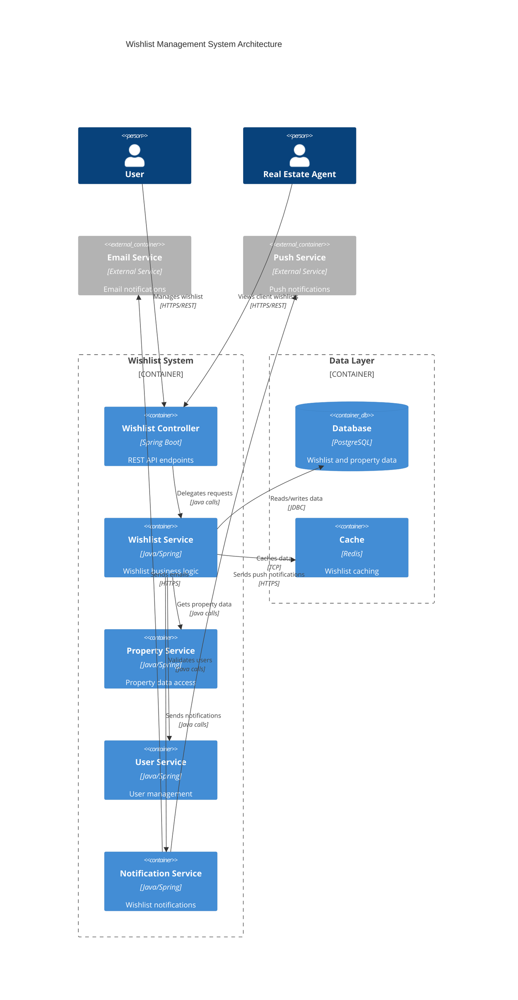

# Wishlist Endpoints Guide

## Overview

The Wishlist System provides comprehensive property wishlist management capabilities, allowing users to save, organize, and manage their favorite properties. The system supports adding properties to wishlists, removing them, retrieving wishlist contents, and clearing entire wishlists with high performance and user-friendly operations.

## Architecture

### System Architecture



### Component Diagram

```mermaid
C4Component
    title Wishlist Components
    
    Component_Boundary(wishlistComponents, "Wishlist Components") {
        Component(wishlistEntity, "Wishlist", "Entity", "Wishlist data model")
        Component(wishlistResponse, "WishlistResponse", "DTO", "Wishlist with properties")
        Component(wishlistSummary, "WishlistSummary", "DTO", "Wishlist metadata")
        Component(addToWishlistRequest, "AddToWishlistRequest", "DTO", "Add property request")
        Component(propertyResponse, "PropertyResponse", "DTO", "Property details")
        Component(wishlistStats, "WishlistStatistics", "DTO", "Wishlist analytics")
        Component(applicationResponse, "ApplicationResponse", "Wrapper", "Standard API response")
    }
    
    Rel(wishlistEntity, propertyResponse, "Contains list of")
    Rel(wishlistResponse, propertyResponse, "Includes")
    Rel(wishlistResponse, wishlistSummary, "Contains")
    Rel(wishlistResponse, applicationResponse, "Wrapped in")
    Rel(wishlistStats, applicationResponse, "Wrapped in")
```

## Data Models

### Wishlist Entity

Core wishlist entity with user and property relationships:

```java
@Entity
@Table(name = "wishlists")
public class Wishlist {
    @Id
    @GeneratedValue(strategy = GenerationType.IDENTITY)
    private Long id;

    @OneToOne(fetch = FetchType.LAZY)
    @JoinColumn(name = "user_id", nullable = false, unique = true)
    private User user;

    @ManyToMany(fetch = FetchType.LAZY)
    @JoinTable(
            name = "wishlist_properties",
            joinColumns = @JoinColumn(name = "wishlist_id"),
            inverseJoinColumns = @JoinColumn(name = "property_id")
    )
    private List<Property> properties = new ArrayList<>();

    @CreationTimestamp
    @Column(name = "created_at", nullable = false, updatable = false)
    private LocalDateTime createdAt;
    
    // Constructors, getters, and setters
}
```

### WishlistResponse DTO

Response DTO containing complete wishlist information:

```java
public class WishlistResponse {
    private Long id;
    private Long userId;
    private String userEmail;
    private List<PropertyResponse> properties;
    private WishlistSummary summary;
    private LocalDateTime createdAt;
    private LocalDateTime lastModified;
    
    public static class WishlistSummary {
        private int totalProperties;
        private BigDecimal totalValue;
        private String averagePrice;
        private Map<String, Integer> propertyTypeBreakdown;
        private Map<String, Integer> locationBreakdown;
        private Map<String, Integer> priceRangeBreakdown;
    }
}
```

### AddToWishlistRequest DTO

Request DTO for adding properties to wishlist:

```java
public class AddToWishlistRequest {
    @NotNull(message = "Property ID is required")
    private Long propertyId;
    
    private String notes; // Optional user notes about the property
    private Set<String> tags; // Optional user-defined tags
    private Integer priority; // Optional priority ranking (1-5)
    
    // Validation method
    @AssertTrue(message = "Priority must be between 1 and 5")
    public boolean isValidPriority() {
        return priority == null || (priority >= 1 && priority <= 5);
    }
}
```

### WishlistItemResponse DTO

Response DTO for individual wishlist items with metadata:

```java
public class WishlistItemResponse {
    private Long wishlistId;
    private PropertyResponse property;
    private String notes;
    private Set<String> tags;
    private Integer priority;
    private LocalDateTime addedAt;
    private LocalDateTime lastViewed;
    private boolean isAvailable; // Property availability status
    private PriceChangeInfo priceChange;
    
    public static class PriceChangeInfo {
        private BigDecimal originalPrice;
        private BigDecimal currentPrice;
        private BigDecimal changeAmount;
        private Double changePercentage;
        private String changeDirection; // UP, DOWN, STABLE
        private LocalDateTime lastPriceUpdate;
    }
}
```

### WishlistStatistics DTO

Statistics DTO for wishlist analytics:

```java
public class WishlistStatistics {
    private Long userId;
    private int totalProperties;
    private BigDecimal totalValue;
    private BigDecimal averagePrice;
    private BigDecimal medianPrice;
    private PropertyTypeStats typeStats;
    private LocationStats locationStats;
    private PriceRangeStats priceStats;
    private ActivityStats activityStats;
    
    public static class PropertyTypeStats {
        private int saleProperties;
        private int rentProperties;
        private int commercialProperties;
        private Map<String, Integer> categoryBreakdown;
    }
    
    public static class LocationStats {
        private Map<String, Integer> cityBreakdown;
        private Map<String, Integer> stateBreakdown;
        private String mostPopularCity;
        private String mostPopularState;
    }
    
    public static class PriceRangeStats {
        private int under500k;
        private int range500kTo1m;
        private int range1mTo2m;
        private int above2m;
        private BigDecimal lowestPrice;
        private BigDecimal highestPrice;
    }
    
    public static class ActivityStats {
        private LocalDateTime lastActivity;
        private int propertiesAddedThisWeek;
        private int propertiesAddedThisMonth;
        private int propertiesRemovedThisMonth;
        private Double engagementScore;
    }
}
```

### WishlistSearchRequest DTO

Request DTO for searching within wishlist:

```java
public class WishlistSearchRequest {
    private String query;
    private String propertyType; // SALE, RENT, COMMERCIAL
    private String propertyCategory; // HOUSE, APARTMENT, VILLA, etc.
    private BigDecimal minPrice;
    private BigDecimal maxPrice;
    private String location;
    private Set<String> tags;
    private Integer minPriority;
    private Integer maxPriority;
    private String sortBy; // addedAt, price, priority, title
    private String sortDirection; // asc, desc
    private Integer page;
    private Integer size;
}
```

## API Endpoints

### 1. Get User Wishlist

**Endpoint:** `GET /api/wishlist`

**Description:** Retrieve the current user's complete wishlist with all saved properties and metadata.

**Query Parameters:**
- `includeUnavailable` (Boolean, optional): Include unavailable properties (default: true)
- `sortBy` (String, optional): Sort field (addedAt, price, priority, title) (default: addedAt)
- `sortDirection` (String, optional): Sort direction (asc, desc) (default: desc)
- `page` (Integer, optional): Page number (default: 1)
- `size` (Integer, optional): Page size (default: 20)

**Response:**
```json
{
    "success": true,
    "data": {
        "id": 1,
        "userId": 123,
        "userEmail": "user@example.com",
        "properties": [
            {
                "id": 1,
                "mainTitle": "Luxury Villa with Ocean View",
                "type": "SALE",
                "category": "VILLA",
                "price": 1250000.00,
                "keywords": "luxury, ocean view, villa, beachfront",
                "location": {
                    "address": "123 Ocean Drive",
                    "city": "Miami",
                    "state": "FL",
                    "zipCode": "33139",
                    "latitude": 25.7617,
                    "longitude": -80.1918
                },
                "contactPhone": "+1-555-0123",
                "contactEmail": "agent@luxuryrealty.com",
                "nearbyPlaces": [
                    {
                        "placeType": "Beach",
                        "name": "South Beach",
                        "distance": "0.2 km"
                    }
                ],
                "area": "450 sqm",
                "bedrooms": 5,
                "bathrooms": 4,
                "parkingSpots": 3,
                "maxAdultsAccommodation": 10,
                "maxChildrenAccommodation": 4,
                "website": "https://luxuryrealty.com/property/1",
                "description": "Stunning oceanfront villa with panoramic views...",
                "amenities": ["Pool", "Gym", "Garden", "Security", "WiFi"],
                "enableAccordionWidget": true,
                "accordionItems": [
                    {
                        "title": "Property Features",
                        "details": "High-end finishes, smart home technology..."
                    }
                ],
                "showSimilarProperties": true,
                "showPriceChangeDynamics": true,
                "showGoogleMaps": true,
                "status": "AVAILABLE",
                "createdByEmail": "agent@luxuryrealty.com",
                "createdAt": "2024-01-15T10:30:00",
                "updatedAt": "2024-01-15T10:30:00"
            }
        ],
        "summary": {
            "totalProperties": 5,
            "totalValue": 4750000.00,
            "averagePrice": "950,000",
            "propertyTypeBreakdown": {
                "SALE": 3,
                "RENT": 2
            },
            "locationBreakdown": {
                "Miami": 2,
                "New York": 2,
                "Los Angeles": 1
            },
            "priceRangeBreakdown": {
                "under500k": 1,
                "500k-1m": 2,
                "1m-2m": 2,
                "above2m": 0
            }
        },
        "createdAt": "2024-01-10T09:00:00",
        "lastModified": "2024-01-20T14:30:00"
    },
    "error": null,
    "message": "Wishlist retrieved successfully"
}
```

### 2. Add Property to Wishlist

**Endpoint:** `POST /api/wishlist/{propertyId}`

**Description:** Add a specific property to the user's wishlist with optional metadata.

**Path Parameters:**
- `propertyId` (Long, required): ID of the property to add

**Request Body (Optional):**
```json
{
    "notes": "Interested in this property for investment",
    "tags": ["investment", "beachfront", "luxury"],
    "priority": 4
}
```

**Response:**
```json
{
    "success": true,
    "data": {
        "wishlistId": 1,
        "property": {
            "id": 1,
            "mainTitle": "Luxury Villa with Ocean View",
            "type": "SALE",
            "category": "VILLA",
            "price": 1250000.00,
            "location": {
                "address": "123 Ocean Drive",
                "city": "Miami",
                "state": "FL",
                "zipCode": "33139"
            },
            "bedrooms": 5,
            "bathrooms": 4,
            "status": "AVAILABLE"
        },
        "notes": "Interested in this property for investment",
        "tags": ["investment", "beachfront", "luxury"],
        "priority": 4,
        "addedAt": "2024-01-20T15:30:00",
        "lastViewed": null,
        "isAvailable": true,
        "priceChange": {
            "originalPrice": 1250000.00,
            "currentPrice": 1250000.00,
            "changeAmount": 0.00,
            "changePercentage": 0.0,
            "changeDirection": "STABLE",
            "lastPriceUpdate": "2024-01-15T10:30:00"
        }
    },
    "error": null,
    "message": "Property added to wishlist successfully"
}
```

### 3. Remove Property from Wishlist

**Endpoint:** `DELETE /api/wishlist/{propertyId}`

**Description:** Remove a specific property from the user's wishlist.

**Path Parameters:**
- `propertyId` (Long, required): ID of the property to remove

**Response:**
```json
{
    "success": true,
    "data": {
        "propertyId": 1,
        "propertyTitle": "Luxury Villa with Ocean View",
        "removedAt": "2024-01-20T16:00:00",
        "wasInWishlistFor": "10 days"
    },
    "error": null,
    "message": "Property removed from wishlist successfully"
}
```

### 4. Clear Entire Wishlist

**Endpoint:** `DELETE /api/wishlist`

**Description:** Remove all properties from the user's wishlist.

**Query Parameters:**
- `confirm` (Boolean, required): Confirmation flag to prevent accidental deletion

**Response:**
```json
{
    "success": true,
    "data": {
        "clearedAt": "2024-01-20T16:30:00",
        "propertiesRemoved": 5,
        "backupCreated": true,
        "backupId": "backup_123_20240120_163000"
    },
    "error": null,
    "message": "Wishlist cleared successfully"
}
```

### 5. Get Wishlist Statistics

**Endpoint:** `GET /api/wishlist/statistics`

**Description:** Get comprehensive statistics and analytics about the user's wishlist.

**Response:**
```json
{
    "success": true,
    "data": {
        "userId": 123,
        "totalProperties": 5,
        "totalValue": 4750000.00,
        "averagePrice": 950000.00,
        "medianPrice": 875000.00,
        "typeStats": {
            "saleProperties": 3,
            "rentProperties": 2,
            "commercialProperties": 0,
            "categoryBreakdown": {
                "VILLA": 2,
                "APARTMENT": 2,
                "HOUSE": 1
            }
        },
        "locationStats": {
            "cityBreakdown": {
                "Miami": 2,
                "New York": 2,
                "Los Angeles": 1
            },
            "stateBreakdown": {
                "FL": 2,
                "NY": 2,
                "CA": 1
            },
            "mostPopularCity": "Miami",
            "mostPopularState": "FL"
        },
        "priceStats": {
            "under500k": 1,
            "range500kTo1m": 2,
            "range1mTo2m": 2,
            "above2m": 0,
            "lowestPrice": 450000.00,
            "highestPrice": 1250000.00
        },
        "activityStats": {
            "lastActivity": "2024-01-20T15:30:00",
            "propertiesAddedThisWeek": 2,
            "propertiesAddedThisMonth": 5,
            "propertiesRemovedThisMonth": 1,
            "engagementScore": 8.5
        }
    },
    "error": null,
    "message": "Wishlist statistics retrieved successfully"
}
```

### 6. Search Within Wishlist

**Endpoint:** `GET /api/wishlist/search`

**Description:** Search and filter properties within the user's wishlist.

**Query Parameters:**
- `query` (String, optional): Search query string
- `propertyType` (String, optional): Property type filter
- `propertyCategory` (String, optional): Property category filter
- `minPrice` (BigDecimal, optional): Minimum price filter
- `maxPrice` (BigDecimal, optional): Maximum price filter
- `location` (String, optional): Location filter
- `tags` (String[], optional): Tag filters
- `minPriority` (Integer, optional): Minimum priority filter
- `maxPriority` (Integer, optional): Maximum priority filter
- `sortBy` (String, optional): Sort field (default: addedAt)
- `sortDirection` (String, optional): Sort direction (default: desc)
- `page` (Integer, optional): Page number (default: 1)
- `size` (Integer, optional): Page size (default: 10)

**Response:**
```json
{
    "success": true,
    "data": {
        "properties": [
            {
                "wishlistId": 1,
                "property": {
                    "id": 1,
                    "mainTitle": "Luxury Villa with Ocean View",
                    "type": "SALE",
                    "category": "VILLA",
                    "price": 1250000.00,
                    "location": {
                        "city": "Miami",
                        "state": "FL"
                    },
                    "bedrooms": 5,
                    "bathrooms": 4,
                    "status": "AVAILABLE"
                },
                "notes": "Interested in this property for investment",
                "tags": ["investment", "beachfront", "luxury"],
                "priority": 4,
                "addedAt": "2024-01-20T15:30:00",
                "isAvailable": true
            }
        ],
        "metadata": {
            "totalResults": 3,
            "totalPages": 1,
            "currentPage": 1,
            "pageSize": 10,
            "query": "luxury",
            "hasNext": false,
            "hasPrevious": false
        }
    },
    "error": null,
    "message": "Wishlist search completed successfully"
}
```

### 7. Update Wishlist Item

**Endpoint:** `PUT /api/wishlist/{propertyId}`

**Description:** Update metadata for a property in the user's wishlist.

**Path Parameters:**
- `propertyId` (Long, required): ID of the property to update

**Request Body:**
```json
{
    "notes": "Updated notes about this property",
    "tags": ["investment", "beachfront", "luxury", "updated"],
    "priority": 5
}
```

**Response:**
```json
{
    "success": true,
    "data": {
        "wishlistId": 1,
        "propertyId": 1,
        "notes": "Updated notes about this property",
        "tags": ["investment", "beachfront", "luxury", "updated"],
        "priority": 5,
        "updatedAt": "2024-01-20T17:00:00"
    },
    "error": null,
    "message": "Wishlist item updated successfully"
}
```

## Usage Examples

### PowerShell Examples

#### Get User Wishlist
```powershell
$response = Invoke-RestMethod -Uri "http://localhost:8080/api/wishlist" `
    -Method GET `
    -WebSession $session

if ($response.success) {
    Write-Output "Wishlist contains $($response.data.summary.totalProperties) properties"
    Write-Output "Total value: $($response.data.summary.totalValue)"
    
    $response.data.properties | ForEach-Object {
        Write-Output "Property: $($_.mainTitle) - $($_.price) in $($_.location.city)"
    }
} else {
    Write-Error "Failed to get wishlist: $($response.error.message)"
}
```

#### Add Property to Wishlist
```powershell
$propertyId = 123
$requestBody = @{
    notes = "Interested in this property for investment"
    tags = @("investment", "beachfront", "luxury")
    priority = 4
} | ConvertTo-Json

$response = Invoke-RestMethod -Uri "http://localhost:8080/api/wishlist/$propertyId" `
    -Method POST `
    -Body $requestBody `
    -ContentType "application/json" `
    -WebSession $session

if ($response.success) {
    Write-Output "Property added to wishlist successfully"
    Write-Output "Property: $($response.data.property.mainTitle)"
    Write-Output "Priority: $($response.data.priority)"
} else {
    Write-Error "Failed to add property: $($response.error.message)"
}
```

#### Remove Property from Wishlist
```powershell
$propertyId = 123

$response = Invoke-RestMethod -Uri "http://localhost:8080/api/wishlist/$propertyId" `
    -Method DELETE `
    -WebSession $session

if ($response.success) {
    Write-Output "Property removed from wishlist"
    Write-Output "Property: $($response.data.propertyTitle)"
    Write-Output "Was in wishlist for: $($response.data.wasInWishlistFor)"
} else {
    Write-Error "Failed to remove property: $($response.error.message)"
}
```

#### Clear Entire Wishlist
```powershell
$confirmation = Read-Host "Are you sure you want to clear your entire wishlist? (yes/no)"

if ($confirmation -eq "yes") {
    $response = Invoke-RestMethod -Uri "http://localhost:8080/api/wishlist?confirm=true" `
        -Method DELETE `
        -WebSession $session

    if ($response.success) {
        Write-Output "Wishlist cleared successfully"
        Write-Output "Properties removed: $($response.data.propertiesRemoved)"
        Write-Output "Backup created: $($response.data.backupId)"
    } else {
        Write-Error "Failed to clear wishlist: $($response.error.message)"
    }
} else {
    Write-Output "Wishlist clear operation cancelled"
}
```

#### Get Wishlist Statistics
```powershell
$response = Invoke-RestMethod -Uri "http://localhost:8080/api/wishlist/statistics" `
    -Method GET `
    -WebSession $session

if ($response.success) {
    $stats = $response.data
    
    Write-Output "=== Wishlist Statistics ==="
    Write-Output "Total Properties: $($stats.totalProperties)"
    Write-Output "Total Value: $($stats.totalValue)"
    Write-Output "Average Price: $($stats.averagePrice)"
    Write-Output "Median Price: $($stats.medianPrice)"
    
    Write-Output "`n=== Property Types ==="
    Write-Output "For Sale: $($stats.typeStats.saleProperties)"
    Write-Output "For Rent: $($stats.typeStats.rentProperties)"
    Write-Output "Commercial: $($stats.typeStats.commercialProperties)"
    
    Write-Output "`n=== Top Locations ==="
    Write-Output "Most Popular City: $($stats.locationStats.mostPopularCity)"
    Write-Output "Most Popular State: $($stats.locationStats.mostPopularState)"
    
    Write-Output "`n=== Recent Activity ==="
    Write-Output "Added This Week: $($stats.activityStats.propertiesAddedThisWeek)"
    Write-Output "Added This Month: $($stats.activityStats.propertiesAddedThisMonth)"
    Write-Output "Engagement Score: $($stats.activityStats.engagementScore)"
} else {
    Write-Error "Failed to get statistics: $($response.error.message)"
}
```

#### Search Within Wishlist
```powershell
$searchParams = @{
    query = "luxury"
    propertyType = "SALE"
    minPrice = 500000
    maxPrice = 2000000
    location = "Miami"
    sortBy = "price"
    sortDirection = "desc"
    page = 1
    size = 10
}

$queryString = ($searchParams.GetEnumerator() | ForEach-Object { "$($_.Key)=$($_.Value)" }) -join "&"
$response = Invoke-RestMethod -Uri "http://localhost:8080/api/wishlist/search?$queryString" `
    -Method GET `
    -WebSession $session

if ($response.success) {
    Write-Output "Found $($response.data.metadata.totalResults) matching properties in wishlist"
    
    $response.data.properties | ForEach-Object {
        Write-Output "Property: $($_.property.mainTitle)"
        Write-Output "  Price: $($_.property.price)"
        Write-Output "  Priority: $($_.priority)"
        Write-Output "  Tags: $($_.tags -join ', ')"
        Write-Output "  Added: $($_.addedAt)"
        Write-Output ""
    }
} else {
    Write-Error "Search failed: $($response.error.message)"
}
```

### JavaScript Examples

#### Get User Wishlist
```javascript
async function getUserWishlist(options = {}) {
    const params = new URLSearchParams({
        includeUnavailable: options.includeUnavailable || true,
        sortBy: options.sortBy || 'addedAt',
        sortDirection: options.sortDirection || 'desc',
        page: options.page || 1,
        size: options.size || 20
    });

    try {
        const response = await fetch(`/api/wishlist?${params.toString()}`, {
            method: 'GET',
            credentials: 'include'
        });
        
        const data = await response.json();
        
        if (data.success) {
            return data.data;
        } else {
            throw new Error(data.error.message);
        }
    } catch (error) {
        console.error('Error getting wishlist:', error);
        throw error;
    }
}

// Usage
getUserWishlist({ sortBy: 'price', sortDirection: 'desc' }).then(wishlist => {
    console.log(`Wishlist contains ${wishlist.summary.totalProperties} properties`);
    console.log(`Total value: $${wishlist.summary.totalValue.toLocaleString()}`);
    
    wishlist.properties.forEach(property => {
        console.log(`${property.mainTitle} - $${property.price.toLocaleString()} in ${property.location.city}`);
    });
});
```

#### Add Property to Wishlist
```javascript
async function addToWishlist(propertyId, metadata = {}) {
    const requestBody = {
        notes: metadata.notes || '',
        tags: metadata.tags || [],
        priority: metadata.priority || null
    };

    try {
        const response = await fetch(`/api/wishlist/${propertyId}`, {
            method: 'POST',
            headers: {
                'Content-Type': 'application/json'
            },
            body: JSON.stringify(requestBody),
            credentials: 'include'
        });
        
        const data = await response.json();
        
        if (data.success) {
            return data.data;
        } else {
            throw new Error(data.error.message);
        }
    } catch (error) {
        console.error('Error adding to wishlist:', error);
        throw error;
    }
}

// Usage
addToWishlist(123, {
    notes: "Interested in this property for investment",
    tags: ["investment", "beachfront", "luxury"],
    priority: 4
}).then(result => {
    console.log(`Added ${result.property.mainTitle} to wishlist`);
    console.log(`Priority: ${result.priority}`);
    showSuccessMessage('Property added to wishlist successfully!');
}).catch(error => {
    showErrorMessage(`Failed to add property: ${error.message}`);
});
```

#### Remove Property from Wishlist
```javascript
async function removeFromWishlist(propertyId) {
    try {
        const response = await fetch(`/api/wishlist/${propertyId}`, {
            method: 'DELETE',
            credentials: 'include'
        });
        
        const data = await response.json();
        
        if (data.success) {
            return data.data;
        } else {
            throw new Error(data.error.message);
        }
    } catch (error) {
        console.error('Error removing from wishlist:', error);
        throw error;
    }
}

// Usage with confirmation
function confirmRemoveFromWishlist(propertyId, propertyTitle) {
    if (confirm(`Are you sure you want to remove "${propertyTitle}" from your wishlist?`)) {
        removeFromWishlist(propertyId).then(result => {
            console.log(`Removed ${result.propertyTitle} from wishlist`);
            console.log(`Was in wishlist for: ${result.wasInWishlistFor}`);
            showSuccessMessage('Property removed from wishlist');
            // Update UI to remove the property
            updateWishlistUI();
        }).catch(error => {
            showErrorMessage(`Failed to remove property: ${error.message}`);
        });
    }
}
```

#### Clear Entire Wishlist
```javascript
async function clearWishlist() {
    try {
        const response = await fetch('/api/wishlist?confirm=true', {
            method: 'DELETE',
            credentials: 'include'
        });
        
        const data = await response.json();
        
        if (data.success) {
            return data.data;
        } else {
            throw new Error(data.error.message);
        }
    } catch (error) {
        console.error('Error clearing wishlist:', error);
        throw error;
    }
}

// Usage with double confirmation
function confirmClearWishlist() {
    const firstConfirm = confirm('Are you sure you want to clear your entire wishlist?');
    
    if (firstConfirm) {
        const secondConfirm = confirm('This action cannot be undone. Are you absolutely sure?');
        
        if (secondConfirm) {
            clearWishlist().then(result => {
                console.log(`Cleared wishlist: ${result.propertiesRemoved} properties removed`);
                console.log(`Backup created: ${result.backupId}`);
                showSuccessMessage(`Wishlist cleared. ${result.propertiesRemoved} properties removed.`);
                // Clear the UI
                clearWishlistUI();
            }).catch(error => {
                showErrorMessage(`Failed to clear wishlist: ${error.message}`);
            });
        }
    }
}
```

#### Get Wishlist Statistics
```javascript
async function getWishlistStatistics() {
    try {
        const response = await fetch('/api/wishlist/statistics', {
            method: 'GET',
            credentials: 'include'
        });
        
        const data = await response.json();
        
        if (data.success) {
            return data.data;
        } else {
            throw new Error(data.error.message);
        }
    } catch (error) {
        console.error('Error getting wishlist statistics:', error);
        throw error;
    }
}

// Usage with UI update
getWishlistStatistics().then(stats => {
    updateStatisticsDisplay(stats);
}).catch(error => {
    console.error('Failed to load statistics:', error);
});

function updateStatisticsDisplay(stats) {
    document.getElementById('total-properties').textContent = stats.totalProperties;
    document.getElementById('total-value').textContent = `$${stats.totalValue.toLocaleString()}`;
    document.getElementById('average-price').textContent = `$${stats.averagePrice.toLocaleString()}`;
    document.getElementById('median-price').textContent = `$${stats.medianPrice.toLocaleString()}`;
    
    // Update charts or graphs
    updatePropertyTypeChart(stats.typeStats);
    updateLocationChart(stats.locationStats);
    updatePriceRangeChart(stats.priceStats);
    updateActivityChart(stats.activityStats);
}
```

#### Search Within Wishlist
```javascript
async function searchWishlist(searchCriteria) {
    const params = new URLSearchParams();
    
    Object.entries(searchCriteria).forEach(([key, value]) => {
        if (value !== null && value !== undefined && value !== '') {
            if (Array.isArray(value)) {
                value.forEach(item => params.append(key, item));
            } else {
                params.append(key, value);
            }
        }
    });

    try {
        const response = await fetch(`/api/wishlist/search?${params.toString()}`, {
            method: 'GET',
            credentials: 'include'
        });
        
        const data = await response.json();
        
        if (data.success) {
            return data.data;
        } else {
            throw new Error(data.error.message);
        }
    } catch (error) {
        console.error('Error searching wishlist:', error);
        throw error;
    }
}

// Usage with search form
function handleWishlistSearch(event) {
    event.preventDefault();
    
    const formData = new FormData(event.target);
    const searchCriteria = {
        query: formData.get('query'),
        propertyType: formData.get('propertyType'),
        propertyCategory: formData.get('propertyCategory'),
        minPrice: formData.get('minPrice'),
        maxPrice: formData.get('maxPrice'),
        location: formData.get('location'),
        tags: formData.getAll('tags'),
        minPriority: formData.get('minPriority'),
        maxPriority: formData.get('maxPriority'),
        sortBy: formData.get('sortBy') || 'addedAt',
        sortDirection: formData.get('sortDirection') || 'desc',
        page: 1,
        size: 20
    };

    searchWishlist(searchCriteria).then(results => {
        displaySearchResults(results);
    }).catch(error => {
        showErrorMessage(`Search failed: ${error.message}`);
    });
}

function displaySearchResults(results) {
    const container = document.getElementById('search-results');
    container.innerHTML = '';
    
    if (results.properties.length === 0) {
        container.innerHTML = '<p>No properties found matching your criteria.</p>';
        return;
    }
    
    results.properties.forEach(item => {
        const propertyElement = createPropertyElement(item);
        container.appendChild(propertyElement);
    });
    
    // Update pagination
    updatePagination(results.metadata);
}
```

## Error Handling

### Common Error Codes

| Error Code | HTTP Status | Description |
|------------|-------------|-------------|
| 3001 | 400 | Invalid property ID |
| 3002 | 400 | Property already in wishlist |
| 3003 | 404 | Property not found |
| 3004 | 404 | Property not in wishlist |
| 3005 | 400 | Invalid wishlist operation |
| 3006 | 400 | Invalid priority value |
| 3007 | 400 | Invalid tags format |
| 3008 | 401 | User not authenticated |
| 3009 | 403 | Wishlist access denied |
| 3010 | 429 | Wishlist operation rate limit exceeded |
| 3011 | 500 | Wishlist service unavailable |

### Error Response Format

```json
{
    "success": false,
    "data": null,
    "error": {
        "code": 3002,
        "message": "Property is already in your wishlist",
        "status": "BAD_REQUEST",
        "details": {
            "propertyId": 123,
            "addedAt": "2024-01-15T10:30:00"
        }
    },
    "message": "Wishlist operation failed"
}
```

### Error Handling Examples

#### PowerShell Error Handling
```powershell
try {
    $response = Invoke-RestMethod -Uri "http://localhost:8080/api/wishlist/123" `
        -Method POST `
        -WebSession $session
    
    if ($response.success) {
        Write-Output "Property added to wishlist successfully"
    } else {
        Write-Error "Wishlist operation failed: $($response.error.message)"
        
        # Handle specific error codes
        switch ($response.error.code) {
            3002 { 
                Write-Warning "Property is already in your wishlist (added on $($response.error.details.addedAt))"
            }
            3003 { 
                Write-Warning "Property not found. It may have been removed or is no longer available."
            }
            3010 { 
                Write-Warning "Too many wishlist operations. Please wait before trying again."
            }
            default { 
                Write-Warning "Unexpected wishlist error occurred"
            }
        }
    }
} catch {
    Write-Error "Request failed: $($_.Exception.Message)"
}
```

#### JavaScript Error Handling
```javascript
async function handleWishlistOperation(operation) {
    try {
        const result = await operation();
        return result;
    } catch (error) {
        console.error('Wishlist operation failed:', error);
        
        // Handle specific error scenarios
        if (error.message.includes('already in wishlist')) {
            showUserMessage('This property is already in your wishlist.', 'info');
            return null;
        } else if (error.message.includes('not found')) {
            showUserMessage('Property not found. It may have been removed.', 'error');
            return null;
        } else if (error.message.includes('rate limit')) {
            showUserMessage('Too many requests. Please wait a moment.', 'warning');
            return null;
        } else if (error.message.includes('not authenticated')) {
            showUserMessage('Please log in to manage your wishlist.', 'error');
            redirectToLogin();
            return null;
        } else {
            showUserMessage('Wishlist operation failed. Please try again.', 'error');
            return null;
        }
    }
}

// Usage
handleWishlistOperation(() => addToWishlist(123, { priority: 5 }))
    .then(result => {
        if (result) {
            showUserMessage('Property added to wishlist!', 'success');
            updateWishlistUI();
        }
    });
```

## Security Considerations

### Authentication & Authorization
- All wishlist endpoints require user authentication
- Users can only access and modify their own wishlists
- Property visibility respects property-level access controls
- Session validation on every request

### Data Protection
- Wishlist data is encrypted at rest
- Personal notes and tags are private to the user
- Property contact information follows privacy settings
- Audit logging for all wishlist operations

### Input Validation
- Property IDs are validated for existence and accessibility
- User input (notes, tags) is sanitized and validated
- Priority values are constrained to valid ranges
- Search parameters are validated for type and format

### Rate Limiting
- Wishlist operations are rate-limited per user
- Bulk operations have additional restrictions
- Search operations have separate rate limits
- Premium users may have higher limits

## Best Practices

### Wishlist Management
1. **Use meaningful tags** to organize properties effectively
2. **Set priorities** to focus on most important properties
3. **Add notes** to remember why you saved each property
4. **Regular cleanup** to remove outdated or unavailable properties
5. **Use search functionality** to quickly find specific properties

### User Experience
1. **Provide visual feedback** for all wishlist operations
2. **Show property availability status** in real-time
3. **Display price change notifications** for saved properties
4. **Implement wishlist sharing** for collaborative decision-making
5. **Offer wishlist export** functionality for external use

### Performance
1. **Implement client-side caching** for frequently accessed wishlists
2. **Use pagination** for large wishlists
3. **Lazy load property details** to improve initial load times
4. **Optimize database queries** with proper indexing
5. **Monitor wishlist operation performance** and optimize accordingly

### Data Management
1. **Regular backup** of wishlist data
2. **Implement soft deletes** for recovery purposes
3. **Archive old wishlist items** rather than permanent deletion
4. **Monitor storage usage** and implement cleanup policies
5. **Provide data export** options for users

---

*This guide provides comprehensive documentation for the Wishlist Management System. For additional support or questions, please contact the development team.*