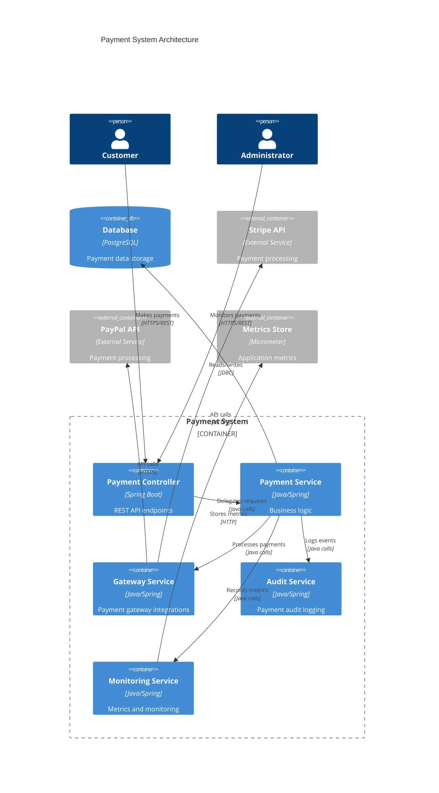

# Payment Endpoints Guide

## Overview

The Payment Management System provides comprehensive payment processing capabilities including payment creation, retrieval, refunds, cancellations, status verification, and statistics. The system supports multiple payment gateways (Stripe, PayPal, Square, Razorpay) and various payment methods with robust security, monitoring, and audit logging.

## Architecture

### System Architecture



### Component Diagram

```mermaid
C4Component
    title Payment Processing Components
    
    Component_Boundary(paymentProcessing, "Payment Processing") {
        Component(paymentRequest, "PaymentRequest", "DTO", "Payment request data")
        Component(payment, "Payment", "Entity", "Payment domain model")
        Component(paymentStatus, "PaymentStatus", "Enum", "Payment status values")
        Component(paymentGateway, "PaymentGateway", "Enum", "Gateway types")
        Component(paymentMethod, "PaymentMethod", "Enum", "Payment methods")
        Component(paymentResponse, "PaymentResponse", "DTO", "Payment response data")
        Component(paymentStatistics, "PaymentStatistics", "DTO", "Payment statistics")
        Component(applicationResponse, "ApplicationResponse", "Wrapper", "Standard API response")
    }
    
    Rel(paymentRequest, payment, "Maps to")
    Rel(payment, paymentStatus, "Has")
    Rel(payment, paymentGateway, "Uses")
    Rel(payment, paymentMethod, "Uses")
    Rel(payment, paymentResponse, "Maps to")
    Rel(paymentResponse, applicationResponse, "Wrapped in")
    Rel(paymentStatistics, applicationResponse, "Wrapped in")
```

## Data Models

### Payment Entity

The core payment entity that stores all payment information:

```java
@Entity
@Table(name = "payments")
public class Payment {
    @Id
    @GeneratedValue(strategy = GenerationType.IDENTITY)
    private Long id;
    
    @Column(name = "user_id", nullable = false)
    private Long userId;
    
    @Column(name = "amount", nullable = false, precision = 10, scale = 2)
    private BigDecimal amount;
    
    @Column(name = "currency", nullable = false, length = 3)
    private String currency;
    
    @Column(name = "quantity")
    private Long quantity;
    
    @Column(name = "customer_name", nullable = false)
    private String customerName;
    
    @Enumerated(EnumType.STRING)
    @Column(name = "gateway", nullable = false)
    private PaymentGateway gateway;
    
    @Enumerated(EnumType.STRING)
    @Column(name = "method", nullable = false)
    private PaymentMethod method;
    
    @Enumerated(EnumType.STRING)
    @Column(name = "status", nullable = false)
    private PaymentStatus status;
    
    @Column(name = "gateway_payment_id")
    private String gatewayPaymentId;
    
    @Column(name = "client_secret")
    private String clientSecret;
    
    @Column(name = "gateway_customer_id")
    private String gatewayCustomerId;
    
    @Column(name = "description")
    private String description;
    
    @Column(name = "failure_reason")
    private String failureReason;
    
    @Column(name = "metadata", columnDefinition = "TEXT")
    private String metadata;
    
    @CreationTimestamp
    @Column(name = "created_at", nullable = false, updatable = false)
    private LocalDateTime createdAt;
    
    @UpdateTimestamp
    @Column(name = "updated_at", nullable = false)
    private LocalDateTime updatedAt;
}
```

### PaymentRequest DTO

Request DTO for creating payments:

```java
public class PaymentRequest {
    @NotBlank(message = "Customer name is required")
    @Size(max = 100, message = "Customer name must not exceed 100 characters")
    private String name;
    
    @NotNull(message = "User ID is required")
    private Long userId;
    
    @NotNull(message = "Amount is required")
    @DecimalMin(value = "0.01", message = "Amount must be greater than 0")
    @Digits(integer = 8, fraction = 2, message = "Amount must have at most 8 integer digits and 2 decimal places")
    private BigDecimal amount;
    
    @Min(value = 1, message = "Quantity must be at least 1")
    private Long quantity = 1L;
    
    @NotBlank(message = "Currency is required")
    @Pattern(regexp = "^[A-Z]{3}$", message = "Currency must be a valid 3-letter ISO code")
    private String currency;
    
    @NotBlank(message = "Gateway is required")
    private String gateway; // stripe, paypal, square, razorpay
    
    @NotBlank(message = "Payment method is required")
    private String method; // credit_card, debit_card, bank_transfer, etc.
    
    private String description;
    
    // Convenience methods for enum conversion
    public PaymentGateway getGatewayEnum() {
        return PaymentGateway.fromString(this.gateway);
    }
    
    public PaymentMethod getMethodEnum() {
        return PaymentMethod.fromString(this.method);
    }
}
```

### PaymentResponse DTO

Response DTO containing payment information:

```java
public class PaymentResponse {
    private Long id;
    private Long userId;
    private BigDecimal amount;
    private String currency;
    private Long quantity;
    private String customerName;
    private PaymentGateway gateway;
    private PaymentMethod method;
    private PaymentStatus status;
    private String gatewayPaymentId;
    private String clientSecret;
    private String description;
    private String failureReason;
    private LocalDateTime createdAt;
    private LocalDateTime updatedAt;
}
```

### PaymentRefundRequest DTO

Request DTO for processing refunds:

```java
public class PaymentRefundRequest {
    private Long paymentId;
    private BigDecimal refundAmount;
    private String reason;
    private Long userId;
}
```

### PaymentStatistics DTO

Statistics DTO for payment analytics:

```java
public class PaymentStatistics {
    private BigDecimal totalAmount;
    private BigDecimal successfulAmount;
    private BigDecimal failedAmount;
    private BigDecimal refundedAmount;
    private long totalCount;
    private long successfulCount;
    private long failedCount;
    private long refundedCount;
}
```

### Enums

#### PaymentStatus
```java
public enum PaymentStatus {
    PENDING("pending"),
    PROCESSING("processing"),
    SUCCEEDED("succeeded"),
    FAILED("failed"),
    CANCELLED("cancelled"),
    REFUNDED("refunded"),
    PARTIALLY_REFUNDED("partially_refunded"),
    DISPUTED("disputed"),
    EXPIRED("expired");
}
```

#### PaymentGateway
```java
public enum PaymentGateway {
    STRIPE("stripe"),
    PAYPAL("paypal"),
    SQUARE("square"),
    RAZORPAY("razorpay");
}
```

#### PaymentMethod
```java
public enum PaymentMethod {
    CREDIT_CARD("credit_card"),
    DEBIT_CARD("debit_card"),
    BANK_TRANSFER("bank_transfer"),
    DIGITAL_WALLET("digital_wallet"),
    CASH("cash"),
    CHECK("check"),
    CRYPTOCURRENCY("cryptocurrency");
}
```

## API Endpoints

### 1. Process Payment

**Endpoint:** `POST /api/payments/process`

**Description:** Process a new payment through the specified gateway.

**Request Body:**
```json
{
    "name": "John Doe",
    "userId": 1,
    "amount": 99.99,
    "quantity": 1,
    "currency": "USD",
    "gateway": "stripe",
    "method": "credit_card",
    "description": "Property listing subscription"
}
```

**Response:**
```json
{
    "success": true,
    "data": {
        "id": 123,
        "userId": 1,
        "amount": 99.99,
        "currency": "USD",
        "quantity": 1,
        "customerName": "John Doe",
        "gateway": "STRIPE",
        "method": "CREDIT_CARD",
        "status": "PROCESSING",
        "gatewayPaymentId": "pi_1234567890",
        "clientSecret": "pi_1234567890_secret_abc123",
        "description": "Property listing subscription",
        "failureReason": null,
        "createdAt": "2024-01-15T10:30:00",
        "updatedAt": "2024-01-15T10:30:00"
    },
    "error": null,
    "message": null
}
```

### 2. Get Payment by ID

**Endpoint:** `GET /api/payments/{paymentId}?userId={userId}`

**Description:** Retrieve a specific payment by its ID.

**Path Parameters:**
- `paymentId` (Long): The payment ID

**Query Parameters:**
- `userId` (Long): The user ID for authorization

**Response:**
```json
{
    "success": true,
    "data": {
        "id": 123,
        "userId": 1,
        "amount": 99.99,
        "currency": "USD",
        "quantity": 1,
        "customerName": "John Doe",
        "gateway": "STRIPE",
        "method": "CREDIT_CARD",
        "status": "SUCCEEDED",
        "gatewayPaymentId": "pi_1234567890",
        "clientSecret": "pi_1234567890_secret_abc123",
        "description": "Property listing subscription",
        "failureReason": null,
        "createdAt": "2024-01-15T10:30:00",
        "updatedAt": "2024-01-15T10:35:00"
    },
    "error": null,
    "message": null
}
```

### 3. Get User Payments

**Endpoint:** `GET /api/payments/user/{userId}?page={page}&size={size}&sortBy={sortBy}&sortDirection={sortDirection}`

**Description:** Retrieve paginated payment history for a user.

**Path Parameters:**
- `userId` (Long): The user ID

**Query Parameters:**
- `page` (int, default: 1): Page number
- `size` (int, default: 10): Page size
- `sortBy` (String, default: "createdAt"): Sort field
- `sortDirection` (String, default: "desc"): Sort direction

**Response:**
```json
{
    "success": true,
    "data": {
        "content": [
            {
                "id": 123,
                "userId": 1,
                "amount": 99.99,
                "currency": "USD",
                "quantity": 1,
                "customerName": "John Doe",
                "gateway": "STRIPE",
                "method": "CREDIT_CARD",
                "status": "SUCCEEDED",
                "gatewayPaymentId": "pi_1234567890",
                "clientSecret": null,
                "description": "Property listing subscription",
                "failureReason": null,
                "createdAt": "2024-01-15T10:30:00",
                "updatedAt": "2024-01-15T10:35:00"
            }
        ],
        "totalElements": 25,
        "totalPages": 3,
        "currentPage": 1,
        "pageSize": 10,
        "hasNext": true,
        "hasPrevious": false
    },
    "error": null,
    "message": null
}
```

### 4. Process Refund

**Endpoint:** `POST /api/payments/refund`

**Description:** Process a refund for an existing payment.

**Request Body:**
```json
{
    "paymentId": 123,
    "refundAmount": 99.99,
    "reason": "Customer requested refund",
    "userId": 1
}
```

**Response:**
```json
{
    "success": true,
    "data": {
        "id": 123,
        "userId": 1,
        "amount": 99.99,
        "currency": "USD",
        "quantity": 1,
        "customerName": "John Doe",
        "gateway": "STRIPE",
        "method": "CREDIT_CARD",
        "status": "REFUNDED",
        "gatewayPaymentId": "pi_1234567890",
        "clientSecret": null,
        "description": "Property listing subscription",
        "failureReason": null,
        "createdAt": "2024-01-15T10:30:00",
        "updatedAt": "2024-01-15T11:00:00"
    },
    "error": null,
    "message": null
}
```

### 5. Cancel Payment

**Endpoint:** `POST /api/payments/{paymentId}/cancel?userId={userId}`

**Description:** Cancel a pending payment.

**Path Parameters:**
- `paymentId` (Long): The payment ID

**Query Parameters:**
- `userId` (Long): The user ID for authorization

**Response:**
```json
{
    "success": true,
    "data": {
        "id": 123,
        "userId": 1,
        "amount": 99.99,
        "currency": "USD",
        "quantity": 1,
        "customerName": "John Doe",
        "gateway": "STRIPE",
        "method": "CREDIT_CARD",
        "status": "CANCELLED",
        "gatewayPaymentId": "pi_1234567890",
        "clientSecret": null,
        "description": "Property listing subscription",
        "failureReason": null,
        "createdAt": "2024-01-15T10:30:00",
        "updatedAt": "2024-01-15T10:45:00"
    },
    "error": null,
    "message": null
}
```

### 6. Verify Payment Status

**Endpoint:** `POST /api/payments/{paymentId}/verify?userId={userId}`

**Description:** Verify payment status with the payment gateway.

**Path Parameters:**
- `paymentId` (Long): The payment ID

**Query Parameters:**
- `userId` (Long): The user ID for authorization

**Response:**
```json
{
    "success": true,
    "data": {
        "id": 123,
        "userId": 1,
        "amount": 99.99,
        "currency": "USD",
        "quantity": 1,
        "customerName": "John Doe",
        "gateway": "STRIPE",
        "method": "CREDIT_CARD",
        "status": "SUCCEEDED",
        "gatewayPaymentId": "pi_1234567890",
        "clientSecret": null,
        "description": "Property listing subscription",
        "failureReason": null,
        "createdAt": "2024-01-15T10:30:00",
        "updatedAt": "2024-01-15T10:35:00"
    },
    "error": null,
    "message": null
}
```

### 7. Get Payment Statistics

**Endpoint:** `GET /api/payments/statistics/{userId}?startDate={startDate}&endDate={endDate}`

**Description:** Get payment statistics for a user within a date range.

**Path Parameters:**
- `userId` (Long): The user ID

**Query Parameters:**
- `startDate` (LocalDateTime): Start date (ISO format)
- `endDate` (LocalDateTime): End date (ISO format)

**Response:**
```json
{
    "success": true,
    "data": {
        "totalAmount": 299.97,
        "successfulAmount": 199.98,
        "failedAmount": 99.99,
        "refundedAmount": 0.00,
        "totalCount": 3,
        "successfulCount": 2,
        "failedCount": 1,
        "refundedCount": 0
    },
    "error": null,
    "message": null
}
```

## Usage Examples

### PowerShell Examples

#### Process Payment
```powershell
$paymentData = @{
    name = "John Doe"
    userId = 1
    amount = 99.99
    quantity = 1
    currency = "USD"
    gateway = "stripe"
    method = "credit_card"
    description = "Property listing subscription"
} | ConvertTo-Json

$response = Invoke-RestMethod -Uri "http://localhost:8080/api/payments/process" `
    -Method POST `
    -ContentType "application/json" `
    -Body $paymentData `
    -WebSession $session

Write-Output "Payment processed: $($response.data.id)"
```

#### Get User Payments
```powershell
$response = Invoke-RestMethod -Uri "http://localhost:8080/api/payments/user/1?page=1&size=10" `
    -Method GET `
    -WebSession $session

Write-Output "Found $($response.data.totalElements) payments"
$response.data.content | ForEach-Object {
    Write-Output "Payment $($_.id): $($_.amount) $($_.currency) - $($_.status)"
}
```

#### Process Refund
```powershell
$refundData = @{
    paymentId = 123
    refundAmount = 99.99
    reason = "Customer requested refund"
    userId = 1
} | ConvertTo-Json

$response = Invoke-RestMethod -Uri "http://localhost:8080/api/payments/refund" `
    -Method POST `
    -ContentType "application/json" `
    -Body $refundData `
    -WebSession $session

Write-Output "Refund processed: $($response.data.status)"
```

#### Get Payment Statistics
```powershell
$startDate = "2024-01-01T00:00:00"
$endDate = "2024-01-31T23:59:59"

$response = Invoke-RestMethod -Uri "http://localhost:8080/api/payments/statistics/1?startDate=$startDate&endDate=$endDate" `
    -Method GET `
    -WebSession $session

Write-Output "Total Amount: $($response.data.totalAmount)"
Write-Output "Successful Payments: $($response.data.successfulCount)"
Write-Output "Success Rate: $([math]::Round($response.data.successfulCount / $response.data.totalCount * 100, 2))%"
```

### JavaScript Examples

#### Process Payment
```javascript
const paymentData = {
    name: "John Doe",
    userId: 1,
    amount: 99.99,
    quantity: 1,
    currency: "USD",
    gateway: "stripe",
    method: "credit_card",
    description: "Property listing subscription"
};

fetch('/api/payments/process', {
    method: 'POST',
    headers: {
        'Content-Type': 'application/json',
    },
    body: JSON.stringify(paymentData),
    credentials: 'include'
})
.then(response => response.json())
.then(data => {
    if (data.success) {
        console.log('Payment processed:', data.data.id);
        // Handle successful payment
        if (data.data.clientSecret) {
            // Use client secret for frontend payment confirmation
            confirmPayment(data.data.clientSecret);
        }
    } else {
        console.error('Payment failed:', data.error.message);
    }
});
```

#### Get Payment by ID
```javascript
async function getPayment(paymentId, userId) {
    try {
        const response = await fetch(`/api/payments/${paymentId}?userId=${userId}`, {
            method: 'GET',
            credentials: 'include'
        });
        
        const data = await response.json();
        
        if (data.success) {
            return data.data;
        } else {
            throw new Error(data.error.message);
        }
    } catch (error) {
        console.error('Error fetching payment:', error);
        throw error;
    }
}
```

#### Get User Payments with Pagination
```javascript
async function getUserPayments(userId, page = 1, size = 10) {
    try {
        const response = await fetch(`/api/payments/user/${userId}?page=${page}&size=${size}&sortBy=createdAt&sortDirection=desc`, {
            method: 'GET',
            credentials: 'include'
        });
        
        const data = await response.json();
        
        if (data.success) {
            return data.data;
        } else {
            throw new Error(data.error.message);
        }
    } catch (error) {
        console.error('Error fetching user payments:', error);
        throw error;
    }
}

// Usage
getUserPayments(1, 1, 10).then(result => {
    console.log(`Found ${result.totalElements} payments`);
    result.content.forEach(payment => {
        console.log(`Payment ${payment.id}: ${payment.amount} ${payment.currency} - ${payment.status}`);
    });
});
```

#### Process Refund
```javascript
async function processRefund(paymentId, refundAmount, reason, userId) {
    const refundData = {
        paymentId: paymentId,
        refundAmount: refundAmount,
        reason: reason,
        userId: userId
    };

    try {
        const response = await fetch('/api/payments/refund', {
            method: 'POST',
            headers: {
                'Content-Type': 'application/json',
            },
            body: JSON.stringify(refundData),
            credentials: 'include'
        });
        
        const data = await response.json();
        
        if (data.success) {
            console.log('Refund processed successfully');
            return data.data;
        } else {
            throw new Error(data.error.message);
        }
    } catch (error) {
        console.error('Error processing refund:', error);
        throw error;
    }
}
```

## Error Handling

### Common Error Codes

| Error Code | HTTP Status | Description |
|------------|-------------|-------------|
| 1001 | 400 | Invalid request data |
| 1002 | 401 | Authentication required |
| 1003 | 403 | Access denied |
| 1004 | 404 | Payment not found |
| 1005 | 409 | Payment already processed |
| 1006 | 422 | Invalid payment amount |
| 1007 | 429 | Rate limit exceeded |
| 1008 | 500 | Payment gateway error |
| 1009 | 503 | Service unavailable |

### Error Response Format

```json
{
    "success": false,
    "data": null,
    "error": {
        "code": 1008,
        "message": "Payment gateway error: Insufficient funds",
        "status": "INTERNAL_SERVER_ERROR"
    },
    "message": "Payment processing failed"
}
```

### Error Handling Examples

#### PowerShell Error Handling
```powershell
try {
    $response = Invoke-RestMethod -Uri "http://localhost:8080/api/payments/process" `
        -Method POST `
        -ContentType "application/json" `
        -Body $paymentData `
        -WebSession $session
    
    if ($response.success) {
        Write-Output "Payment successful: $($response.data.id)"
    } else {
        Write-Error "Payment failed: $($response.error.message)"
    }
} catch {
    Write-Error "Request failed: $($_.Exception.Message)"
}
```

#### JavaScript Error Handling
```javascript
fetch('/api/payments/process', {
    method: 'POST',
    headers: {
        'Content-Type': 'application/json',
    },
    body: JSON.stringify(paymentData),
    credentials: 'include'
})
.then(response => {
    if (!response.ok) {
        throw new Error(`HTTP error! status: ${response.status}`);
    }
    return response.json();
})
.then(data => {
    if (data.success) {
        console.log('Payment processed:', data.data);
    } else {
        console.error('Payment failed:', data.error.message);
        // Handle specific error codes
        switch (data.error.code) {
            case 1006:
                alert('Invalid payment amount');
                break;
            case 1008:
                alert('Payment gateway error. Please try again.');
                break;
            default:
                alert('Payment failed. Please contact support.');
        }
    }
})
.catch(error => {
    console.error('Request failed:', error);
    alert('Network error. Please check your connection.');
});
```

## Security Considerations

### Authentication & Authorization
- All endpoints require valid session authentication
- Users can only access their own payment data
- Admin users have access to all payment data
- Rate limiting is applied to prevent abuse

### Data Protection
- Sensitive payment data is encrypted at rest
- PCI DSS compliance for credit card data
- Client secrets are only provided when necessary
- Payment gateway credentials are securely stored

### Input Validation
- All input data is validated using Bean Validation annotations
- Amount validation prevents negative or excessive values
- Currency codes are validated against ISO standards
- Gateway and method values are validated against enums

### Audit Logging
- All payment operations are logged for audit purposes
- Failed payment attempts are tracked
- Suspicious activity triggers alerts
- Webhook events are logged and verified

## Best Practices

### Payment Processing
1. **Always validate payment amounts** before processing
2. **Use idempotency keys** to prevent duplicate payments
3. **Handle asynchronous payment confirmations** via webhooks
4. **Store minimal sensitive data** - rely on gateway tokens
5. **Implement proper error handling** for gateway failures

### Security
1. **Never log sensitive payment data** (card numbers, secrets)
2. **Use HTTPS for all payment communications**
3. **Validate webhook signatures** to ensure authenticity
4. **Implement rate limiting** to prevent abuse
5. **Regular security audits** of payment flows

### Performance
1. **Use pagination** for payment history queries
2. **Implement caching** for frequently accessed data
3. **Monitor payment gateway response times**
4. **Use database indexes** for payment queries
5. **Implement circuit breakers** for gateway calls

### Monitoring
1. **Track payment success rates** by gateway
2. **Monitor payment processing times**
3. **Set up alerts** for failed payments
4. **Track refund rates** and patterns
5. **Monitor webhook delivery** success rates

---

*This guide provides comprehensive documentation for the Payment Management System. For additional support or questions, please contact the development team.*