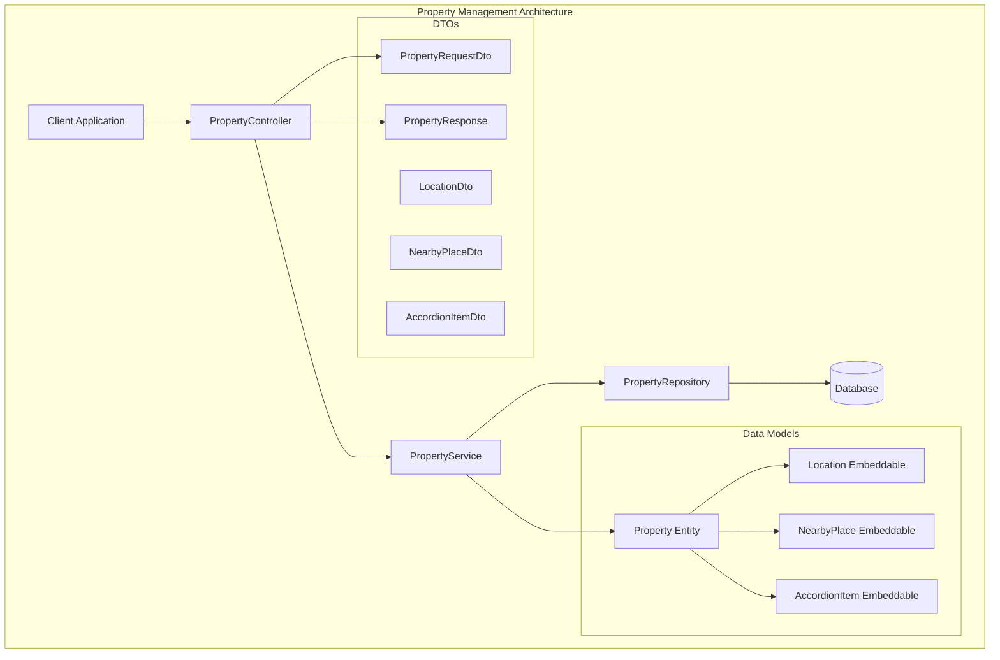
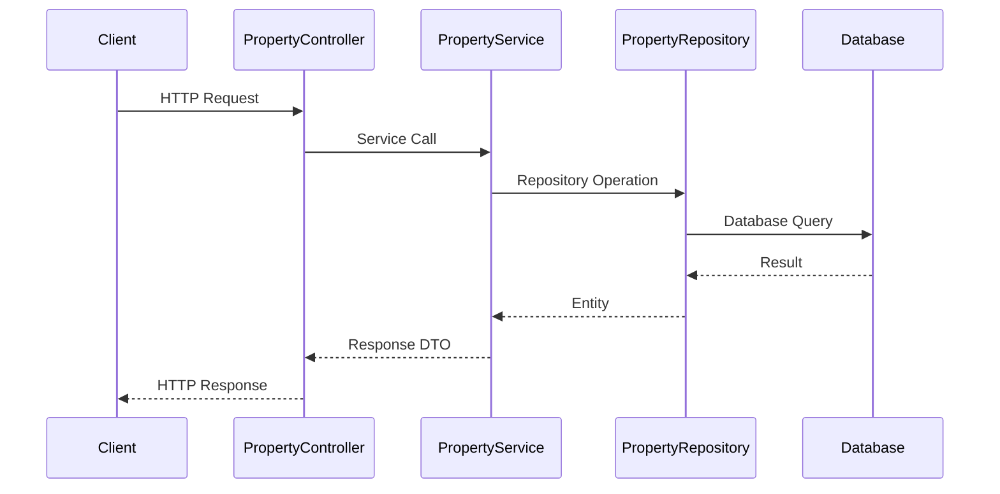

# Property Management Endpoints Guide

## Table of Contents
1. [Overview](#overview)
2. [Architecture](#architecture)
3. [Data Models](#data-models)
4. [API Endpoints](#api-endpoints)
5. [Usage Examples](#usage-examples)
6. [Error Handling](#error-handling)
7. [Best Practices](#best-practices)
8. [Security Considerations](#security-considerations)

## Overview

The Property Management system provides comprehensive CRUD operations for managing real estate properties. This system supports various property types (sale, rent, commercial), categories (house, apartment, hotel, villa, office, land), and includes rich metadata such as location, amenities, nearby places, and custom accordion widgets.

### Key Features
- **Property CRUD Operations**: Create, read, update, and delete properties
- **Rich Property Data**: Support for detailed property information including location, amenities, and media
- **Flexible Property Types**: Sale, rent, and commercial properties
- **Multiple Categories**: Houses, apartments, hotels, villas, offices, and land
- **Location Services**: Embedded location with GPS coordinates
- **Nearby Places**: Track nearby amenities and points of interest
- **Custom Widgets**: Accordion items for additional property details
- **Status Management**: Track property availability (available, pending, sold, rented)

## Architecture



### Component Flow


## Data Models

### Property Entity
The main property entity with comprehensive property information:

```java
@Entity
@Table(name = "properties")
public class Property {
    private Long id;
    private String mainTitle;
    private PropertyType type;           // SALE, RENT, COMMERCIAL
    private PropertyCategory category;   // HOUSE, APARTMENT, HOTEL, VILLA, OFFICE, LAND
    private BigDecimal price;
    private String keywords;
    private Location location;
    private String contactPhone;
    private String contactEmail;
    private List<NearbyPlace> nearbyPlaces;
    private String area;
    private Integer bedrooms;
    private Integer bathrooms;
    private Integer parkingSpots;
    private Integer maxAdultsAccommodation;
    private Integer maxChildrenAccommodation;
    private String website;
    private String description;
    private Set<String> amenities;
    private boolean enableAccordionWidget;
    private List<AccordionItem> accordionItems;
    private boolean showSimilarProperties;
    private boolean showPriceChangeDynamics;
    private boolean showGoogleMaps;
    private PropertyStatus status;       // AVAILABLE, PENDING, SOLD, RENTED
    private User createdBy;
    private LocalDateTime createdAt;
    private LocalDateTime updatedAt;
}
```

### Location Embeddable
Embedded location information with GPS coordinates:

```java
@Embeddable
public class Location {
    private String address;
    private String city;
    private String state;
    private String country;
    private String zipCode;
    private Double latitude;
    private Double longitude;
}
```

### NearbyPlace Embeddable
Information about nearby places and amenities:

```java
@Embeddable
public class NearbyPlace {
    private String placeType;    // e.g., "School", "Hospital", "Shopping Mall"
    private String name;         // Name of the place
    private String distance;     // Distance from property
}
```

### AccordionItem Embeddable
Custom accordion widgets for additional property details:

```java
@Embeddable
public class AccordionItem {
    private String title;        // Accordion section title
    private String details;      // Detailed content (supports HTML)
}
```

### PropertyRequestDto
Request DTO for creating and updating properties:

```java
public class PropertyRequestDto {
    private String mainTitle;
    private PropertyType type;
    private PropertyCategory category;
    private BigDecimal price;
    private String keywords;
    private LocationDto location;
    private String contactPhone;
    private String contactEmail;
    private List<NearbyPlaceDto> nearbyPlaces;
    private String area;
    private Integer bedrooms;
    private Integer bathrooms;
    private Integer parkingSpots;
    private Integer maxAdultsAccommodation;
    private Integer maxChildrenAccommodation;
    private String website;
    private String description;
    private Set<String> amenities;
    private boolean enableAccordionWidget;
    private List<AccordionItemDto> accordionItems;
    private boolean showSimilarProperties;
    private boolean showPriceChangeDynamics;
    private boolean showGoogleMaps;
    private PropertyStatus status;
}
```

### PropertyResponse
Response DTO with complete property information:

```java
public class PropertyResponse {
    private Long id;
    private String mainTitle;
    private PropertyType type;
    private PropertyCategory category;
    private BigDecimal price;
    private String keywords;
    private LocationDto location;
    private String contactPhone;
    private String contactEmail;
    private List<NearbyPlaceDto> nearbyPlaces;
    private String area;
    private Integer bedrooms;
    private Integer bathrooms;
    private Integer parkingSpots;
    private Integer maxAdultsAccommodation;
    private Integer maxChildrenAccommodation;
    private String website;
    private String description;
    private Set<String> amenities;
    private boolean enableAccordionWidget;
    private List<AccordionItemDto> accordionItems;
    private boolean showSimilarProperties;
    private boolean showPriceChangeDynamics;
    private boolean showGoogleMaps;
    private PropertyStatus status;
    private String createdByEmail;
    private LocalDateTime createdAt;
    private LocalDateTime updatedAt;
}
```

### Enums

#### PropertyType
```java
public enum PropertyType {
    SALE,        // Properties for sale
    RENT,        // Properties for rent
    COMMERCIAL   // Commercial properties
}
```

#### PropertyCategory
```java
public enum PropertyCategory {
    HOUSE,       // Single-family houses
    APARTMENT,   // Apartments and condos
    HOTEL,       // Hotels and hospitality
    VILLA,       // Luxury villas
    OFFICE,      // Office spaces
    LAND         // Land plots
}
```

#### PropertyStatus
```java
public enum PropertyStatus {
    AVAILABLE,   // Available for sale/rent
    PENDING,     // Under negotiation
    SOLD,        // Sold (for sale properties)
    RENTED       // Rented (for rental properties)
}
```

## API Endpoints

### 1. Create Property
**Endpoint:** `POST /api/properties`  
**Description:** Creates a new property listing  
**Authentication:** Required (JWT)  
**Authorization:** Authenticated users

#### Request Body
```json
{
  "mainTitle": "Luxury Villa with Ocean View",
  "type": "SALE",
  "category": "VILLA",
  "price": 1250000.00,
  "keywords": "luxury, ocean view, villa, private pool",
  "location": {
    "address": "123 Ocean Drive",
    "city": "Miami",
    "state": "FL",
    "zipCode": "33139",
    "latitude": 25.7617,
    "longitude": -80.1918
  },
  "contactPhone": "+1-555-0123",
  "contactEmail": "contact@luxuryvilla.com",
  "nearbyPlaces": [
    {
      "placeType": "Beach",
      "name": "South Beach",
      "distance": "0.5 miles"
    },
    {
      "placeType": "School",
      "name": "Miami Elementary",
      "distance": "1.2 miles"
    }
  ],
  "area": "4,500 sq ft",
  "bedrooms": 5,
  "bathrooms": 4,
  "parkingSpots": 3,
  "maxAdultsAccommodation": 10,
  "maxChildrenAccommodation": 4,
  "website": "https://luxuryvilla.com",
  "description": "Stunning luxury villa with panoramic ocean views, private pool, and modern amenities.",
  "amenities": ["Pool", "Ocean View", "Garage", "Garden", "Security System"],
  "enableAccordionWidget": true,
  "accordionItems": [
    {
      "title": "Property Features",
      "details": "This villa features high-end finishes, marble countertops, and smart home technology."
    },
    {
      "title": "Neighborhood",
      "details": "Located in the prestigious Ocean Drive area with easy access to beaches and restaurants."
    }
  ],
  "showSimilarProperties": true,
  "showPriceChangeDynamics": true,
  "showGoogleMaps": true,
  "status": "AVAILABLE"
}
```

#### Response
```json
{
  "success": true,
  "message": "Property created successfully",
  "data": {
    "id": 1,
    "mainTitle": "Luxury Villa with Ocean View",
    "type": "SALE",
    "category": "VILLA",
    "price": 1250000.00,
    "keywords": "luxury, ocean view, villa, private pool",
    "location": {
      "address": "123 Ocean Drive",
      "city": "Miami",
      "state": "FL",
      "zipCode": "33139",
      "latitude": 25.7617,
      "longitude": -80.1918
    },
    "contactPhone": "+1-555-0123",
    "contactEmail": "contact@luxuryvilla.com",
    "nearbyPlaces": [
      {
        "placeType": "Beach",
        "name": "South Beach",
        "distance": "0.5 miles"
      },
      {
        "placeType": "School",
        "name": "Miami Elementary",
        "distance": "1.2 miles"
      }
    ],
    "area": "4,500 sq ft",
    "bedrooms": 5,
    "bathrooms": 4,
    "parkingSpots": 3,
    "maxAdultsAccommodation": 10,
    "maxChildrenAccommodation": 4,
    "website": "https://luxuryvilla.com",
    "description": "Stunning luxury villa with panoramic ocean views, private pool, and modern amenities.",
    "amenities": ["Pool", "Ocean View", "Garage", "Garden", "Security System"],
    "enableAccordionWidget": true,
    "accordionItems": [
      {
        "title": "Property Features",
        "details": "This villa features high-end finishes, marble countertops, and smart home technology."
      },
      {
        "title": "Neighborhood",
        "details": "Located in the prestigious Ocean Drive area with easy access to beaches and restaurants."
      }
    ],
    "showSimilarProperties": true,
    "showPriceChangeDynamics": true,
    "showGoogleMaps": true,
    "status": "AVAILABLE",
    "createdByEmail": "user@example.com",
    "createdAt": "2024-01-15T10:30:00",
    "updatedAt": "2024-01-15T10:30:00"
  }
}
```

### 2. Get All Properties
**Endpoint:** `GET /api/properties`  
**Description:** Retrieves all properties with pagination  
**Authentication:** Required (JWT)  
**Authorization:** Authenticated users

#### Response
```json
{
  "success": true,
  "message": "Properties retrieved successfully",
  "data": [
    {
      "id": 1,
      "mainTitle": "Luxury Villa with Ocean View",
      "type": "SALE",
      "category": "VILLA",
      "price": 1250000.00,
      "location": {
        "address": "123 Ocean Drive",
        "city": "Miami",
        "state": "FL",
        "zipCode": "33139",
        "latitude": 25.7617,
        "longitude": -80.1918
      },
      "bedrooms": 5,
      "bathrooms": 4,
      "status": "AVAILABLE",
      "createdByEmail": "user@example.com",
      "createdAt": "2024-01-15T10:30:00",
      "updatedAt": "2024-01-15T10:30:00"
    },
    {
      "id": 2,
      "mainTitle": "Modern Downtown Apartment",
      "type": "RENT",
      "category": "APARTMENT",
      "price": 2500.00,
      "location": {
        "address": "456 Downtown Ave",
        "city": "Miami",
        "state": "FL",
        "zipCode": "33130",
        "latitude": 25.7743,
        "longitude": -80.1937
      },
      "bedrooms": 2,
      "bathrooms": 2,
      "status": "AVAILABLE",
      "createdByEmail": "agent@example.com",
      "createdAt": "2024-01-14T14:20:00",
      "updatedAt": "2024-01-14T14:20:00"
    }
  ]
}
```

### 3. Get Property by ID
**Endpoint:** `GET /api/properties/{id}`  
**Description:** Retrieves a specific property by its ID  
**Authentication:** Required (JWT)  
**Authorization:** Authenticated users

#### Path Parameters
- `id` (Long): Property ID

#### Response
```json
{
  "success": true,
  "message": "Property retrieved successfully",
  "data": {
    "id": 1,
    "mainTitle": "Luxury Villa with Ocean View",
    "type": "SALE",
    "category": "VILLA",
    "price": 1250000.00,
    "keywords": "luxury, ocean view, villa, private pool",
    "location": {
      "address": "123 Ocean Drive",
      "city": "Miami",
      "state": "FL",
      "zipCode": "33139",
      "latitude": 25.7617,
      "longitude": -80.1918
    },
    "contactPhone": "+1-555-0123",
    "contactEmail": "contact@luxuryvilla.com",
    "nearbyPlaces": [
      {
        "placeType": "Beach",
        "name": "South Beach",
        "distance": "0.5 miles"
      }
    ],
    "area": "4,500 sq ft",
    "bedrooms": 5,
    "bathrooms": 4,
    "parkingSpots": 3,
    "amenities": ["Pool", "Ocean View", "Garage"],
    "status": "AVAILABLE",
    "createdByEmail": "user@example.com",
    "createdAt": "2024-01-15T10:30:00",
    "updatedAt": "2024-01-15T10:30:00"
  }
}
```

### 4. Update Property
**Endpoint:** `PUT /api/properties/{id}`  
**Description:** Updates an existing property  
**Authentication:** Required (JWT)  
**Authorization:** Property owner or admin

#### Path Parameters
- `id` (Long): Property ID

#### Request Body
```json
{
  "mainTitle": "Updated Luxury Villa with Ocean View",
  "type": "SALE",
  "category": "VILLA",
  "price": 1350000.00,
  "status": "PENDING",
  "description": "Updated description with new features and recent renovations."
}
```

#### Response
```json
{
  "success": true,
  "message": "Property updated successfully",
  "data": {
    "id": 1,
    "mainTitle": "Updated Luxury Villa with Ocean View",
    "type": "SALE",
    "category": "VILLA",
    "price": 1350000.00,
    "status": "PENDING",
    "description": "Updated description with new features and recent renovations.",
    "createdByEmail": "user@example.com",
    "createdAt": "2024-01-15T10:30:00",
    "updatedAt": "2024-01-15T16:45:00"
  }
}
```

### 5. Delete Property
**Endpoint:** `DELETE /api/properties/{id}`  
**Description:** Deletes a property  
**Authentication:** Required (JWT)  
**Authorization:** Property owner or admin

#### Path Parameters
- `id` (Long): Property ID

#### Response
```json
{
  "success": true,
  "message": "Property deleted successfully",
  "data": null
}
```

## Usage Examples

### PowerShell Examples

#### Create Property Function
```powershell
function New-Property {
    param(
        [string]$BaseUrl = "http://localhost:8080",
        [string]$AccessToken,
        [hashtable]$PropertyData
    )
    
    $headers = @{
        "Authorization" = "Bearer $AccessToken"
        "Content-Type" = "application/json"
    }
    
    $body = $PropertyData | ConvertTo-Json -Depth 10
    
    try {
        $response = Invoke-RestMethod -Uri "$BaseUrl/api/properties" -Method POST -Headers $headers -Body $body
        Write-Host "Property created successfully!" -ForegroundColor Green
        return $response
    }
    catch {
        Write-Error "Failed to create property: $($_.Exception.Message)"
        return $null
    }
}

# Usage
$propertyData = @{
    mainTitle = "Modern Apartment"
    type = "RENT"
    category = "APARTMENT"
    price = 2000.00
    location = @{
        address = "123 Main St"
        city = "Miami"
        state = "FL"
        zipCode = "33101"
        latitude = 25.7617
        longitude = -80.1918
    }
    bedrooms = 2
    bathrooms = 2
    status = "AVAILABLE"
    amenities = @("Pool", "Gym", "Parking")
}

$result = New-Property -AccessToken "your-jwt-token" -PropertyData $propertyData
```

#### Get All Properties Function
```powershell
function Get-AllProperties {
    param(
        [string]$BaseUrl = "http://localhost:8080",
        [string]$AccessToken
    )
    
    $headers = @{
        "Authorization" = "Bearer $AccessToken"
    }
    
    try {
        $response = Invoke-RestMethod -Uri "$BaseUrl/api/properties" -Method GET -Headers $headers
        Write-Host "Retrieved $($response.data.Count) properties" -ForegroundColor Green
        return $response.data
    }
    catch {
        Write-Error "Failed to retrieve properties: $($_.Exception.Message)"
        return $null
    }
}

# Usage
$properties = Get-AllProperties -AccessToken "your-jwt-token"
$properties | Format-Table id, mainTitle, type, category, price, status
```

#### Update Property Function
```powershell
function Update-Property {
    param(
        [string]$BaseUrl = "http://localhost:8080",
        [string]$AccessToken,
        [int]$PropertyId,
        [hashtable]$UpdateData
    )
    
    $headers = @{
        "Authorization" = "Bearer $AccessToken"
        "Content-Type" = "application/json"
    }
    
    $body = $UpdateData | ConvertTo-Json -Depth 10
    
    try {
        $response = Invoke-RestMethod -Uri "$BaseUrl/api/properties/$PropertyId" -Method PUT -Headers $headers -Body $body
        Write-Host "Property updated successfully!" -ForegroundColor Green
        return $response
    }
    catch {
        Write-Error "Failed to update property: $($_.Exception.Message)"
        return $null
    }
}

# Usage
$updateData = @{
    price = 2200.00
    status = "RENTED"
    description = "Updated apartment with new amenities"
}

$result = Update-Property -AccessToken "your-jwt-token" -PropertyId 1 -UpdateData $updateData
```

### JavaScript Examples

#### Create Property
```javascript
async function createProperty(accessToken, propertyData) {
    try {
        const response = await fetch('http://localhost:8080/api/properties', {
            method: 'POST',
            headers: {
                'Authorization': `Bearer ${accessToken}`,
                'Content-Type': 'application/json'
            },
            body: JSON.stringify(propertyData)
        });
        
        const result = await response.json();
        
        if (result.success) {
            console.log('Property created successfully:', result.data);
            return result.data;
        } else {
            console.error('Failed to create property:', result.message);
            return null;
        }
    } catch (error) {
        console.error('Error creating property:', error);
        return null;
    }
}

// Usage
const propertyData = {
    mainTitle: "Cozy Studio Apartment",
    type: "RENT",
    category: "APARTMENT",
    price: 1500.00,
    location: {
        address: "789 Studio Lane",
        city: "Miami",
        state: "FL",
        zipCode: "33102",
        latitude: 25.7617,
        longitude: -80.1918
    },
    bedrooms: 1,
    bathrooms: 1,
    status: "AVAILABLE",
    amenities: ["WiFi", "AC", "Furnished"]
};

createProperty('your-jwt-token', propertyData);
```

#### Get Properties with Filtering
```javascript
async function getProperties(accessToken, filters = {}) {
    try {
        const queryParams = new URLSearchParams();
        
        // Add filters if provided
        Object.keys(filters).forEach(key => {
            if (filters[key] !== undefined && filters[key] !== null) {
                queryParams.append(key, filters[key]);
            }
        });
        
        const url = `http://localhost:8080/api/properties${queryParams.toString() ? '?' + queryParams.toString() : ''}`;
        
        const response = await fetch(url, {
            method: 'GET',
            headers: {
                'Authorization': `Bearer ${accessToken}`
            }
        });
        
        const result = await response.json();
        
        if (result.success) {
            console.log(`Retrieved ${result.data.length} properties`);
            return result.data;
        } else {
            console.error('Failed to retrieve properties:', result.message);
            return [];
        }
    } catch (error) {
        console.error('Error retrieving properties:', error);
        return [];
    }
}

// Usage
getProperties('your-jwt-token', { type: 'RENT', category: 'APARTMENT' })
    .then(properties => {
        properties.forEach(property => {
            console.log(`${property.mainTitle} - $${property.price}`);
        });
    });
```

## Error Handling

### Common Error Responses

#### 400 Bad Request
```json
{
  "success": false,
  "message": "Validation failed",
  "errors": [
    {
      "field": "price",
      "message": "Price must be greater than 0"
    },
    {
      "field": "mainTitle",
      "message": "Main title is required"
    }
  ]
}
```

#### 401 Unauthorized
```json
{
  "success": false,
  "message": "Authentication required",
  "error": "UNAUTHORIZED"
}
```

#### 403 Forbidden
```json
{
  "success": false,
  "message": "You don't have permission to access this property",
  "error": "FORBIDDEN"
}
```

#### 404 Not Found
```json
{
  "success": false,
  "message": "Property not found",
  "error": "PROPERTY_NOT_FOUND"
}
```

#### 500 Internal Server Error
```json
{
  "success": false,
  "message": "An internal server error occurred",
  "error": "INTERNAL_SERVER_ERROR"
}
```

### Error Handling Best Practices

1. **Always check the `success` field** in the response
2. **Handle specific error codes** appropriately in your application
3. **Display user-friendly error messages** based on the error type
4. **Implement retry logic** for transient errors (5xx status codes)
5. **Log errors** for debugging and monitoring purposes

## Best Practices

### 1. Data Validation
- Always validate required fields before sending requests
- Ensure price values are positive numbers
- Validate email formats for contact information
- Check that coordinates are within valid ranges

### 2. Performance Optimization
- Use pagination for large property lists
- Implement caching for frequently accessed properties
- Optimize image uploads and media handling
- Use appropriate database indexes

### 3. Security
- Always include JWT tokens in requests
- Validate user permissions before property operations
- Sanitize user input to prevent injection attacks
- Use HTTPS in production environments

### 4. User Experience
- Provide real-time validation feedback
- Implement progressive loading for property lists
- Cache property data for offline viewing
- Optimize mobile responsiveness

### 5. Data Management
- Regularly backup property data
- Implement soft deletes for data recovery
- Maintain audit trails for property changes
- Use consistent data formats across the application

## Security Considerations

### Authentication & Authorization
- **JWT Authentication**: All endpoints require valid JWT tokens
- **Role-Based Access**: Users can only modify their own properties (unless admin)
- **Token Expiration**: Implement proper token refresh mechanisms
- **Rate Limiting**: Implement rate limiting to prevent abuse

### Data Protection
- **Input Validation**: Validate all input data to prevent injection attacks
- **SQL Injection Prevention**: Use parameterized queries
- **XSS Protection**: Sanitize user-generated content
- **File Upload Security**: Validate and scan uploaded media files

### Privacy & Compliance
- **Data Encryption**: Encrypt sensitive data at rest and in transit
- **GDPR Compliance**: Implement data deletion and export capabilities
- **Audit Logging**: Log all property modifications for compliance
- **Access Logging**: Monitor and log all API access attempts

### Infrastructure Security
- **HTTPS Only**: Use HTTPS in production environments
- **Database Security**: Secure database connections and access
- **API Gateway**: Use API gateways for additional security layers
- **Monitoring**: Implement security monitoring and alerting

---

*This guide provides comprehensive documentation for the Property Management API endpoints. For additional support or questions, please refer to the main API documentation or contact the development team.*