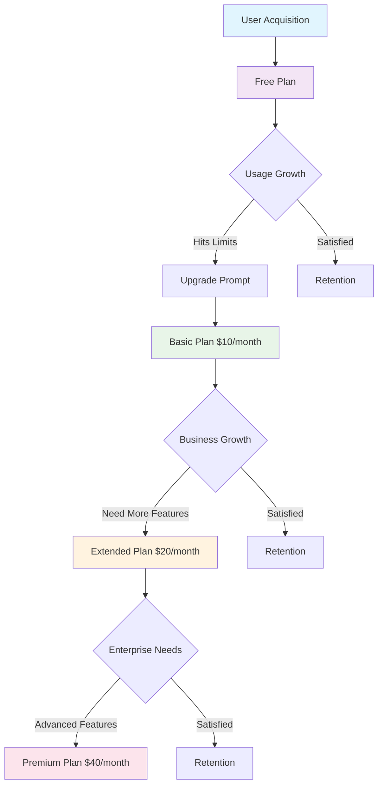
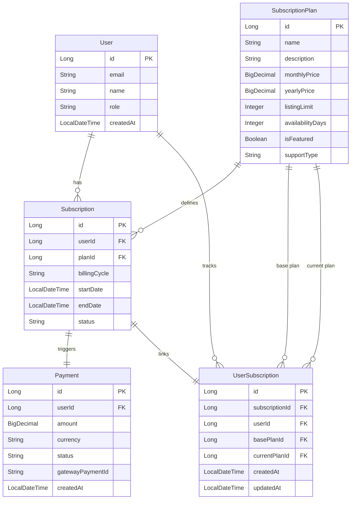
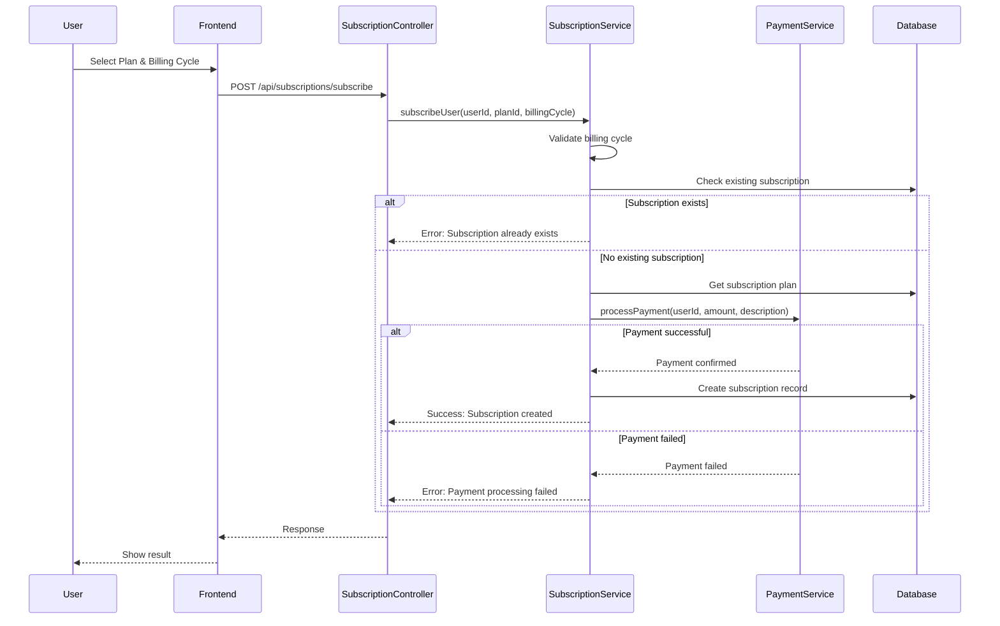
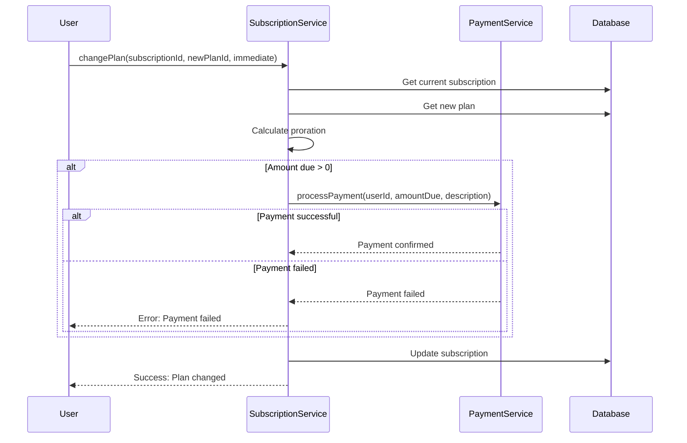
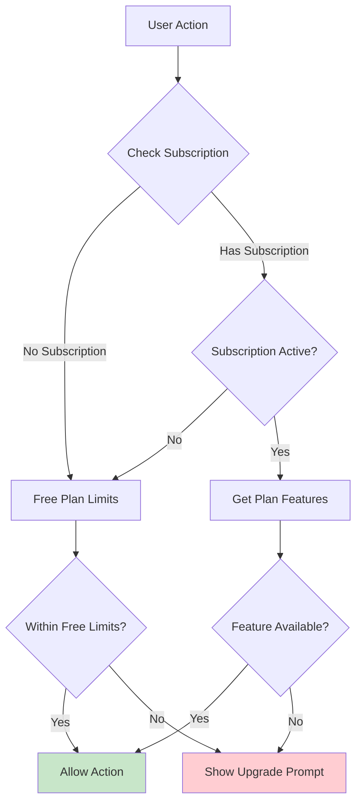
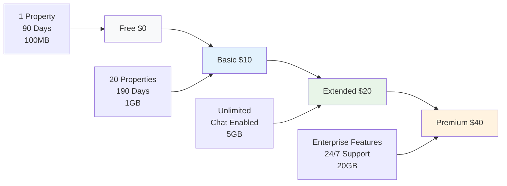
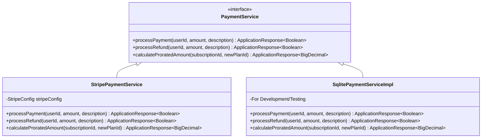
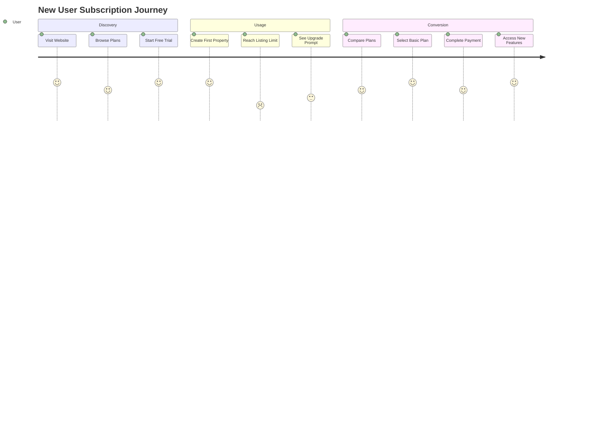
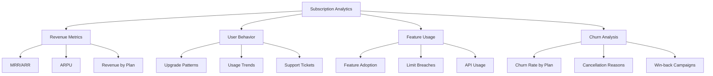

# Imovel Subscription Model Documentation

## Table of Contents
1. [Overview](#overview)
2. [Current Subscription Strategy](#current-subscription-strategy)
3. [Data Model Architecture](#data-model-architecture)
4. [Business Logic Flow](#business-logic-flow)
5. [Subscription Plans & Features](#subscription-plans--features)
6. [Payment Integration](#payment-integration)
7. [API Endpoints](#api-endpoints)
8. [Usage Examples](#usage-examples)
9. [Suggested Improvements](#suggested-improvements)
10. [Implementation Recommendations](#implementation-recommendations)

## Overview

The Imovel subscription system implements a **tiered pricing model** with four distinct plans (Free, Basic, Extended, Premium) designed to serve different user segments from individual landlords to enterprise property management companies. The system uses a **feature-based approach** where each plan provides specific capabilities and limitations.

### Key Characteristics
- **Freemium Model**: Free tier to attract users with upgrade paths
- **Usage-Based Limitations**: Property listing limits, storage quotas, API call limits
- **Feature Gating**: Advanced features locked behind higher tiers
- **Flexible Billing**: Monthly and yearly billing cycles with discounts
- **Proration Support**: Seamless plan upgrades with prorated billing

## Current Subscription Strategy

### Business Model Analysis



### Target Market Segmentation

| Segment | Plan | Target Users | Key Value Proposition |
|---------|------|--------------|----------------------|
| **Individual Landlords** | Free/Basic | 1-5 properties | Cost-effective property management |
| **Small Agencies** | Basic/Extended | 6-50 properties | Professional tools, unlimited listings |
| **Growing Businesses** | Extended | 50-200 properties | Advanced features, business support |
| **Enterprise** | Premium | 200+ properties | Full feature set, priority support |

## Data Model Architecture

### Entity Relationship Diagram



### Core Entities

#### SubscriptionPlan Entity
```java
@Entity
@Table(name = "subscription_plans")
public class SubscriptionPlan {
    @Id
    @GeneratedValue(strategy = GenerationType.IDENTITY)
    private Long id;
    
    @Column(nullable = false, unique = true)
    private String name;                    // "Free", "Basic", "Extended", "Premium"
    
    @Column(nullable = false)
    private String description;
    
    @Column(name = "monthly_price", nullable = false)
    private BigDecimal monthlyPrice;        // Monthly subscription cost
    
    @Column(name = "yearly_price", nullable = false)
    private BigDecimal yearlyPrice;         // Yearly subscription cost (discounted)
    
    @Column(name = "listing_limit")
    private Integer listingLimit;           // null = unlimited
    
    @Column(name = "availability_days")
    private Integer availabilityDays;       // How long listings stay active
    
    @Column(name = "is_featured", nullable = false)
    private Boolean isFeatured = false;     // Featured listing boost
    
    @Column(name = "support_type", nullable = false)
    private String supportType;             // "limited", "business_hours", "24/7"
}
```

#### Subscription Entity
```java
@Entity
@Table(name = "subscriptions")
public class Subscription {
    @Id
    @GeneratedValue(strategy = GenerationType.IDENTITY)
    private Long id;
    
    @ManyToOne
    @JoinColumn(name = "plan_id", nullable = false)
    private SubscriptionPlan plan;
    
    @Column(name = "user_id", nullable = false)
    private Long userId;
    
    @Column(nullable = false)
    private String billingCycle;            // "monthly" or "yearly"
    
    @Column(name = "start_date", nullable = false)
    private LocalDateTime startDate;
    
    @Column(name = "end_date", nullable = false)
    private LocalDateTime endDate;
    
    @Column(nullable = false)
    private String status;                  // "active", "canceled", "expired"
}
```

#### UserSubscription Entity
```java
@Entity
@Table(name = "user_subscriptions")
public class UserSubscription {
    @Id
    @GeneratedValue(strategy = GenerationType.IDENTITY)
    private Long id;
    
    @Column(name = "subscription_id", nullable = false)
    private Long subscriptionId;            // Links to Subscription entity
    
    @Column(name = "user_id", nullable = false)
    private Long userId;                    // User who owns this subscription
    
    @ManyToOne
    @JoinColumn(name = "base_plan_id", nullable = false)
    private SubscriptionPlan basePlan;      // Original plan user subscribed to
    
    @ManyToOne
    @JoinColumn(name = "current_plan_id", nullable = false)
    private SubscriptionPlan currentPlan;   // Current plan (after changes)
    
    @Column(name = "created_at", nullable = false)
    private LocalDateTime createdAt;
    
    @Column(name = "updated_at", nullable = false)
    private LocalDateTime updatedAt;
    
    // Helper method to check if user has changed from their base plan
    public boolean hasChangedPlan() {
        return !this.basePlan.getId().equals(this.currentPlan.getId());
    }
}
```

**Key Features:**
- **Base Plan Tracking**: Maintains record of the original subscription plan
- **Current Plan Tracking**: Tracks the current active plan after any changes
- **Plan Change Detection**: Provides method to check if user has upgraded/downgraded
- **Audit Trail**: Timestamps for creation and updates
- **Proration Support**: Enables proper billing calculations for plan changes

## Business Logic Flow

### Subscription Creation Flow



### Plan Change Flow



### Feature Access Control Flow



## Subscription Plans & Features

### Current Plan Structure

| Feature | Free | Basic ($10/month) | Extended ($20/month) | Premium ($40/month) |
|---------|------|-------------------|----------------------|---------------------|
| **Property Listings** | 1 | 20 | Unlimited | Unlimited |
| **Availability Duration** | 90 days | 190 days | Unlimited | Unlimited |
| **Built-in Chat** | ❌ | ❌ | ✅ | ✅ |
| **Email Integration** | Basic | Basic | Dedicated Inbox | Dedicated Inbox |
| **Customer Support** | None | None | Business Hours | 24/7 Priority |
| **Featured Listings** | ❌ | ❌ | ❌ | ✅ |
| **Analytics Dashboard** | ❌ | ❌ | Basic | Advanced |
| **Mobile App Access** | Web Only | Web Only | Basic App | Full App |
| **API Access** | ❌ | 100 calls/day | 500 calls/day | Unlimited |
| **File Storage** | 100 MB | 1 GB | 5 GB | 20 GB |

### Pricing Strategy Analysis



**Pricing Insights:**
- **2x multiplier** between tiers creates clear value differentiation
- **Yearly discount**: ~10% savings to encourage annual commitments
- **Feature bundling**: Each tier adds multiple features, not just limits

## Payment Integration

### Payment Service Architecture



### Proration Calculation Logic

```java
public class ProrationResult {
    private BigDecimal amountDue;
    private LocalDateTime newStartDate;
    private LocalDateTime newEndDate;
    
    // Proration calculation for plan changes
    public static ProrationResult calculateProration(
            Subscription currentSub, 
            SubscriptionPlan newPlan, 
            boolean immediate) {
        
        LocalDateTime now = LocalDateTime.now();
        BigDecimal amountDue = BigDecimal.ZERO;
        
        if (immediate) {
            // Calculate unused time credit
            long totalDays = ChronoUnit.DAYS.between(currentSub.getStartDate(), currentSub.getEndDate());
            long usedDays = ChronoUnit.DAYS.between(currentSub.getStartDate(), now);
            long remainingDays = totalDays - usedDays;
            
            // Calculate credit and new plan cost
            BigDecimal currentPlanPrice = getCurrentPlanPrice(currentSub);
            BigDecimal dailyRate = currentPlanPrice.divide(BigDecimal.valueOf(totalDays), 2, RoundingMode.HALF_UP);
            BigDecimal credit = dailyRate.multiply(BigDecimal.valueOf(remainingDays));
            
            BigDecimal newPlanPrice = getNewPlanPrice(newPlan, currentSub.getBillingCycle());
            amountDue = newPlanPrice.subtract(credit);
        }
        
        return new ProrationResult(amountDue, newStartDate, newEndDate);
    }
}
```

## API Endpoints

### Subscription Management Endpoints

| Method | Endpoint | Description | Auth Required |
|--------|----------|-------------|---------------|
| `POST` | `/api/subscriptions/subscribe` | Create new subscription | ✅ |
| `GET` | `/api/subscriptions/user/{userId}` | Get user's subscription | ✅ |
| `GET` | `/api/subscriptions/user/{userId}/details` | Get user's subscription with base/current plan details | ✅ |
| `POST` | `/api/subscriptions/{subscriptionId}/change-plan` | Change subscription plan | ✅ |
| `POST` | `/api/subscriptions/{subscriptionId}/cancel` | Cancel subscription | ✅ |
| `GET` | `/api/subscription-plans` | List all available plans | ❌ |
| `GET` | `/api/subscription-plans/{id}` | Get specific plan details | ❌ |

### Request/Response Examples

#### Subscribe to Plan
```json
POST /api/subscriptions/subscribe
{
    "userId": 123,
    "planId": 2,
    "billingCycle": "monthly"
}

Response:
{
    "success": true,
    "data": {
        "id": 456,
        "plan": {
            "id": 2,
            "name": "Basic",
            "monthlyPrice": 10.00
        },
        "userId": 123,
        "billingCycle": "monthly",
        "startDate": "2024-01-15T10:00:00",
        "endDate": "2024-02-15T10:00:00",
        "status": "active"
    },
    "message": "Subscription created successfully"
}
```

#### Get User Subscription Details
```json
GET /api/subscriptions/user/{userId}/details

Response:
{
    "success": true,
    "data": {
        "id": 789,
        "subscriptionId": 456,
        "userId": 123,
        "basePlan": {
            "id": 1,
            "name": "Free",
            "description": "Basic plan for individual landlords",
            "monthlyPrice": 0.00,
            "yearlyPrice": 0.00,
            "listingLimit": 1,
            "availabilityDays": 30,
            "isFeatured": false,
            "supportType": "limited"
        },
        "currentPlan": {
            "id": 2,
            "name": "Basic",
            "description": "Enhanced plan for small agencies",
            "monthlyPrice": 10.00,
            "yearlyPrice": 100.00,
            "listingLimit": 20,
            "availabilityDays": 60,
            "isFeatured": false,
            "supportType": "business_hours"
        },
        "hasChangedPlan": true,
        "createdAt": "2024-01-15T10:00:00",
        "updatedAt": "2024-01-20T14:30:00"
    },
    "message": "User subscription details retrieved successfully"
}
```

## Usage Examples

### Example 1: New User Onboarding



**Scenario**: Sarah, a small landlord with 3 properties
1. **Starts with Free Plan**: Lists 1 property to test the platform
2. **Hits Limitation**: Needs to list 2 more properties
3. **Upgrades to Basic**: Pays $10/month for 20 property limit
4. **Growth**: Eventually upgrades to Extended for unlimited listings

### Example 2: Business Growth Scenario

**Scenario**: PropertyCorp, a growing real estate agency
1. **Basic Plan**: Starts with 15 properties ($10/month)
2. **Hits Limit**: Grows to 25 properties, needs upgrade
3. **Extended Plan**: Upgrades to unlimited listings ($20/month)
4. **Advanced Needs**: Requires analytics and priority support
5. **Premium Plan**: Final upgrade to enterprise features ($40/month)

### Example 3: Plan Change with Proration

```java
// User changes from Basic ($10/month) to Extended ($20/month) mid-cycle
// Current subscription: 15 days used out of 30 days
// Remaining value: $5.00 (15 days × $10/30)
// New plan cost: $20.00
// Amount due: $20.00 - $5.00 = $15.00

SubscriptionService.changePlan(subscriptionId, extendedPlanId, true);
```

## Suggested Improvements

### 1. Enhanced Feature Management System

**Current Issue**: Features are hardcoded in plan definitions
**Proposed Solution**: Dynamic feature management system

```mermaid
classDiagram
    class Feature {
        +Long id
        +String key
        +String name
        +String description
        +FeatureType type
        +Object defaultValue
        +Object constraints
    }
    
    class PlanFeature {
        +Long planId
        +Long featureId
        +Object value
        +Boolean enabled
    }
    
    class FeatureUsage {
        +Long userId
        +Long featureId
        +Object currentUsage
        +LocalDateTime lastUpdated
    }
    
    Feature ||--o{ PlanFeature : configures
    PlanFeature }o--|| SubscriptionPlan : belongs_to
    Feature ||--o{ FeatureUsage : tracks
```

**Benefits**:
- Admin can modify features without code changes
- A/B testing of different feature combinations
- Granular usage tracking and analytics

### 2. Usage-Based Billing Model

**Current Issue**: Fixed pricing regardless of actual usage
**Proposed Enhancement**: Hybrid model with base + usage components

```java
public class UsageBasedPricing {
    private BigDecimal basePrice;           // Fixed monthly cost
    private Map<String, UsageTier> usageTiers; // Variable costs
    
    public static class UsageTier {
        private String featureKey;          // "api_calls", "storage_gb"
        private Integer includedAmount;     // Free tier amount
        private BigDecimal pricePerUnit;    // Cost per additional unit
        private Integer maxAmount;          // Hard limit
    }
}
```

**Example Enhanced Pricing**:
- **Basic Plan**: $10 base + $0.01 per API call over 1000
- **Extended Plan**: $20 base + $0.005 per API call over 5000
- **Premium Plan**: $40 base + unlimited API calls

### 3. Advanced Subscription Analytics

**Proposed Dashboard Metrics**:



### 4. Smart Upgrade Recommendations

**AI-Powered Upgrade Suggestions**:

```java
public class UpgradeRecommendationEngine {
    public UpgradeRecommendation analyzeUser(Long userId) {
        UserUsagePattern pattern = analyzeUsagePattern(userId);
        SubscriptionPlan currentPlan = getCurrentPlan(userId);
        
        if (pattern.isApproachingLimits()) {
            return new UpgradeRecommendation(
                getNextTierPlan(currentPlan),
                "You're approaching your listing limit",
                calculateROI(pattern, getNextTierPlan(currentPlan))
            );
        }
        
        return UpgradeRecommendation.none();
    }
}
```

### 5. Flexible Billing Cycles

**Current Issue**: Only monthly/yearly options
**Proposed Enhancement**: Multiple billing options

- **Quarterly**: 3-month cycles with 5% discount
- **Semi-annual**: 6-month cycles with 8% discount
- **Custom Enterprise**: Negotiated terms for large clients

### 6. Subscription Pause/Resume Feature

**Use Case**: Seasonal businesses or temporary inactivity

```java
public class SubscriptionPauseService {
    public ApplicationResponse<Void> pauseSubscription(Long subscriptionId, Integer pauseDays) {
        // Extend end date by pause duration
        // Suspend feature access during pause
        // No billing during pause period
    }
    
    public ApplicationResponse<Void> resumeSubscription(Long subscriptionId) {
        // Reactivate all features
        // Resume normal billing cycle
    }
}
```

### 7. Multi-Tenant Support

**For Property Management Companies**:

```mermaid
classDiagram
    class Organization {
        +Long id
        +String name
        +SubscriptionPlan plan
        +List~User~ members
    }
    
    class OrganizationSubscription {
        +Long organizationId
        +Integer seatCount
        +BigDecimal pricePerSeat
        +List~Feature~ enabledFeatures
    }
    
    Organization ||--|| OrganizationSubscription : has
    Organization ||--o{ User : contains
```

## Implementation Recommendations

### Phase 1: Core Improvements (1-2 months)
1. **Enhanced Analytics Dashboard**
   - Implement subscription metrics tracking
   - Add usage monitoring for all features
   - Create admin dashboard for subscription management

2. **Improved User Experience**
   - Add upgrade prompts at limit boundaries
   - Implement plan comparison tool
   - Create subscription management portal

### Phase 2: Advanced Features (2-3 months)
1. **Dynamic Feature Management**
   - Implement feature toggle system
   - Create admin interface for feature configuration
   - Add A/B testing capabilities

2. **Usage-Based Billing**
   - Implement usage tracking infrastructure
   - Add billing calculation engine
   - Create usage dashboards for users

### Phase 3: Enterprise Features (3-4 months)
1. **Multi-Tenant Support**
   - Organization management system
   - Seat-based billing
   - Role-based access control

2. **Advanced Analytics**
   - Predictive churn analysis
   - Upgrade recommendation engine
   - Revenue optimization tools

### Technical Debt & Refactoring

#### Current Issues to Address:

1. **Payment Service Abstraction**
   ```java
   // Current: Tight coupling
   ApplicationResponse<Boolean> paymentResponse = paymentService.processPayment(userId, amount, description);
   
   // Improved: Event-driven approach
   PaymentEvent event = new PaymentEvent(userId, amount, description, subscriptionId);
   eventPublisher.publishEvent(event);
   ```

2. **Error Handling Standardization**
   - Implement consistent error codes for subscription operations
   - Add retry mechanisms for payment failures
   - Improve logging and monitoring

3. **Database Optimization**
   - Add indexes for subscription queries
   - Implement soft deletes for audit trails
   - Add database constraints for data integrity

### Monitoring & Alerting

**Key Metrics to Track**:
- Monthly Recurring Revenue (MRR)
- Customer Acquisition Cost (CAC)
- Lifetime Value (LTV)
- Churn Rate by Plan
- Feature Adoption Rates
- Payment Failure Rates

**Recommended Alerts**:
- High payment failure rate (>5%)
- Unusual churn spike (>20% increase)
- Feature limit breaches trending up
- Revenue targets not met

---

## Conclusion

The current Imovel subscription system provides a solid foundation with clear plan tiers and basic functionality. However, there are significant opportunities for improvement in areas such as:

1. **Dynamic feature management** for operational flexibility
2. **Usage-based billing** for fairer pricing
3. **Advanced analytics** for data-driven decisions
4. **Enhanced user experience** for better conversion rates

Implementing these improvements in phases will help maximize revenue while providing better value to users across all segments.

The recommended approach prioritizes quick wins in analytics and UX improvements, followed by more complex features like usage-based billing and multi-tenant support. This strategy balances immediate business impact with long-term scalability goals.