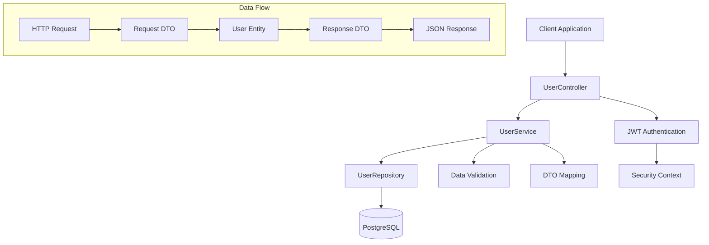
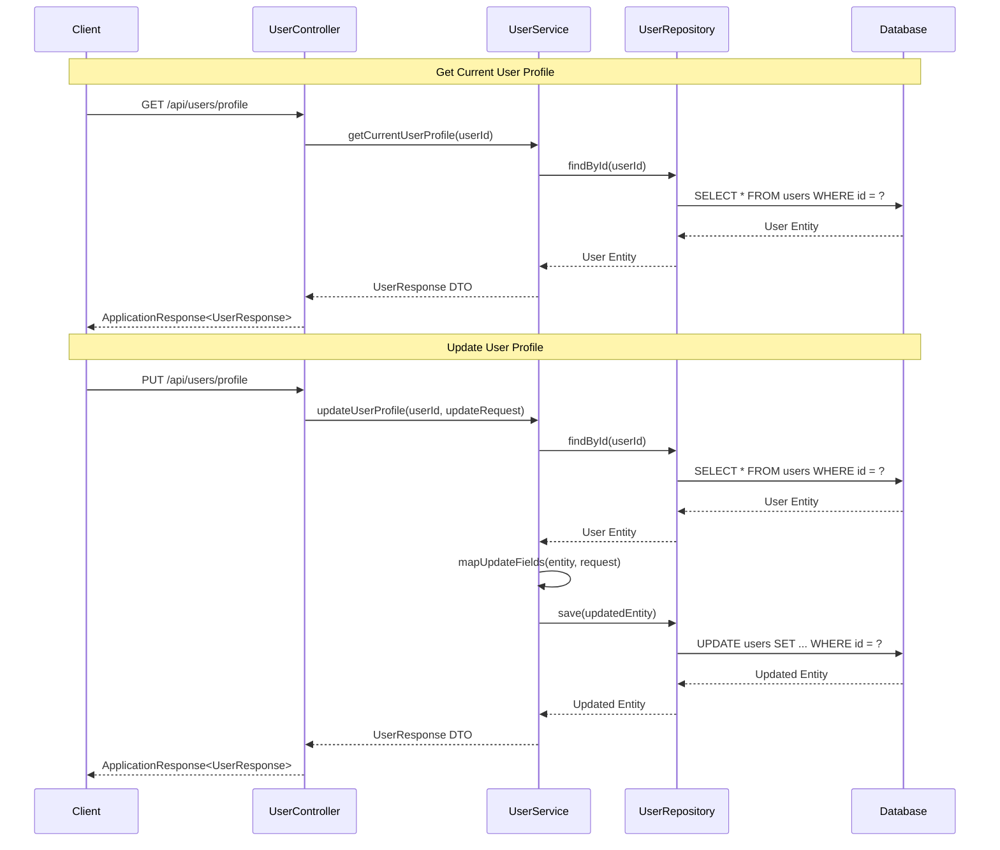

# User Management Endpoints Guide

## Table of Contents
1. [Overview](#overview)
2. [Architecture](#architecture)
3. [Data Models](#data-models)
4. [API Endpoints](#api-endpoints)
5. [Usage Examples](#usage-examples)
6. [Error Handling](#error-handling)
7. [Best Practices](#best-practices)
8. [Security Considerations](#security-considerations)

## Overview

The User Management system provides comprehensive endpoints for managing user profiles, including profile retrieval, updates, and administrative operations. This system integrates with the authentication system to ensure secure access to user data.

### Key Features
- **Profile Management**: Complete CRUD operations for user profiles
- **Social Links Integration**: Support for multiple social media platforms
- **Avatar Management**: Profile picture upload and management
- **Administrative Access**: Admin-only endpoints for user management
- **Secure Operations**: JWT-based authentication for all operations

## Architecture

### System Architecture Diagram



### User Management Flow



## Data Models

### Core Entities

#### User Entity
```java
@Entity
@Table(name = "users")
public class User {
    @Id
    @GeneratedValue(strategy = GenerationType.IDENTITY)
    private Long id;
    
    @Column(nullable = false, length = 100)
    private String name;
    
    @Column(nullable = false, unique = true, length = 255)
    private String email;
    
    @Column(length = 20)
    private String phone;
    
    @Column(length = 512)
    private String avatar;
    
    @ElementCollection
    @CollectionTable(
        name = "user_social_links",
        joinColumns = @JoinColumn(name = "user_id")
    )
    private List<SocialLink> socialLinks = new ArrayList<>();
    
    @CreationTimestamp
    @Column(name = "created_at", nullable = false, updatable = false)
    private LocalDateTime createdAt;
    
    @UpdateTimestamp
    @Column(name = "updated_at", nullable = false)
    private LocalDateTime updatedAt;
    
    // Relationships
    @OneToMany(mappedBy = "createdBy", cascade = CascadeType.ALL, orphanRemoval = true)
    private List<Property> properties = new ArrayList<>();
    
    @OneToOne(mappedBy = "user", cascade = CascadeType.ALL, orphanRemoval = true)
    private Wishlist wishlist;
    
    @OneToMany(mappedBy = "user", cascade = CascadeType.ALL, orphanRemoval = true)
    private List<Review> reviews = new ArrayList<>();
}
```

#### SocialLink Embeddable
```java
@Embeddable
public class SocialLink {
    @Column(name = "platform", nullable = false, length = 50)
    private String platform;
    
    @Column(name = "url", nullable = false, length = 512)
    private String url;
    
    public SocialLink() {}
    
    public SocialLink(String platform, String url) {
        this.platform = platform;
        this.url = url;
    }
    
    // Getters and setters
    public String getPlatform() { return platform; }
    public void setPlatform(String platform) { this.platform = platform; }
    public String getUrl() { return url; }
    public void setUrl(String url) { this.url = url; }
}
```

### Request/Response DTOs

#### UserUpdateRequest
```java
public class UserUpdateRequest {
    private String name;
    private String phone;
    private String avatar;
    private List<SocialLinkDto> socialLinks;
    
    // Getters and setters
    public String getName() { return name; }
    public void setName(String name) { this.name = name; }
    public String getPhone() { return phone; }
    public void setPhone(String phone) { this.phone = phone; }
    public String getAvatar() { return avatar; }
    public void setAvatar(String avatar) { this.avatar = avatar; }
    public List<SocialLinkDto> getSocialLinks() { return socialLinks; }
    public void setSocialLinks(List<SocialLinkDto> socialLinks) { this.socialLinks = socialLinks; }
}
```

#### SocialLinkDto
```java
public class SocialLinkDto {
    private String platform;
    private String url;
    
    // Getters and setters
    public String getPlatform() { return platform; }
    public void setPlatform(String platform) { this.platform = platform; }
    public String getUrl() { return url; }
    public void setUrl(String url) { this.url = url; }
}
```

#### UserResponse
```java
public class UserResponse implements Serializable {
    private Long id;
    private String name;
    private String email;
    private String phone;
    private String avatar;
    private List<SocialLinkDto> socialLinks;
    
    // Getters and setters
    public Long getId() { return id; }
    public void setId(Long id) { this.id = id; }
    public String getName() { return name; }
    public void setName(String name) { this.name = name; }
    public String getEmail() { return email; }
    public void setEmail(String email) { this.email = email; }
    public String getPhone() { return phone; }
    public void setPhone(String phone) { this.phone = phone; }
    public String getAvatar() { return avatar; }
    public void setAvatar(String avatar) { this.avatar = avatar; }
    public List<SocialLinkDto> getSocialLinks() { return socialLinks; }
    public void setSocialLinks(List<SocialLinkDto> socialLinks) { this.socialLinks = socialLinks; }
}
```

## API Endpoints

### 1. Get All Users (Admin Only)

**Endpoint:** `GET /api/users`

**Description:** Retrieves a list of all users in the system. This endpoint is restricted to administrators only.

**Authentication:** Required (JWT Token + Admin Role)

**Request Headers:**
```
Authorization: Bearer <jwt_token>
Content-Type: application/json
```

**Request Parameters:** None

**Response:**
```json
{
    "success": true,
    "message": "Users retrieved successfully",
    "data": [
        {
            "id": 1,
            "name": "John Doe",
            "email": "john.doe@example.com",
            "phone": "+1234567890",
            "avatar": "https://example.com/avatars/john.jpg",
            "socialLinks": [
                {
                    "platform": "linkedin",
                    "url": "https://linkedin.com/in/johndoe"
                },
                {
                    "platform": "twitter",
                    "url": "https://twitter.com/johndoe"
                }
            ]
        },
        {
            "id": 2,
            "name": "Jane Smith",
            "email": "jane.smith@example.com",
            "phone": "+1987654321",
            "avatar": "https://example.com/avatars/jane.jpg",
            "socialLinks": []
        }
    ],
    "timestamp": "2024-01-15T10:30:00Z"
}
```

**Error Responses:**
- `401 Unauthorized`: Invalid or missing JWT token
- `403 Forbidden`: User does not have admin privileges
- `500 Internal Server Error`: Server error

### 2. Get Current User Profile

**Endpoint:** `GET /api/users/profile`

**Description:** Retrieves the profile information of the currently authenticated user.

**Authentication:** Required (JWT Token)

**Request Headers:**
```
Authorization: Bearer <jwt_token>
Content-Type: application/json
```

**Request Parameters:** None

**Response:**
```json
{
    "success": true,
    "message": "User profile retrieved successfully",
    "data": {
        "id": 1,
        "name": "John Doe",
        "email": "john.doe@example.com",
        "phone": "+1234567890",
        "avatar": "https://example.com/avatars/john.jpg",
        "socialLinks": [
            {
                "platform": "linkedin",
                "url": "https://linkedin.com/in/johndoe"
            },
            {
                "platform": "twitter",
                "url": "https://twitter.com/johndoe"
            }
        ]
    },
    "timestamp": "2024-01-15T10:30:00Z"
}
```

**Error Responses:**
- `401 Unauthorized`: Invalid or missing JWT token
- `404 Not Found`: User not found
- `500 Internal Server Error`: Server error

### 3. Update User Profile

**Endpoint:** `PUT /api/users/profile`

**Description:** Updates the profile information of the currently authenticated user.

**Authentication:** Required (JWT Token)

**Request Headers:**
```
Authorization: Bearer <jwt_token>
Content-Type: application/json
```

**Request Body:**
```json
{
    "name": "John Doe Updated",
    "phone": "+1234567891",
    "avatar": "https://example.com/avatars/john-updated.jpg",
    "socialLinks": [
        {
            "platform": "linkedin",
            "url": "https://linkedin.com/in/johndoe-updated"
        },
        {
            "platform": "twitter",
            "url": "https://twitter.com/johndoe_updated"
        },
        {
            "platform": "github",
            "url": "https://github.com/johndoe"
        }
    ]
}
```

**Response:**
```json
{
    "success": true,
    "message": "User profile updated successfully",
    "data": {
        "id": 1,
        "name": "John Doe Updated",
        "email": "john.doe@example.com",
        "phone": "+1234567891",
        "avatar": "https://example.com/avatars/john-updated.jpg",
        "socialLinks": [
            {
                "platform": "linkedin",
                "url": "https://linkedin.com/in/johndoe-updated"
            },
            {
                "platform": "twitter",
                "url": "https://twitter.com/johndoe_updated"
            },
            {
                "platform": "github",
                "url": "https://github.com/johndoe"
            }
        ]
    },
    "timestamp": "2024-01-15T10:35:00Z"
}
```

**Validation Rules:**
- `name`: Optional, max 100 characters
- `phone`: Optional, max 20 characters
- `avatar`: Optional, valid URL format, max 512 characters
- `socialLinks`: Optional array of social link objects
  - `platform`: Required if socialLinks provided, max 50 characters
  - `url`: Required if socialLinks provided, valid URL format, max 512 characters

**Error Responses:**
- `400 Bad Request`: Invalid request data or validation errors
- `401 Unauthorized`: Invalid or missing JWT token
- `404 Not Found`: User not found
- `500 Internal Server Error`: Server error

### 4. Delete User Profile

**Endpoint:** `DELETE /api/users/profile`

**Description:** Deletes the profile of the currently authenticated user. This action is irreversible and will also delete all associated data (properties, reviews, wishlist).

**Authentication:** Required (JWT Token)

**Request Headers:**
```
Authorization: Bearer <jwt_token>
Content-Type: application/json
```

**Request Parameters:** None

**Response:**
```json
{
    "success": true,
    "message": "User profile deleted successfully",
    "data": null,
    "timestamp": "2024-01-15T10:40:00Z"
}
```

**Error Responses:**
- `401 Unauthorized`: Invalid or missing JWT token
- `404 Not Found`: User not found
- `500 Internal Server Error`: Server error

## Usage Examples

### PowerShell Examples

#### Get Current User Profile
```powershell
# Function to get current user profile
function Get-UserProfile {
    param(
        [Parameter(Mandatory=$true)]
        [string]$AccessToken,
        
        [Parameter(Mandatory=$false)]
        [string]$BaseUrl = "http://localhost:8080"
    )
    
    $headers = @{
        "Authorization" = "Bearer $AccessToken"
        "Content-Type" = "application/json"
    }
    
    try {
        $response = Invoke-RestMethod -Uri "$BaseUrl/api/users/profile" -Method GET -Headers $headers
        Write-Host "Profile retrieved successfully!" -ForegroundColor Green
        return $response
    }
    catch {
        Write-Host "Error retrieving profile: $($_.Exception.Message)" -ForegroundColor Red
        throw
    }
}

# Usage
$token = "your_jwt_token_here"
$profile = Get-UserProfile -AccessToken $token
Write-Host "User: $($profile.data.name) ($($profile.data.email))"
```

#### Update User Profile
```powershell
# Function to update user profile
function Update-UserProfile {
    param(
        [Parameter(Mandatory=$true)]
        [string]$AccessToken,
        
        [Parameter(Mandatory=$false)]
        [string]$Name,
        
        [Parameter(Mandatory=$false)]
        [string]$Phone,
        
        [Parameter(Mandatory=$false)]
        [string]$Avatar,
        
        [Parameter(Mandatory=$false)]
        [array]$SocialLinks,
        
        [Parameter(Mandatory=$false)]
        [string]$BaseUrl = "http://localhost:8080"
    )
    
    $headers = @{
        "Authorization" = "Bearer $AccessToken"
        "Content-Type" = "application/json"
    }
    
    $body = @{}
    if ($Name) { $body.name = $Name }
    if ($Phone) { $body.phone = $Phone }
    if ($Avatar) { $body.avatar = $Avatar }
    if ($SocialLinks) { $body.socialLinks = $SocialLinks }
    
    $jsonBody = $body | ConvertTo-Json -Depth 3
    
    try {
        $response = Invoke-RestMethod -Uri "$BaseUrl/api/users/profile" -Method PUT -Headers $headers -Body $jsonBody
        Write-Host "Profile updated successfully!" -ForegroundColor Green
        return $response
    }
    catch {
        Write-Host "Error updating profile: $($_.Exception.Message)" -ForegroundColor Red
        throw
    }
}

# Usage
$token = "your_jwt_token_here"
$socialLinks = @(
    @{ platform = "linkedin"; url = "https://linkedin.com/in/johndoe" },
    @{ platform = "twitter"; url = "https://twitter.com/johndoe" }
)

$updatedProfile = Update-UserProfile -AccessToken $token -Name "John Doe Updated" -Phone "+1234567891" -SocialLinks $socialLinks
Write-Host "Updated user: $($updatedProfile.data.name)"
```

#### Get All Users (Admin)
```powershell
# Function to get all users (admin only)
function Get-AllUsers {
    param(
        [Parameter(Mandatory=$true)]
        [string]$AccessToken,
        
        [Parameter(Mandatory=$false)]
        [string]$BaseUrl = "http://localhost:8080"
    )
    
    $headers = @{
        "Authorization" = "Bearer $AccessToken"
        "Content-Type" = "application/json"
    }
    
    try {
        $response = Invoke-RestMethod -Uri "$BaseUrl/api/users" -Method GET -Headers $headers
        Write-Host "Users retrieved successfully! Total: $($response.data.Count)" -ForegroundColor Green
        return $response
    }
    catch {
        Write-Host "Error retrieving users: $($_.Exception.Message)" -ForegroundColor Red
        throw
    }
}

# Usage (requires admin token)
$adminToken = "your_admin_jwt_token_here"
$allUsers = Get-AllUsers -AccessToken $adminToken
foreach ($user in $allUsers.data) {
    Write-Host "User: $($user.name) - $($user.email)"
}
```

### JavaScript/Node.js Examples

#### Get Current User Profile
```javascript
const axios = require('axios');

async function getCurrentUserProfile(accessToken, baseUrl = 'http://localhost:8080') {
    try {
        const response = await axios.get(`${baseUrl}/api/users/profile`, {
            headers: {
                'Authorization': `Bearer ${accessToken}`,
                'Content-Type': 'application/json'
            }
        });
        
        console.log('Profile retrieved successfully!');
        return response.data;
    } catch (error) {
        console.error('Error retrieving profile:', error.response?.data || error.message);
        throw error;
    }
}

// Usage
const token = 'your_jwt_token_here';
getCurrentUserProfile(token)
    .then(profile => {
        console.log(`User: ${profile.data.name} (${profile.data.email})`);
    })
    .catch(error => {
        console.error('Failed to get profile:', error);
    });
```

#### Update User Profile
```javascript
async function updateUserProfile(accessToken, updateData, baseUrl = 'http://localhost:8080') {
    try {
        const response = await axios.put(`${baseUrl}/api/users/profile`, updateData, {
            headers: {
                'Authorization': `Bearer ${accessToken}`,
                'Content-Type': 'application/json'
            }
        });
        
        console.log('Profile updated successfully!');
        return response.data;
    } catch (error) {
        console.error('Error updating profile:', error.response?.data || error.message);
        throw error;
    }
}

// Usage
const token = 'your_jwt_token_here';
const updateData = {
    name: 'John Doe Updated',
    phone: '+1234567891',
    socialLinks: [
        { platform: 'linkedin', url: 'https://linkedin.com/in/johndoe' },
        { platform: 'twitter', url: 'https://twitter.com/johndoe' }
    ]
};

updateUserProfile(token, updateData)
    .then(updatedProfile => {
        console.log(`Updated user: ${updatedProfile.data.name}`);
    })
    .catch(error => {
        console.error('Failed to update profile:', error);
    });
```

## Error Handling

### Common Error Responses

#### 400 Bad Request
```json
{
    "success": false,
    "message": "Validation failed",
    "errors": [
        {
            "field": "name",
            "message": "Name cannot exceed 100 characters"
        },
        {
            "field": "socialLinks[0].url",
            "message": "Invalid URL format"
        }
    ],
    "timestamp": "2024-01-15T10:30:00Z"
}
```

#### 401 Unauthorized
```json
{
    "success": false,
    "message": "Authentication required",
    "error": "Invalid or expired JWT token",
    "timestamp": "2024-01-15T10:30:00Z"
}
```

#### 403 Forbidden
```json
{
    "success": false,
    "message": "Access denied",
    "error": "Insufficient privileges for this operation",
    "timestamp": "2024-01-15T10:30:00Z"
}
```

#### 404 Not Found
```json
{
    "success": false,
    "message": "User not found",
    "error": "No user found with the provided ID",
    "timestamp": "2024-01-15T10:30:00Z"
}
```

#### 500 Internal Server Error
```json
{
    "success": false,
    "message": "Internal server error",
    "error": "An unexpected error occurred while processing the request",
    "timestamp": "2024-01-15T10:30:00Z"
}
```

## Best Practices

### 1. Profile Updates
- **Partial Updates**: Only send fields that need to be updated
- **Validation**: Always validate data on both client and server side
- **Optimistic Updates**: Update UI immediately, rollback on error

### 2. Social Links Management
- **Platform Validation**: Validate platform names against allowed list
- **URL Validation**: Ensure URLs are properly formatted and accessible
- **Duplicate Prevention**: Check for duplicate platforms before adding

### 3. Avatar Management
- **File Size Limits**: Implement reasonable file size limits (e.g., 5MB)
- **Format Validation**: Only allow common image formats (JPG, PNG, WebP)
- **CDN Integration**: Use CDN for avatar storage and delivery

### 4. Performance Optimization
- **Caching**: Cache user profiles for frequently accessed data
- **Pagination**: Implement pagination for admin user lists
- **Lazy Loading**: Load social links and other optional data on demand

### 5. Data Privacy
- **Minimal Data**: Only request and store necessary user information
- **Data Retention**: Implement data retention policies
- **User Consent**: Ensure proper consent for data collection and processing

## Security Considerations

### 1. Authentication & Authorization
- **JWT Validation**: Always validate JWT tokens on every request
- **Role-Based Access**: Implement proper role-based access control
- **Token Expiration**: Use reasonable token expiration times

### 2. Data Validation
- **Input Sanitization**: Sanitize all user inputs to prevent XSS
- **SQL Injection Prevention**: Use parameterized queries
- **File Upload Security**: Validate file types and scan for malware

### 3. Privacy Protection
- **Data Encryption**: Encrypt sensitive data at rest and in transit
- **Access Logging**: Log all access to user data for audit purposes
- **GDPR Compliance**: Implement right to be forgotten and data portability

### 4. Rate Limiting
- **API Rate Limits**: Implement rate limiting to prevent abuse
- **Profile Update Limits**: Limit frequency of profile updates
- **Failed Request Monitoring**: Monitor and block suspicious activity

### 5. Secure Communication
- **HTTPS Only**: Always use HTTPS in production
- **CORS Configuration**: Properly configure CORS policies
- **Security Headers**: Implement security headers (CSP, HSTS, etc.)

---

**Note**: This guide covers the core user management endpoints. For authentication-related operations (login, registration, password management), refer to the [Authentication Endpoints Guide](authentication_endpoints_guide.md).