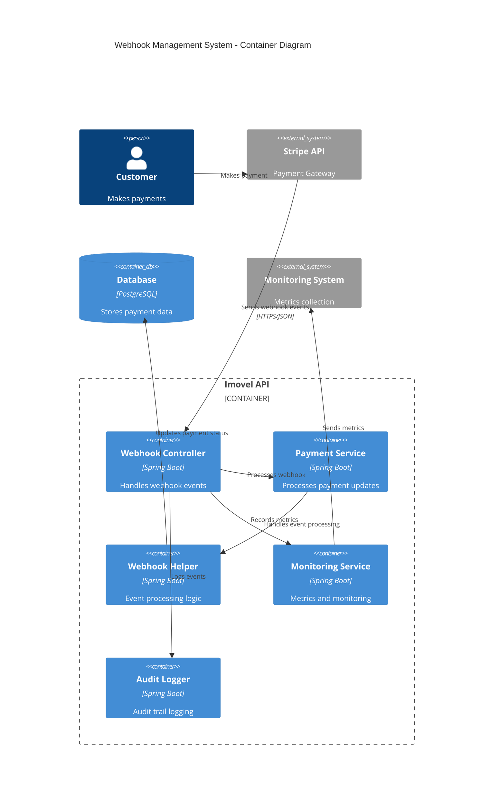
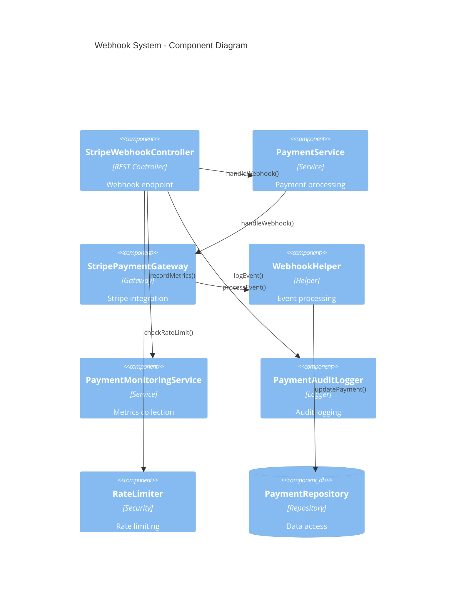

# Webhook Endpoints Guide

## Overview

The Webhook Management System provides secure and reliable webhook processing capabilities for handling real-time payment events from external payment gateways. The system currently supports Stripe webhooks with comprehensive event processing, signature verification, monitoring, and audit logging.

## Architecture

### System Architecture



### Component Architecture



## Data Models

### Webhook Event Structure

```json
{
  "id": "evt_1234567890",
  "object": "event",
  "api_version": "2023-10-16",
  "created": 1672531200,
  "data": {
    "object": {
      "id": "pi_1234567890",
      "object": "payment_intent",
      "amount": 2000,
      "currency": "usd",
      "status": "succeeded",
      "metadata": {
        "property_id": "123",
        "user_id": "456"
      }
    }
  },
  "livemode": false,
  "pending_webhooks": 1,
  "request": {
    "id": "req_1234567890",
    "idempotency_key": null
  },
  "type": "payment_intent.succeeded"
}
```

### WebhookEventRequest DTO

```java
public class WebhookEventRequest {
    private String id;
    private String type;
    private String apiVersion;
    private Long created;
    private WebhookEventData data;
    private Boolean livemode;
    private Integer pendingWebhooks;
    
    // Getters and setters
}

public class WebhookEventData {
    private PaymentIntentObject object;
    
    // Getters and setters
}

public class PaymentIntentObject {
    private String id;
    private String object;
    private Long amount;
    private String currency;
    private String status;
    private Map<String, String> metadata;
    
    // Getters and setters
}
```

### WebhookProcessingResponse DTO

```java
public class WebhookProcessingResponse {
    private String status;
    private String message;
    private String eventId;
    private String eventType;
    private String paymentId;
    private Long processingTimeMs;
    private String timestamp;
    
    // Getters and setters
}
```

### WebhookStatistics DTO

```java
public class WebhookStatistics {
    private Long totalEvents;
    private Long successfulEvents;
    private Long failedEvents;
    private Double successRate;
    private Long averageProcessingTimeMs;
    private Map<String, Long> eventTypeBreakdown;
    private List<WebhookFailure> recentFailures;
    
    // Getters and setters
}

public class WebhookFailure {
    private String eventId;
    private String eventType;
    private String errorMessage;
    private String timestamp;
    private Integer retryCount;
    
    // Getters and setters
}
```

### WebhookConfiguration DTO

```java
public class WebhookConfiguration {
    private String endpointUrl;
    private List<String> enabledEvents;
    private String apiVersion;
    private Boolean signatureVerification;
    private Integer timeoutSeconds;
    private Integer maxRetries;
    private String status;
    
    // Getters and setters
}
```

## API Endpoints

### 1. Process Stripe Webhook

**Endpoint:** `POST /api/webhooks/events`

**Description:** Processes incoming Stripe webhook events with signature verification and event handling.

**Headers:**
- `Stripe-Signature`: Required signature for verification
- `Content-Type`: application/json

**Request Body:**
```json
{
  "id": "evt_1234567890",
  "object": "event",
  "api_version": "2023-10-16",
  "created": 1672531200,
  "data": {
    "object": {
      "id": "pi_1234567890",
      "object": "payment_intent",
      "amount": 2000,
      "currency": "usd",
      "status": "succeeded"
    }
  },
  "type": "payment_intent.succeeded"
}
```

**Response:**
```json
{
  "status": "success",
  "message": "Webhook processed successfully"
}
```

**Error Responses:**
```json
{
  "status": "error",
  "message": "Invalid webhook signature",
  "code": 5110
}
```

### 2. Get Webhook Statistics

**Endpoint:** `GET /api/webhooks/statistics`

**Description:** Retrieves comprehensive webhook processing statistics and metrics.

**Query Parameters:**
- `startDate` (optional): Start date for statistics (ISO 8601)
- `endDate` (optional): End date for statistics (ISO 8601)
- `eventType` (optional): Filter by specific event type

**Response:**
```json
{
  "success": true,
  "data": {
    "totalEvents": 1250,
    "successfulEvents": 1235,
    "failedEvents": 15,
    "successRate": 98.8,
    "averageProcessingTimeMs": 145,
    "eventTypeBreakdown": {
      "payment_intent.succeeded": 800,
      "payment_intent.payment_failed": 25,
      "payment_intent.canceled": 10
    },
    "recentFailures": [
      {
        "eventId": "evt_failed_123",
        "eventType": "payment_intent.succeeded",
        "errorMessage": "Payment not found",
        "timestamp": "2024-01-15T10:30:00Z",
        "retryCount": 3
      }
    ]
  }
}
```

### 3. Get Webhook Configuration

**Endpoint:** `GET /api/webhooks/configuration`

**Description:** Retrieves current webhook endpoint configuration and settings.

**Response:**
```json
{
  "success": true,
  "data": {
    "endpointUrl": "https://api.imovel.com/api/webhooks/events",
    "enabledEvents": [
      "payment_intent.succeeded",
      "payment_intent.payment_failed",
      "payment_intent.canceled"
    ],
    "apiVersion": "2023-10-16",
    "signatureVerification": true,
    "timeoutSeconds": 30,
    "maxRetries": 3,
    "status": "active"
  }
}
```

### 4. Update Webhook Configuration

**Endpoint:** `PUT /api/webhooks/configuration`

**Description:** Updates webhook endpoint configuration and event subscriptions.

**Request Body:**
```json
{
  "enabledEvents": [
    "payment_intent.succeeded",
    "payment_intent.payment_failed",
    "payment_intent.canceled",
    "charge.dispute.created"
  ],
  "timeoutSeconds": 45,
  "maxRetries": 5
}
```

**Response:**
```json
{
  "success": true,
  "message": "Webhook configuration updated successfully",
  "data": {
    "endpointUrl": "https://api.imovel.com/api/webhooks/events",
    "enabledEvents": [
      "payment_intent.succeeded",
      "payment_intent.payment_failed",
      "payment_intent.canceled",
      "charge.dispute.created"
    ],
    "timeoutSeconds": 45,
    "maxRetries": 5,
    "status": "active"
  }
}
```

### 5. Retry Failed Webhook

**Endpoint:** `POST /api/webhooks/retry/{eventId}`

**Description:** Manually retries processing of a failed webhook event.

**Path Parameters:**
- `eventId`: The ID of the failed webhook event

**Response:**
```json
{
  "success": true,
  "message": "Webhook event retried successfully",
  "data": {
    "eventId": "evt_failed_123",
    "retryAttempt": 4,
    "status": "processing",
    "timestamp": "2024-01-15T11:00:00Z"
  }
}
```

### 6. Get Webhook Event Details

**Endpoint:** `GET /api/webhooks/events/{eventId}`

**Description:** Retrieves detailed information about a specific webhook event.

**Path Parameters:**
- `eventId`: The ID of the webhook event

**Response:**
```json
{
  "success": true,
  "data": {
    "eventId": "evt_1234567890",
    "eventType": "payment_intent.succeeded",
    "paymentId": "pi_1234567890",
    "processingStatus": "completed",
    "processingTimeMs": 125,
    "receivedAt": "2024-01-15T10:15:00Z",
    "processedAt": "2024-01-15T10:15:00Z",
    "retryCount": 0,
    "errorMessage": null,
    "metadata": {
      "property_id": "123",
      "user_id": "456"
    }
  }
}
```

## Usage Examples

### PowerShell Examples

#### Process Webhook Event (Simulated)
```powershell
# Note: This endpoint is typically called by Stripe, not manually
# This example shows the structure for testing purposes

$webhookPayload = @{
    id = "evt_test_webhook"
    object = "event"
    api_version = "2023-10-16"
    created = [DateTimeOffset]::UtcNow.ToUnixTimeSeconds()
    data = @{
        object = @{
            id = "pi_test_payment"
            object = "payment_intent"
            amount = 2000
            currency = "usd"
            status = "succeeded"
        }
    }
    type = "payment_intent.succeeded"
} | ConvertTo-Json -Depth 10

$headers = @{
    "Content-Type" = "application/json"
    "Stripe-Signature" = "t=1672531200,v1=test_signature"
}

try {
    $response = Invoke-RestMethod -Uri "https://api.imovel.com/api/webhooks/events" `
                                  -Method POST `
                                  -Headers $headers `
                                  -Body $webhookPayload
    
    Write-Host "✅ Webhook processed successfully"
    Write-Host "Status: $($response.status)"
    Write-Host "Message: $($response.message)"
}
catch {
    Write-Host "❌ Error processing webhook: $($_.Exception.Message)"
}
```

#### Get Webhook Statistics
```powershell
$headers = @{
    "Authorization" = "Bearer $jwtToken"
    "Content-Type" = "application/json"
}

$queryParams = @{
    startDate = "2024-01-01T00:00:00Z"
    endDate = "2024-01-31T23:59:59Z"
    eventType = "payment_intent.succeeded"
}

$uri = "https://api.imovel.com/api/webhooks/statistics?" + 
       ($queryParams.GetEnumerator() | ForEach-Object { "$($_.Key)=$($_.Value)" }) -join "&"

try {
    $response = Invoke-RestMethod -Uri $uri -Method GET -Headers $headers
    
    Write-Host "📊 Webhook Statistics:"
    Write-Host "Total Events: $($response.data.totalEvents)"
    Write-Host "Success Rate: $($response.data.successRate)%"
    Write-Host "Average Processing Time: $($response.data.averageProcessingTimeMs)ms"
    
    Write-Host "`n📈 Event Type Breakdown:"
    $response.data.eventTypeBreakdown.PSObject.Properties | ForEach-Object {
        Write-Host "  $($_.Name): $($_.Value)"
    }
}
catch {
    Write-Host "❌ Error retrieving statistics: $($_.Exception.Message)"
}
```

#### Update Webhook Configuration
```powershell
$headers = @{
    "Authorization" = "Bearer $jwtToken"
    "Content-Type" = "application/json"
}

$configUpdate = @{
    enabledEvents = @(
        "payment_intent.succeeded",
        "payment_intent.payment_failed",
        "payment_intent.canceled",
        "charge.dispute.created"
    )
    timeoutSeconds = 45
    maxRetries = 5
} | ConvertTo-Json

try {
    $response = Invoke-RestMethod -Uri "https://api.imovel.com/api/webhooks/configuration" `
                                  -Method PUT `
                                  -Headers $headers `
                                  -Body $configUpdate
    
    Write-Host "✅ Webhook configuration updated successfully"
    Write-Host "Enabled Events: $($response.data.enabledEvents -join ', ')"
    Write-Host "Timeout: $($response.data.timeoutSeconds) seconds"
    Write-Host "Max Retries: $($response.data.maxRetries)"
}
catch {
    Write-Host "❌ Error updating configuration: $($_.Exception.Message)"
}
```

### JavaScript Examples

#### Get Webhook Statistics
```javascript
async function getWebhookStatistics(startDate, endDate, eventType) {
    const params = new URLSearchParams();
    if (startDate) params.append('startDate', startDate);
    if (endDate) params.append('endDate', endDate);
    if (eventType) params.append('eventType', eventType);
    
    try {
        const response = await fetch(`https://api.imovel.com/api/webhooks/statistics?${params}`, {
            method: 'GET',
            headers: {
                'Authorization': `Bearer ${jwtToken}`,
                'Content-Type': 'application/json'
            }
        });
        
        if (!response.ok) {
            throw new Error(`HTTP error! status: ${response.status}`);
        }
        
        const data = await response.json();
        
        console.log('📊 Webhook Statistics:');
        console.log(`Total Events: ${data.data.totalEvents}`);
        console.log(`Success Rate: ${data.data.successRate}%`);
        console.log(`Average Processing Time: ${data.data.averageProcessingTimeMs}ms`);
        
        console.log('\n📈 Event Type Breakdown:');
        Object.entries(data.data.eventTypeBreakdown).forEach(([type, count]) => {
            console.log(`  ${type}: ${count}`);
        });
        
        if (data.data.recentFailures.length > 0) {
            console.log('\n❌ Recent Failures:');
            data.data.recentFailures.forEach(failure => {
                console.log(`  ${failure.eventId}: ${failure.errorMessage}`);
            });
        }
        
        return data.data;
    } catch (error) {
        console.error('❌ Error retrieving webhook statistics:', error.message);
        throw error;
    }
}

// Usage
getWebhookStatistics('2024-01-01T00:00:00Z', '2024-01-31T23:59:59Z', 'payment_intent.succeeded');
```

#### Retry Failed Webhook
```javascript
async function retryFailedWebhook(eventId) {
    try {
        const response = await fetch(`https://api.imovel.com/api/webhooks/retry/${eventId}`, {
            method: 'POST',
            headers: {
                'Authorization': `Bearer ${jwtToken}`,
                'Content-Type': 'application/json'
            }
        });
        
        if (!response.ok) {
            throw new Error(`HTTP error! status: ${response.status}`);
        }
        
        const data = await response.json();
        
        console.log('✅ Webhook retry initiated successfully');
        console.log(`Event ID: ${data.data.eventId}`);
        console.log(`Retry Attempt: ${data.data.retryAttempt}`);
        console.log(`Status: ${data.data.status}`);
        
        return data.data;
    } catch (error) {
        console.error('❌ Error retrying webhook:', error.message);
        throw error;
    }
}

// Usage
retryFailedWebhook('evt_failed_123');
```

#### Get Webhook Event Details
```javascript
async function getWebhookEventDetails(eventId) {
    try {
        const response = await fetch(`https://api.imovel.com/api/webhooks/events/${eventId}`, {
            method: 'GET',
            headers: {
                'Authorization': `Bearer ${jwtToken}`,
                'Content-Type': 'application/json'
            }
        });
        
        if (!response.ok) {
            throw new Error(`HTTP error! status: ${response.status}`);
        }
        
        const data = await response.json();
        
        console.log('📋 Webhook Event Details:');
        console.log(`Event ID: ${data.data.eventId}`);
        console.log(`Event Type: ${data.data.eventType}`);
        console.log(`Payment ID: ${data.data.paymentId}`);
        console.log(`Processing Status: ${data.data.processingStatus}`);
        console.log(`Processing Time: ${data.data.processingTimeMs}ms`);
        console.log(`Retry Count: ${data.data.retryCount}`);
        
        if (data.data.errorMessage) {
            console.log(`❌ Error: ${data.data.errorMessage}`);
        }
        
        return data.data;
    } catch (error) {
        console.error('❌ Error retrieving event details:', error.message);
        throw error;
    }
}

// Usage
getWebhookEventDetails('evt_1234567890');
```

## Error Handling

### Common Error Codes

| Code | Message | Description | Resolution |
|------|---------|-------------|------------|
| 5109 | Webhook secret not configured | Webhook secret is missing | Configure stripe.webhook-secret |
| 5110 | Invalid webhook signature | Signature verification failed | Check Stripe signature header |
| 5111 | Webhook processing timeout | Event processing took too long | Increase timeout or optimize processing |
| 5112 | Unsupported event type | Event type not handled | Add event type handler |
| 5113 | Payment not found | Payment ID not in database | Verify payment exists |
| 5114 | Webhook rate limit exceeded | Too many webhook requests | Implement exponential backoff |

### Error Response Format

```json
{
  "success": false,
  "error": {
    "code": 5110,
    "message": "Invalid webhook signature",
    "details": "Signature verification failed for event evt_1234567890",
    "timestamp": "2024-01-15T10:30:00Z",
    "path": "/api/webhooks/events"
  }
}
```

### Retry Logic

The system implements automatic retry logic for failed webhook processing:

1. **Immediate Retry**: First failure triggers immediate retry
2. **Exponential Backoff**: Subsequent retries use exponential backoff (2s, 4s, 8s, 16s)
3. **Maximum Retries**: Up to 5 retry attempts
4. **Dead Letter Queue**: Failed events after max retries are logged for manual review

## Security Considerations

### 🔐 Signature Verification

1. **Stripe Signature**: All webhook events must include valid Stripe-Signature header
2. **Secret Validation**: Webhook secret must be configured and match Stripe endpoint
3. **Timestamp Validation**: Events older than 5 minutes are rejected
4. **Replay Protection**: Event IDs are tracked to prevent replay attacks

### 🛡️ Rate Limiting

1. **Webhook Rate Limits**: 100 requests per minute per endpoint
2. **IP-based Limiting**: Additional protection against abuse
3. **Graceful Degradation**: Rate limit exceeded returns 429 status
4. **Monitoring**: Rate limit hits are logged and monitored

### 🔍 Input Validation

1. **Payload Validation**: JSON structure validation
2. **Event Type Validation**: Only supported event types are processed
3. **Data Sanitization**: All input data is sanitized before processing
4. **Size Limits**: Webhook payload size is limited to 1MB

### 📊 Monitoring and Alerting

1. **Processing Metrics**: Track processing time, success rate, and failure rate
2. **Error Alerting**: Immediate alerts for webhook processing failures
3. **Performance Monitoring**: Track webhook endpoint performance
4. **Audit Logging**: Comprehensive audit trail for all webhook events

## Best Practices

### 🎯 Webhook Management

1. **Idempotency**: Ensure webhook processing is idempotent
2. **Event Ordering**: Handle events that may arrive out of order
3. **Timeout Handling**: Implement appropriate timeouts for processing
4. **Error Recovery**: Graceful handling of temporary failures

### 🚀 Performance Optimization

1. **Async Processing**: Process webhooks asynchronously when possible
2. **Database Optimization**: Use efficient queries for payment updates
3. **Caching**: Cache frequently accessed data
4. **Connection Pooling**: Optimize database connection usage

### 📈 Monitoring and Analytics

1. **Success Metrics**: Track webhook processing success rates
2. **Performance Metrics**: Monitor processing times and throughput
3. **Error Analysis**: Analyze failure patterns and root causes
4. **Capacity Planning**: Monitor resource usage and plan for scaling

### 🔧 Operational Excellence

1. **Health Checks**: Implement webhook endpoint health monitoring
2. **Documentation**: Maintain up-to-date webhook documentation
3. **Testing**: Comprehensive testing of webhook scenarios
4. **Disaster Recovery**: Plan for webhook processing failures

---

## Conclusion

The Imovel Webhook API provides a robust, secure, and scalable webhook processing system with comprehensive monitoring and error handling. This guide covers all aspects of webhook management, from basic event processing to advanced monitoring and analytics.

For additional support or questions, please refer to the main API documentation or contact the development team.

**Last Updated:** January 15, 2024  
**API Version:** 1.0  
**Guide Version:** 1.0